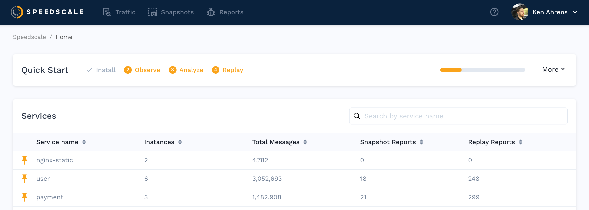

# Review Services

Once the sidecar has seen traffic, your home page will begin to populate with a list of services. You can pin a service to keep it at the top of the list:

### Service Details 

By clicking on one of the services in the list you will be taken to a page that shows each instance of the service and whether it is currently seeing traffic. You may see a flat line if a service is not receiving traffic or if the sidecar was removed.

