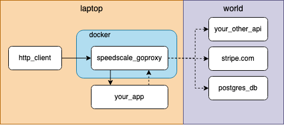

# speedscale

### About

The `speedscale` CLI tool is used to record and inspect application traffic to locally running applications. &#x20;

Ready to get started right away?  [Install](./#install-update) first and then jump in to one of the [guides](guides/).

As engineers, we want to understand the inner workings of our applications, and others, but it's often difficult to get the full picture from the outside.  Clients like `cURL` and Postman can give us external request / response data but fall short of capturing requests made from the application itself.  Also getting from code to a working curl command can be tedious.  `speedscale` is able to gain greater insight by running your application inside a docker container and intercepting all of the requests going in and out.  `speedscale` does more while providing a contextual view of your application traffic.

When a request is made to your application `speedscale` records the raw request / response data, along with metadata like request latency, encoding, detected technologies, etc.  This allows you to get to the specific bits of your network requests, but at a higher level than looking at packets and TCP streams in Wireshark.

This tool is provided free of charge but the features provided by it, and supported environments, are a subset of the Speedscale cloud platform.  If you have an active Speedscale subscription reference the [speedctl CLI tool](../speedctl.md) for interacting with the Speedscale Cloud.

### Supported Architectures

`speedscale` supports a few architectural modes for traffic capture.  If your application is containerized, using docker mode will be the easiest option. If you want to run your application natively on the desktop proxy mode is required.

#### Container Mode&#x20;

Prefer container mode when you need it to "just work" with your containerized application.

If your application is not containerized and you do not want to containerize it then skip this section.  Docker has [relevant documentation](https://docs.docker.com/get-started/) for containerizing an application.

In container mode `speedscale` runs your application alongside the proxy container and requests are transparently proxied to and from your container via some Docker network magic.  This mode automatically captures inbound requests to your application and outbound requests from your application to other services.


.png)

Start capturing in container mode with the [container guide](guides/docker-observability/my-container.md).

#### Proxy Mode

Prefer proxy mode requires additional configuration and is required for running apps natively on the desktop.

In proxy mode your HTTP client talks to the proxy container and the proxy container talks your application, capturing inbound requests as they flow through. In the diagram below these requests are represented by solid lines. For this to work, your `http_client` must be modified to call the `speedscale` port (usually 4143). In the example of `curl` that means  calling `curl http://localhost:4140` instead of `curl http://localhost`.



The dotted lines in the diagram represent outbound requests from your application to other services.  While not required, the `http_proxy` and `https_proxy` environment variables may be set to capture outbound requests, otherwise outbound requests will be made directly. Copy/paste-ready instructions are provided by the `speedscale start capture` command for setting the appropriate environment variables. Please remember to set the environment variables in the same  context (terminal window) as your application.

Start capturing in proxy mode with the [local capture guide](guides/local-observability/my-local-app.md).

### Install / Update

Download the latest version of `speedscale`, which will update the binary in your `~/.speedscale` directory.

```
curl -sL https://downloads.speedscale.com/speedscale-cli/install | bash
```

Initialize `speedscale` and answer the questions that follow.

```
speedscale init
```

Now try one of the [guides](guides/).

### Uninstall

The easiest way to remove `speedscale` is to ensure capture containers are removed and delete the standalone binary.

```
speedscale stop capture; rm -f $(which speedscale)
```

There are a few parts of your system that `speedscale` touches which we've detailed here in case just removing the `speedscale` binary is not enough.&#x20;

#### Docker

`speedscale` does require access to the Docker socket to run and may create or delete docker resources.  Running `speedscale stop capture` should clean up docker resources but take a look at `docker ps --all` to list any remaining containers.

#### Data Directory

By default, both `speedscale` and `speedctl` use the `$HOME/.speedscale` directory to store configuration, binaries, data, etc.  **Removing this directory will remove all Speedscale related files**.  Be careful with this operation if you plan to continue to interact with `speedscale` or `speedctl`.

### &#x20;Troubleshooting

Explore the available commands available by running `speedscale --help` or add `--help` to the end of any command for details on that command.

If you see something like `command not found: speedscale` then ensure the speedscale directory (`~/.speedscale`) has been added to your `$PATH`.

Still have questions?  Come chat with us in the [Speedscale Community Slack](https://slack.speedscale.com)!
