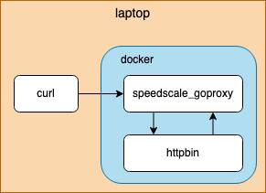

# Demo App

In this guide we will use [httpbin](https://httpbin.org) to play with some traffic capture.  For simplicity [container mode](../../#supported-architectures) will be used.  If you're not familiar, httpbin is a simple HTTP request / response server with a few handy features on top, but you don't need to know more about it than that.  Today we will only use the `/anything` endpoint, which is just an echo server.  The echo server responds with whatever we send it.



### Start The Proxy

Start capturing by specifying the httpbin container image and the port.  httpbin listens on port 80, which will be redirected to localhost port 4143.

```
speedscale start capture --image kennethreitz/httpbin --port-mapping 4143:80
```

### Capture

Make some requests to the echo server on the local port. We expect the response body to match the request body that we're sending.

```
curl http://localhost:4143/ping
curl -X POST http://localhost:8080/customer --data '{
  "id": 23456,
  "first_name": "Barry",
  "last_name": "Allen",
}'
curl -X POST http://localhost:4143/order --data '{
  "id": 12345,
  "customer_id": 23456,
  "product": "sandwich",
  "count": 2
}'
```

### Stop the Proxy

Stop recording and finalize the analysis.

```
speedscale stop capture
```

### Inspect

Inspect the requests made to and from the application.

```
speedscale inspect
```
