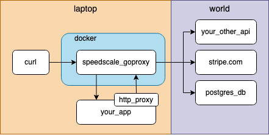

# Python Demo App

For this guide we'll provide a pre-made demo app that accepts inbound HTTP GET requests and returns the current [Hackernews](https://news.ycombinator.com/newest) top 10 new articles. To do this, the app will make multiple calls to two separate endpoints which will give us some interesting calls to inspect.

`speedscale` will run a proxy that sits in between the HTTP client (cURL in this case) and the demo application.  Requests made to the proxy are forwarded to your demo app transparently.



### Clone the Demo App

Find the junk drawer on your local computer and clone the demo Python app.


demo-hackernews: the authoritative news source


### Start the Proxy

Start capturing by specifying your application's HTTP port.  By default our demo app listens on port 8080.

```
speedscale start capture -p 8080
```

Now `speedscale` will forward all requests made to proxy port 4143 to your application on port 8080.

### Add TLS Cert (Required)

You may be prompted to trust a newly generated certificate to support TLS.  This is required so the proxy can capture TLS traffic made to external systems.  The Hackernews API does not allow unsecured connections so this is required.

For Python urllib you'll need to take one more step. Copy and paste a line from the `speedscale start capture` output for `SSL_CERT_FILE` and export it as an environment variable. It should look something like this.

```
export SSL_CERT_FILE=${HOME}/.speedscale/certs/tls.crt
```

### Configure SOCKS Proxy (for Outbound Calls)

The real fun of observing an app is getting the complete call history of both inbound and outbound requests. By setting some environment variables we can redirect outbound requests through the proxy as well to enable outbound visibility.

In our demo app we manually enabled a SOCKS5 proxy to capture outbound traffic. For many languages and libraries you can do this by setting the http\__proxy and https\__proxy environment variables. You do not need to do that for this specific demo app.

Go ahead and run the demo app:

```
./hn.py
```

### Capture

Let's find out what's going on in the world by running a GET against our new endpoint.

```
curl http://localhost:4143/test
{
    "0": "Ask HN: Best PC Laptop less than $1000 for young gamer?",
    "1": "BioNTech CEO says vaccine likely to protect against severe Covid from Omicron",
    "2": "Ask HN: What devices do you use as daily drivers?",
    "3": "The problem with Python's map and filter \u2013 Abhinav Omprakash",
    "4": "How to write a great Stack Overflow question (6 steps)",
    "5": "Meta / Facebook\u2019s Head of Crypto is leaving",
    "6": "Retroactive: Run Aperture, iPhoto, and iTunes on macOS Big Sur",
    "7": "Ask HN: Why did plain text never catch on?",
    "8": "A Thousand Brains: A new theory of intelligence",
    "9": "The one-more-re-nightmare compiler"
}
```

### Stop the Proxy

Stop recording and finalize the analysis.

```
speedscale stop capture
```

### Inspect

Now inspect the snapshot you just created.

```
speedscale inspect
```

Check out the single inbound curl you ran and all the outbound transactions that resulted. You can do this with most desktop applications and quickly see what API calls they depend on.

.png>)

.png>)
