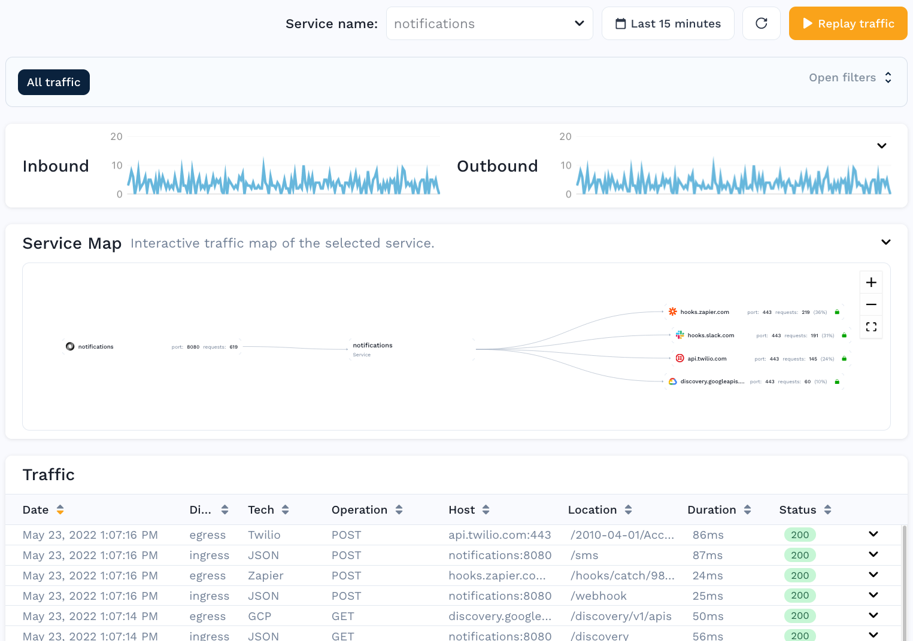
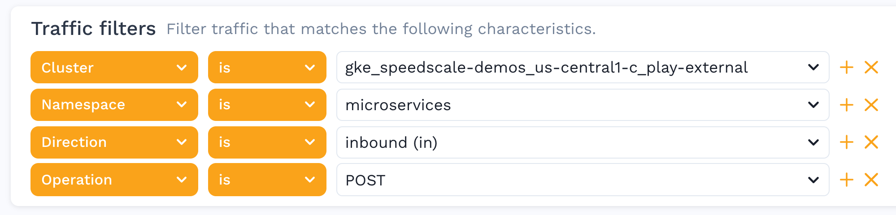

# Traffic Viewer

Detailed log of every transaction in the system

Clicking on one of the instances will take you to the Traffic Viewer screen where you can see:

* Time picker to look at trends during specific time windows
* Throughput graphs for inbound calls to the service and outbound calls to backend systems
* Filters for searching for specific transactions or otherwise customizing the list

### Filtering 

Utilize the filters to drill down even further into a subset of transactions.

### Request Response Details 

Clicking on any individual row reveals a Request / Response Pair. This could be for an inbound transaction to the service, or even a call from the service to a downstream system, even if it uses TLS. The following information is shown in the view:

* **Info** section includes high level details like response code, duration, URL, etc.
* **Request** section includes the Headers and Body that were sent
* **Response** section includes the Headers and Body that were received

Now that you have identified the subset of traffic that you would like to replay, it's time to create a snapshot.
