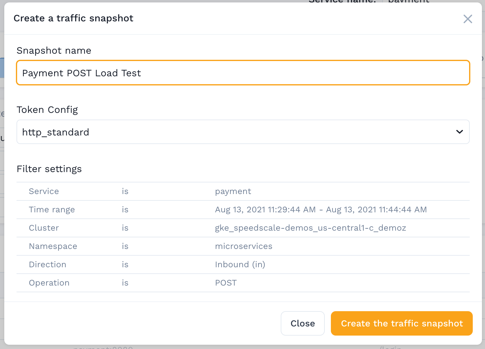

# Create Snapshot

This wizard can help you create a Traffic Snapshot.

### Basic Information&#x20;

Now you simply fill in the values and click save to create your snaspshot:

| Field         | Description                                                                                                          |
| ------------- | -------------------------------------------------------------------------------------------------------------------- |
| Snapshot Name | A descriptive name so you can easily find this snapshot in the future.                                               |
| Token Config  | This determines how the traffic will be processed (see [Tokenizers](../../configuration/tokenizers-1/tokenizers.md)) |

For your first snapshot use one of the built-in configurations, you can always create your own later if you want to customize the data processing.

:::info
Long time ranges can take a very long time to process, and may timeout before the snapshot can be created. If this happens, try again with a smaller time window.
:::
