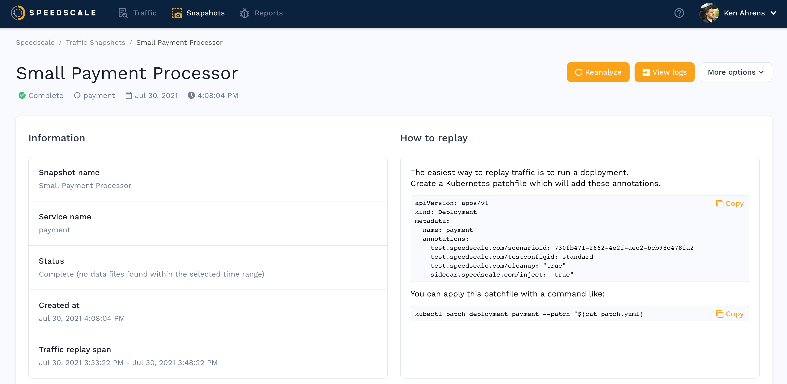

# View Snapshot

A traffic snapshot is created from the selected traffic when running a replay so the same set of traffic can be reviewed and replayed again.

In addition to these details, a Service Map visually represents the inbound and outbound traffic, and how the replay will be orchestrated.

