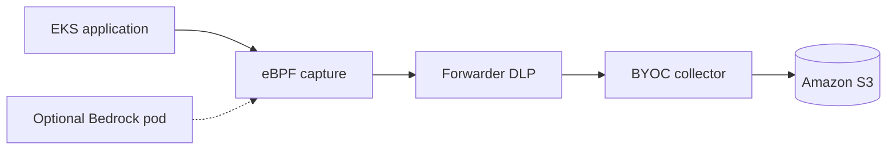
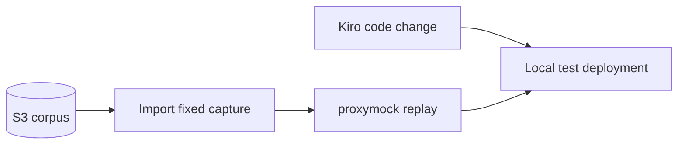

# AWS EKS quality factory with BYOC

An agent can change a service quickly. The harder question is whether that change still honors the behavior clients saw before it. In this reference architecture, Speedscale's eBPF collector captures application traffic on Amazon EKS, a BYOC exporter applies its filter and DLP rule inside the cluster, and replayable request/response pairs are stored in an Amazon S3 bucket you control. A developer imports a bounded capture into `proxymock`, lets Kiro change a local copy of the service, and replays the same requests to check the result.

We validated the eBPF-to-S3-to-replay path with a synthetic banking service. One eBPF-captured deposit expected HTTP 201. A deliberate response-contract change returned HTTP 200 and failed the replay gate. Kiro changed the controller to return 201 while preserving its new response envelope; the same request then passed. This was a one-request status-code check in an isolated local copy, not a semantic body assertion or a change deployed to EKS.

## Architecture

The reference BYOC data path runs inside your AWS account:

The quality gate runs against an isolated test deployment:

The capture and replay paths have different owners. The EKS workload produces traffic. Speedscale's [eBPF collector](/reference/ebpf-traffic-collection) observes the selected workloads without application sidecars. The Forwarder applies the named exporter's filter and DLP configuration before sending records to the in-cluster collector. The collector writes OTLP JSON objects under `byoc/` in S3. The developer or CI job reads a bounded time window from S3 and runs replay against a test deployment. See [How BYOC works](/byoc/how-it-works.md) and [Use BYOC traffic with proxymock](/byoc/use-traffic.md).

The validated EKS demo has no capture proxy sidecars on its transactions, AI, or Bedrock workloads. The transactions service uses the Speedscale Java agent with nettap because it runs on the JVM. The Python AI service and the separate Bedrock probe use nettap without a Java agent. Each workload produced eBPF-tagged records in S3.

The diagrams show the BYOC path. Enabling BYOC does not automatically turn off the separate Speedscale Cloud exporter. Review both exporters when defining where captured data may go.

## AWS and data boundaries

- Keep the bucket private, enable encryption, and set retention for captured traffic. Give the collector only the S3 write permissions it needs and give the replay client only read access to the intended prefix.
- Use a dedicated Kubernetes service account and scoped IAM role for each AWS-calling workload. The Bedrock smoke test used [EKS Pod Identity](https://docs.aws.amazon.com/eks/latest/userguide/pod-identities.html) and a role limited to Amazon Nova Micro inference. It did not use static AWS keys.
- Apply DLP before S3 export, then inspect an exported record. eBPF can also capture the Pod Identity credential response: redact `AccessKeyId`, `SecretAccessKey`, and `Token` in its response body, as well as `Authorization` and `X-Amz-Security-Token` on signed AWS requests. Verify those fields with fake credentials before invoking Bedrock. Check query strings separately; an API key in a URL can survive a header-only rule.
- Keep raw imports and replay results out of public repositories until their contents have been reviewed. Normalize account IDs, tokens, timestamps, and other variable fields before treating a capture as a repeatable test corpus.

For the collector and Forwarder configuration, follow [Configure BYOC on Kubernetes](/byoc/configure-kubernetes.md). For backend choices and the collector support boundary, see [Storage and observability backends](/byoc/backends.md).

## Verify the quality gate

1. Capture synthetic traffic from the EKS service and confirm that the expected RRPairs reached S3 after DLP.
2. Import a narrow S3 time window into `proxymock` and hold that corpus fixed across comparisons. The import reads from your bucket using the replay client's AWS credentials.
3. Replay against the unchanged test service to establish a passing baseline. Introduce a deliberate contract change and verify that the same corpus fails.
4. Let Kiro change an isolated source copy. Rebuild the same test target and replay the same corpus again. Inspect the per-request verdict, not only aggregate output or the process exit code.

In our validation, the deposit replay recorded 201 and observed 200 before the fix, then recorded 201 and observed 201 afterward. Response bodies were ignored because transaction IDs and times varied. That makes this a status-code contract gate. Add stable body assertions before using the pattern to guard response semantics.

## Bedrock extension

A separate, sidecar-free EKS pod used Pod Identity to invoke the [Amazon Bedrock Converse API](https://docs.aws.amazon.com/bedrock/latest/APIReference/API_runtime_Converse.html). The eBPF-tagged BYOC record in S3 contained the outbound HTTP 200 exchange with both AWS signing headers redacted; a separate captured Pod Identity response had all three temporary credential fields redacted. This verifies the scoped IAM, eBPF capture, and DLP path. The banking AI service did not call Bedrock, and we did not replay model-generated answers. Put Bedrock in the application path and choose a deterministic assertion before presenting it as an application-level quality gate.

This example validates a small path through EKS, BYOC, S3, Kiro, and `proxymock`. It is not a capacity benchmark or a turnkey cluster deployment. The [ECS/Fargate example](/byoc/examples/ecs.md) covers a different AWS runtime.
