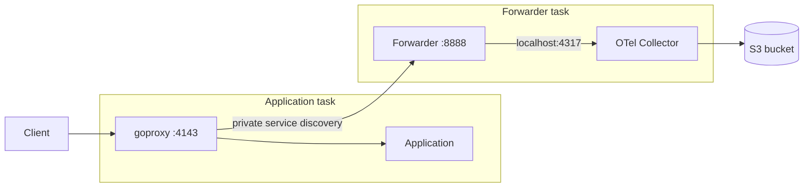

Run goproxy alongside your application, then send captured traffic to a separate ECS task containing the forwarder and an OpenTelemetry collector. The collector writes OTLP JSON records to your S3 bucket using an ECS task role. This configuration was validated with synthetic HTTP traffic on Linux Fargate 1.4.0, Speedscale v2.5.967, and OpenTelemetry Collector Contrib 0.139.0.



## Prerequisites

Use the networking and application setup in [AWS ECS/Fargate](/getting-started/installation/install/ecs.md). You need a Speedscale account with BYOC enabled, a bucket, an ECS cluster, and a private service discovery name for the forwarder. The examples below extend that installation; they do not create the VPC or bucket.

Allow application tasks to reach the forwarder on TCP 8888. The collector listens only on localhost inside the forwarder task. Provide outbound connectivity for image pulls, Secrets Manager, CloudWatch Logs, S3, and the Speedscale API. Adding `EXPORTERS` does not disable the cloud exporter or make this an offline installation.

## Configure credentials and cloud filtering

Populate a Secrets Manager JSON secret with your tenant's values for these keys:

```text
SPEEDSCALE_API_KEY
SPEEDSCALE_APP_URL
TENANT_NAME
TENANT_ID
TENANT_BUCKET
TENANT_REGION
SUB_TENANT_NAME
SUB_TENANT_STREAM
SPEEDSCALE_FILTER_RULE
```

Use the tenant configuration from `speedctl` setup. `TENANT_BUCKET` and `SUB_TENANT_STREAM` are Speedscale tenant values; the collector's destination bucket is configured separately. Keep secret values out of Terraform variables and state.

To filter all captured RRPairs from the cloud exporter, create a dedicated filter in the same tenant:

```bash
cat > ecs-byoc-drop-all.json <<'JSON'
{"id":"ecs-byoc-drop-all","filterQuery":"(location CONTAINS \"\")"}
JSON
speedctl put filter ecs-byoc-drop-all.json
```

Set the secret's `SPEEDSCALE_FILTER_RULE` to `ecs-byoc-drop-all`. The BYOC exporter below uses its own `standard` filter and DLP configuration. Confirm those configurations exist in your tenant before starting the service. Cloud filtering applies to captured RRPairs; registration, configuration downloads, and operational telemetry still use the Speedscale API. Review the DLP rules for your data before capturing sensitive traffic.

Grant the execution role `secretsmanager:GetSecretValue` on this secret and permissions to write the configured CloudWatch log stream. Add `kms:Decrypt` if the secret uses a customer-managed KMS key. JSON-key injection requires Linux Fargate 1.4.0 or later. Launch new tasks after changing the secret. See [AWS secret injection](https://docs.aws.amazon.com/AmazonECS/latest/developerguide/secrets-envvar-secrets-manager.html).

The collector task role needs `s3:PutObject` on `arn:aws:s3:::YOUR_BUCKET/byoc/*` for the SSE-S3 configuration tested here. Both containers in this task share that role; it is separate from the execution role. See [ECS task roles](https://docs.aws.amazon.com/AmazonECS/latest/developerguide/task-iam-roles.html). Enable S3 public access blocking, encryption, and a retention policy appropriate for your captured data.

## Configure the collector

Save this as `collector.yaml.tftpl` alongside your Terraform module. Terraform supplies the bucket name through `templatefile` in the task definition below.

```yaml
receivers:
  otlp:
    protocols:
      grpc:
        endpoint: 127.0.0.1:4317
processors:
  memory_limiter:
    check_interval: 1s
    limit_mib: 192
    spike_limit_mib: 48
  batch:
    timeout: 5s
    send_batch_size: 100
exporters:
  awss3:
    s3uploader:
      region: us-east-1
      s3_bucket: ${bucket}
      s3_prefix: byoc
      compression: none
    marshaler: otlp_json
service:
  telemetry:
    metrics:
      readers:
        - pull:
            exporter:
              prometheus:
                host: 127.0.0.1
                port: 8890
  pipelines:
    logs:
      receivers: [otlp]
      processors: [memory_limiter, batch]
      exporters: [awss3]
```

The collector owns port 4317. Set the forwarder's `OTLP_PORT` to 4319 so its receiver does not bind the same port. The collector's metrics endpoint uses 8890 to avoid another shared-task port conflict. These settings are needed because both containers share the task network namespace.

## Define the forwarder task

Supply `execution_role_arn`, `collector_role_arn`, `forwarder_secret_arn`, and `bucket_name` as module variables containing the ARNs and bucket name created by your infrastructure. Define the log group before deploying the task.

```hcl
locals {
  forwarder_secret_keys = [
    "SPEEDSCALE_API_KEY", "SPEEDSCALE_APP_URL", "TENANT_NAME", "TENANT_ID",
    "TENANT_BUCKET", "TENANT_REGION", "SUB_TENANT_NAME", "SUB_TENANT_STREAM",
    "SPEEDSCALE_FILTER_RULE"
  ]
  log_configuration = {
    logDriver = "awslogs"
    options = {
      awslogs-group         = "/ecs/ecs-byoc"
      awslogs-region        = "us-east-1"
      awslogs-stream-prefix = "ecs"
    }
  }
}

resource "aws_ecs_task_definition" "forwarder" {
  family                   = "ecs-byoc-forwarder"
  requires_compatibilities = ["FARGATE"]
  network_mode             = "awsvpc"
  cpu                      = "512"
  memory                   = "1024"
  execution_role_arn       = var.execution_role_arn
  task_role_arn            = var.collector_role_arn
  runtime_platform {
    operating_system_family = "LINUX"
    cpu_architecture        = "X86_64"
  }
  container_definitions = jsonencode([
    {
      name             = "collector"
      image            = "otel/opentelemetry-collector-contrib:0.139.0"
      essential        = true
      memory           = 256
      command          = ["--config=env:OTEL_CONFIG"]
      environment      = [{ name = "OTEL_CONFIG", value = templatefile("${path.module}/collector.yaml.tftpl", { bucket = var.bucket_name }) }]
      logConfiguration = local.log_configuration
    },
    {
      name             = "forwarder"
      image            = "gcr.io/speedscale/forwarder:v2.5.967"
      essential        = true
      memory           = 768
      dependsOn        = [{ containerName = "collector", condition = "START" }]
      portMappings     = [{ containerPort = 8888, protocol = "tcp" }]
      logConfiguration = local.log_configuration
      secrets = [for key in local.forwarder_secret_keys : {
        name      = key
        valueFrom = "${var.forwarder_secret_arn}:${key}::"
      }]
      environment = [
        { name = "CLUSTER_NAME", value = "ecs-byoc" },
        { name = "LOG_LEVEL", value = "info" },
        # The collector owns port 4317 in this task network namespace.
        { name = "OTLP_PORT", value = "4319" },
        { name = "EXPORTERS", value = jsonencode({
          byoc_otel = {
            otel_endpoint = "http://127.0.0.1:4317"
            filter_rule   = "standard"
            dlp_config_id = "standard"
          }
        }) }
      ]
    }
  ])
}
```

Deploy this task definition through the forwarder ECS service from the [ECS installation guide](/getting-started/installation/install/ecs.md#setup-the-forwarder), with `platform_version = "1.4.0"`. Keep its service discovery registration on the forwarder and set the application's `FORWARDER_ADDR` to that DNS name on port 8888. Set `desired_count = 1` after the secret has a value and the filter exists.

The tested application task used nginx on port 80 and goproxy with `REVERSE_PROXY_HOST=127.0.0.1`, `REVERSE_PROXY_PORT=80`, `CAPTURE_MODE=proxy`, `PROXY_TYPE=dual`, and `PROXY_PROTOCOL=tcp:http`. Requests entered goproxy on port 4143. For this plain HTTP check, `TLS_IN_UNWRAP` and `TLS_OUT_UNWRAP` were both `false`. Configure TLS separately using the ECS guide when your application needs it.

## Verify capture and delivery

Send a request through goproxy, using your load balancer URL or a client in the application task:

```bash
curl --fail 'http://127.0.0.1:4143/?ecs_byoc_validation=synthetic'
```

The localhost command must run inside the application task. Then check both ECS services and their logs:

```bash
aws ecs describe-services --cluster YOUR_CLUSTER --services app forwarder \
  --query 'services[].{name:serviceName,desired:desiredCount,running:runningCount,pending:pendingCount}'
aws logs tail /ecs/ecs-byoc --since 10m
aws s3 ls s3://YOUR_BUCKET/byoc/ --recursive
```

Expect one running task per service, a goproxy connection to the forwarder, and a forwarder startup log containing `starting OTLP log exporter` with `transport=grpc` and endpoint `http://127.0.0.1:4317`. Inspect collector errors if no objects arrive.

Download one newly written object and check the captured content:

```bash
aws s3 cp s3://YOUR_BUCKET/byoc/OBJECT_KEY capture.json
jq '.resourceLogs[].scopeLogs[].logRecords[].body.kvlistValue.values[] |
  select(.key == "service" or .key == "status" or .key == "http")' capture.json
```

The synthetic validation produced the service label, the `ecs_byoc_validation=synthetic` request URI, HTTP status 200, and the nginx response body. Running tasks alone do not verify capture. This check validates HTTP capture and S3 delivery. The lifecycle below was also validated with inbound and outbound TLS captures from an ECS task using nginx on HTTPS port 8443.

For importing stored traffic, see [Use BYOC traffic with proxymock](/byoc/use-traffic.md). Scale both services to zero through your IaC when capture is no longer needed. Keep the bucket and its retention policy under the same infrastructure lifecycle.

## Analyze and replay the BYOC capture

### 1. Install proxymock and pull the capture

Follow the [proxymock CLI setup](/proxymock/getting-started/quickstart/quickstart-cli.md) first. Run the following commands from your application repository so the imported capture and replay results stay with that application. You need AWS read access to the BYOC bucket and `jq` for the replay verdict check. Importing from S3 uses your AWS credentials and does not require uploading traffic to Speedscale Cloud.

Pull a bounded capture window directly from S3:

```bash
AWS_PROFILE=YOUR_PROFILE proxymock import s3 \
  --bucket YOUR_BUCKET --region us-east-1 --prefix byoc/ \
  --service ecs-byoc-nginx \
  --from 2026-09-11T16:41:00Z --to 2026-09-11T16:41:30Z \
  --out ./proxymock/byoc-capture
```

Replace the dates with your capture window. In the validation run, this imported six TLS RRPairs, three inbound and three outbound, with zero malformed records. The analysis identified successful responses, request latency, and the nginx version exposed in response headers. The sample is a functional check, not a load benchmark.

### 2. Inspect and analyze with proxymock

Open the imported records in the local browser interface:

```bash
proxymock web --in ./proxymock/byoc-capture --chat=false --forwarder-addr=""
```

Use the printed local URL to inspect request URLs, headers, response bodies, and inbound versus outbound traffic. This command disables LLM chat and live forwarder discovery so you can work with the downloaded recording. Stop the server with Ctrl+C when finished.

Generate a structured report for automation, a browser-readable HTML report, or a short text report:

```bash
proxymock report --in ./proxymock/byoc-capture --out ./analysis.json
proxymock report --in ./proxymock/byoc-capture --format html --out ./analysis.html
proxymock report --in ./proxymock/byoc-capture --format prompt
```

Open `analysis.html` in your browser. Review response counts and status codes, latency percentiles, and security findings against the underlying RRPairs. For this fixture, expect six HTTP 200 responses and the body `ecs-byoc-tls-response`. The report flags nginx version disclosure and missing security headers; these are properties of the synthetic app, not import failures.

### 3. Replay and check the result

Start the test deployment before replay. Replace `YOUR_TEST_HOST` with its reachable hostname; the original localhost addresses describe the capture task and do not identify your replay target. Replay the inbound requests against that deployment:

```bash
proxymock replay --in ./proxymock/byoc-capture \
  --test-against https://YOUR_TEST_HOST:8443 \
  --out ./proxymock/byoc-replay --timeout 2m \
  --fail-if 'requests.failed!=0'
jq -e '.verdict == "pass" and .summary.pairs > 0 and .summary.mismatches == 0' \
  ./proxymock/byoc-replay/replay-verdict.json
```

The observed responses are written under `./proxymock/byoc-replay`. Inspect the per-request result in `replay-verdict.json`, or open the replay directory with `proxymock web --in ./proxymock/byoc-replay --chat=false --forwarder-addr=""`. A successful run must have at least one replayed pair and no mismatches. An empty run is not a pass.

Use private connectivity to the ECS target or temporary ingress restricted to the replay client's address. Remove temporary ingress after testing. Replay selects inbound requests; outbound records can be used for analysis or mocking dependencies. The nginx validation replayed three inbound requests over HTTPS and matched all three response bodies. This does not validate a dependency-mocking workflow.

Check the per-pair verdict even when aggregate metrics show success. In the tested proxymock client (reported version v2.5.878), a deliberately incorrect expected body produced `verdict=mismatch` while `requests.result-match-pct` remained 100 and the process exited zero. The explicit verdict check above rejects that result. The prompt-format analysis also displayed a 100% status share as 10000%; use the actual response counts when reviewing that version's report.

The TLS capture test used a task-local certificate shared by nginx and goproxy, `TLS_IN_UNWRAP=true`, `TLS_OUT_UNWRAP=true`, and explicit `TLS_IN_PUBLIC_KEY` / `TLS_IN_PRIVATE_KEY` paths. The inbound client trusted that certificate; the outbound client used `localhost` for DNS/SNI matching. The pinned proxy's outbound CA loader required a PKCS#1 RSA key. Both capture clients verified their certificates without curl's insecure flag. The replay check verifies status and body matching over HTTPS; it does not establish replay-client certificate verification or an installation without cloud connectivity.
