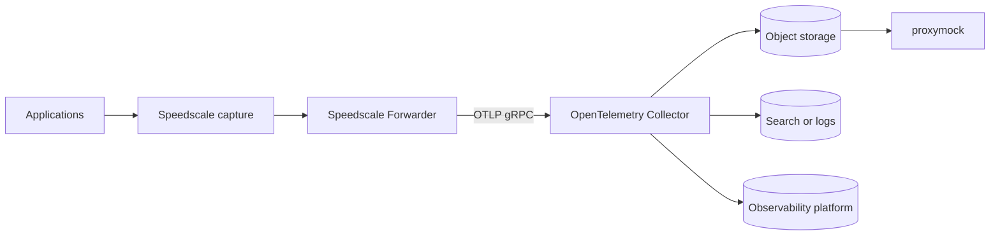
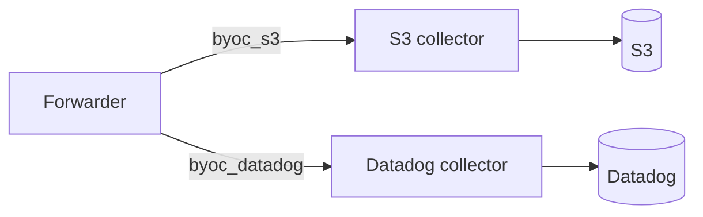

# How BYOC Works

The Speedscale capture components observe application traffic and produce RRPairs. The Forwarder applies the filter and DLP configuration assigned to a named BYOC exporter, encodes the RRPairs as OpenTelemetry log records, and sends them to a collector in your environment.



## Independent destination channels

Configure one named Forwarder exporter for each destination. Each exporter can have its own endpoint, filter, and DLP configuration. A deployment can therefore retain replayable traffic in S3 or GCS while sending a separately filtered stream to Datadog, Dynatrace, New Relic, Loki, or Elasticsearch.



A failure or credential change in one channel does not require sharing credentials with another channel. Run each collector in its own namespace to keep configuration and operational ownership clear.

## Network and data boundaries

Captured RRPairs travel from the Forwarder to the collector endpoint you configure and then to your destination. You control the collector network path, destination credentials, encryption, retention, and access policy.

BYOC is not synonymous with an air-gapped installation. The Forwarder can still contact Speedscale for registration, configuration downloads, and operational telemetry. Review both the BYOC exporter and the cloud exporter when defining your data boundary.

## OTLP transport

The reference collectors accept OTLP/gRPC on port `4317`. The Forwarder infers the transport from the endpoint port:

| Endpoint port | Transport |
| --- | --- |
| `4317` | OTLP/gRPC; used by the reference charts |
| `4318` | OTLP/HTTP |

The protocols are not interchangeable. Include the scheme for compatibility across Forwarder versions, for example `http://otel-collector.byoc-s3.svc.cluster.local:4317`. Forwarder v2.5.617 and later also accept a scheme-less gRPC endpoint.

For a custom collector, enable the protocol that matches the Forwarder endpoint:

```yaml
receivers:
  otlp:
    protocols:
      grpc:
        endpoint: 0.0.0.0:4317
      http:
        endpoint: 0.0.0.0:4318
```

## Stored traffic and local reuse

The S3 and native GCS collectors write OTLP JSON beneath a `byoc/` prefix. proxymock can import a bounded time range directly from those buckets, turn the records back into RRPairs, and use them for local analysis, dependency mocking, or replay. Other destinations require a backend-specific retrieval path. See [Use BYOC traffic with proxymock](./use-traffic.md).

## Next step

[Compare the supported backends](./backends.md), then follow the [Kubernetes configuration guide](./configure-kubernetes.md).
