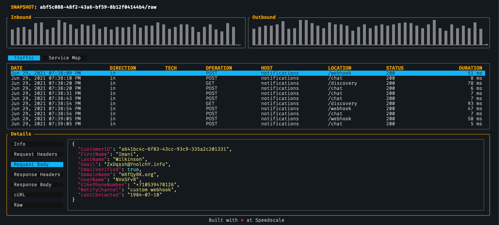
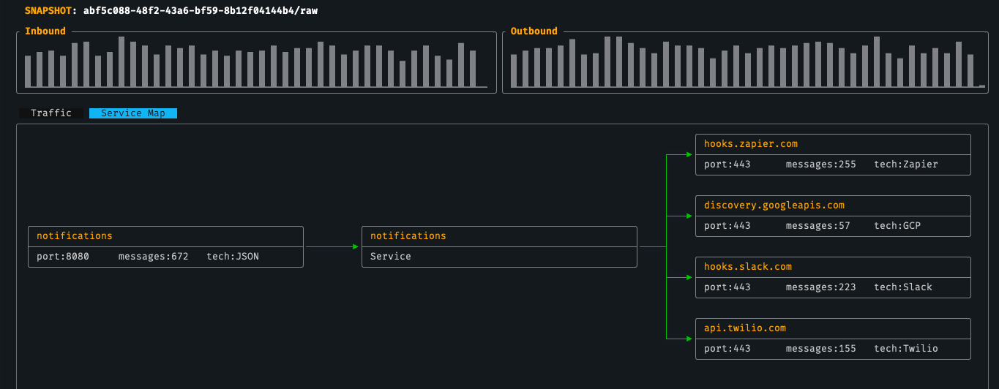

# Explore Sample Data

In this guide you will inspect pre-recorded demo data.

We can start by looking at a set of pre-recorded demo data.  This allows us to skip the record phase altogether and see what `speedscale` would look like when viewing data from your application.

```
speedscale inspect demo
```

This command will download and inspect traffic from a test application which makes requests to several external services.  Navigate down the list of requests and press `enter` to select one.  Use `tab` to move between the request details.



And because `speedscale` captures requests from the target application to external resources it can understand the relationship with those resources, creating a dependency map.


