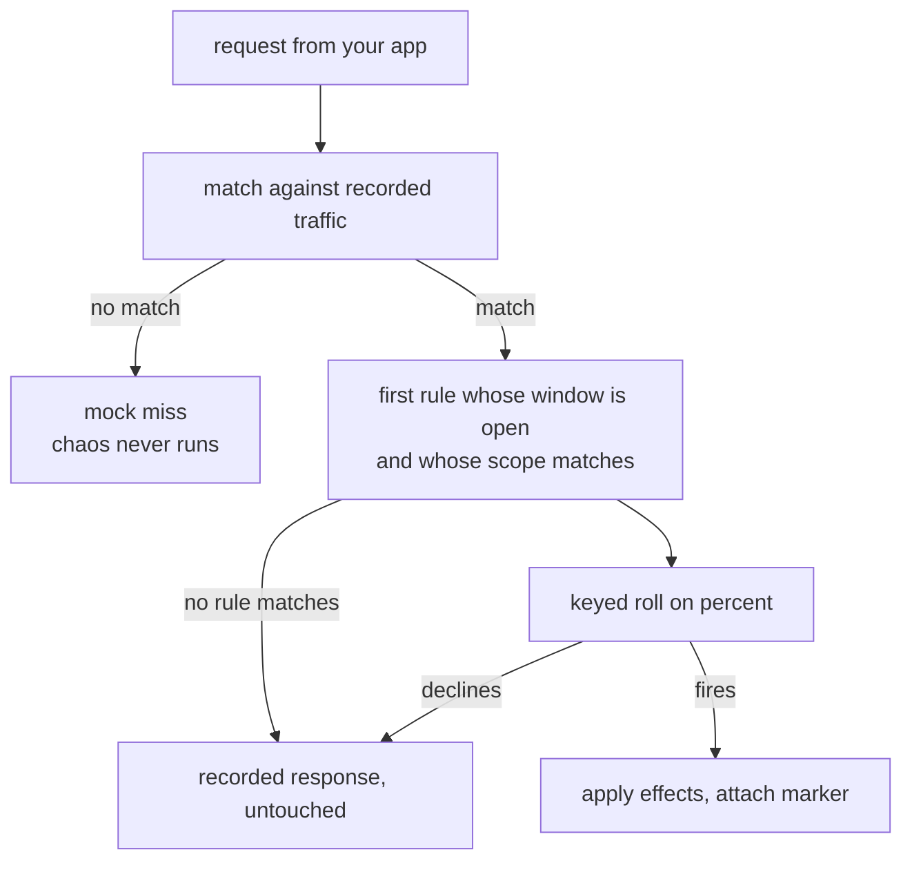
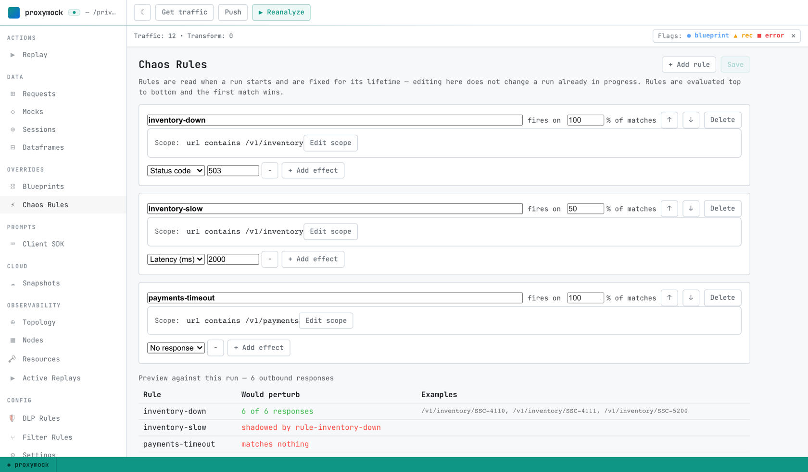
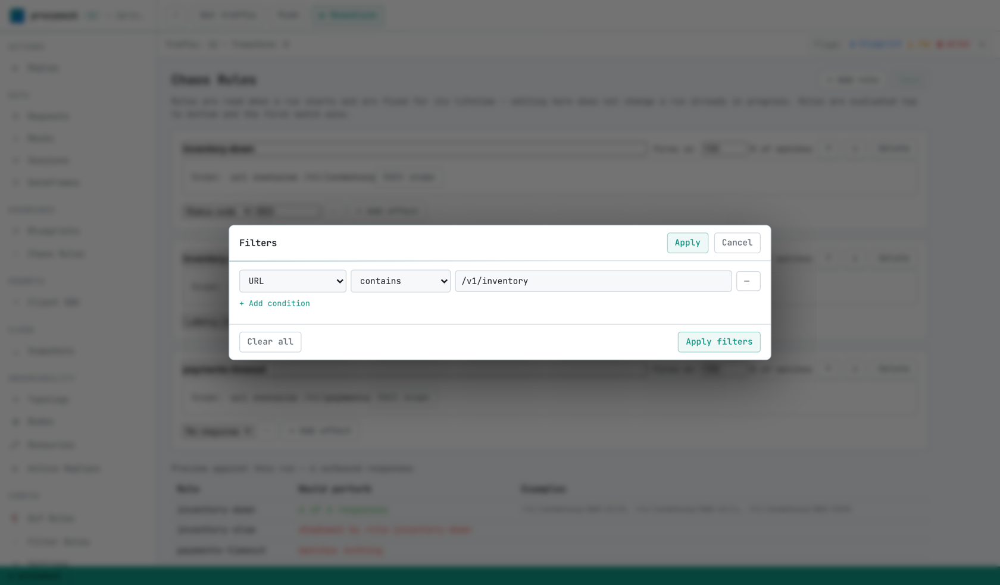

# Chaos Engineering (API)

[Chaos Engineering](https://en.wikipedia.org/wiki/Chaos_engineering#Days_of_Chaos) means designing experiments to ensure that your service will tolerate failures adequately. This term was popularized by Netflix in the early 2010's and was initially focused on experiments involving infrastructure failures like network latency or server failure.

Speedscale introduces chaos at the API level by manipulating individual request response times, status codes and data patterns. For example, Speedscale service mocks can automatically slow down an occasional transaction (versus an entire network connection) or produce an occasional error at random. This is the type of behavior commonly seen when using 3rd party APIs over the internet. Running a chaos oriented test in addition to a stress test provides an extra level of safety for a new build of your code. 

The Speedscale chaos approach is complementary to infrastructure experiments provided by tools like [Gremlin](https://www.gremlin.com/) or [Chaos Monkey](https://netflix.github.io/chaosmonkey/).

## Scoped chaos rules

A chaos rule is three things: **what traffic it applies to**, **how often it fires**, and **what it
does**.

```
--chaos '(url CONTAINS "/v1/inventory"): status=503,percent=100'
```

Rules are evaluated in order and **the first match wins** — one rule applies per response. The
effects *within* that rule all apply.

Chaos is injected by the responder into the responses it serves for your application's outbound
dependencies. It does not touch inbound traffic, and it is HTTP-only today: a rule whose scope
selects gRPC or SQL traffic logs that it matched nothing rather than silently doing nothing.

### Scope

The scope is a filter query — the same syntax as `--query-string` and the Filters dialog. **Every
group must be parenthesized**, which is the most common thing to get wrong:

```
(url CONTAINS "/v1/inventory")
(host IS "api.stripe.com") AND (command IS "POST")
(location REGEX "^/api/checkout")
```

`*` matches everything.

Useful fields: `url`, `location`, `host`, `command`, `status`, `header[Name]`, `query_param[name]`,
`tag[key]`. Operators: `IS`, `CONTAINS`, `NOT`, `NOT CONTAINS`, `REGEX`.

A scope that matches nothing is the most common chaos misconfiguration, so per-rule hit counts are
reported during and after a run — see [Seeing what happened](#seeing-what-happened). If a rule shows
zero hits, the scope is the first thing to check.

### Effects

| Effect | Values | Notes |
| --- | --- | --- |
| `latency` | `2s`, `3x`, `100ms-2s` | Fixed, a multiple of the recorded latency, or a jitter range |
| `status` | `500`, `503`, … | Replaces the status the client receives |
| `connection` | `refuse`, `reset`, `stall`, `drop` | Breaks the connection; `drop` cuts mid-response |
| `body` | `corrupt`, `truncate`, `truncate:<bytes>` | Invalid JSON, or a well-formed shorter body |
| `header` | `Name:Value` | Adds or sets a response header |
| `no-response` | — | Ends the exchange with no reply at all |

Effects compose. `latency=2s,status=503` does both.

### Knobs

| Knob | Meaning |
| --- | --- |
| `percent=` | Chance the rule fires at all, 0–100 |
| `seed=` | Makes the run reproducible; see below |
| `sticky` | Every occurrence of a signature shares one verdict |
| `max-latency=` | Lowers the delay ceiling for this rule |
| `start-after=` | How far into the run the rule becomes active |
| `duration=` | How long it stays active once it opens |
| `@<percent>` | Suffix on an effect, giving it its own probability |

`@<percent>` is Toxiproxy's *toxicity*, not a selection weight. `latency=2s@50,status=503` fires the
status every time the rule matches and the latency half of those times — the two are independent, so
both can happen or only one.

### Bounded windows

A rule with no window is active for the whole run. `start-after` and `duration` bound it:

```
--chaos '(url CONTAINS "/v1/inventory"): status=503,start-after=10s,duration=30s'
```

That is the difference between *this endpoint is flaky* and *this dependency went down for 30
seconds and came back* — the second being the shape a chaos hypothesis usually takes:

> given inventory returns 200, **when** it returns 503 for 30 seconds, **then** the service retries
> and succeeds again once the window closes.

The window is measured from the **start of the run**, not from when a responder process started. The
responder runs as multiple replicas in a cluster, and a per-process clock would open each pod's
window at a different moment, smearing the disruption you are trying to observe cleanly.

A consequence worth knowing: if a run has no start time to anchor to, bounded rules **do not fire**
rather than running for the whole run, and the responder says so. Giving you the entire run when you
asked for thirty seconds would be the more damaging failure.

Windows are also the one place wall-clock enters an otherwise clock-free engine. A windowed run is
reproducible in its **verdicts** — the Nth occurrence of a request gets the same answer — but not in
its exact request *membership*, since which requests land inside the window varies with timing.

## How a rule is selected and applied during a replay

Chaos is injected by the **responder**, at the moment it answers one of your application's
outbound calls. The order of operations matters, because most surprises come from assuming it
happens somewhere else in the pipeline.

### Attaching rules to a run

There are three ways to hand rules to a run, and they all end up in the same place. The responder
builds its engine from `chaos.rules` on the **test config** it was given, so that is the single
mechanism; everything below is a way of getting rules onto it.

**On the command line**, for a local run. Repeat the flag for more than one rule:

```shell
proxymock mock --in ./proxymock/recording \
  --chaos '(url CONTAINS "/v1/inventory"): status=503,percent=100'
```

**Saved in the workspace**, for a local run you want to repeat. Rules authored in the Chaos Rules
pane are written to `proxymock/chaos.json` and picked up by the next `proxymock mock` with no flag
at all.

**On the test config**, for a replay in a cluster. Put the rules in the test config that the
`TrafficReplay` names, and every replay using that config runs with them:

```yaml
apiVersion: speedscale.com/v1
kind: TrafficReplay
metadata:
  name: test-1
spec:
  snapshotID: abf5c088-48f2-43a6-bf59-8b12f04144b4
  testConfigID: chaos-inventory-down   # a test config carrying chaos.rules
  workloadRef:
    kind: Deployment
    name: my-app
```

Keeping chaos on the test config rather than on the replay is what makes a chaos run repeatable
and shareable: the same `testConfigID` is the same experiment, and the CI pipeline that already
passes a test config ID needs no new plumbing to run one.

If more than one source applies to the same local run, the order is `--chaos` first, then the saved
`chaos.json`, then whatever the test config already carried. Because the engine is first-match-wins,
that ordering *is* the precedence: the most explicit and most ephemeral rules get first refusal on
the traffic.

Rules with no `seed=` of their own inherit the test config ID as their seed, so two replays of the
same test config make the same decisions without anyone configuring reproducibility.



**Rules are read once, when the run starts,** and are fixed for its lifetime. Editing them in
proxymock-web does not change a run already in progress.

**Chaos runs on the mock-hit path, after matching.** The request is matched against recorded
traffic first, and the engine is only consulted once a recorded pair has been found. A perturbed
response is therefore always a mock hit and never a miss: chaos never invents a response for
traffic the mock did not recognize. This is why the Chaos column and the Match column agree in
the Requests grid, and why injected failures cannot inflate your no-match rate.

**The scope is matched against the live request plus the response about to be sent.** Request-side
predicates (`url`, `header`, `query_param`) see the actual incoming request, and response-side
predicates (`status`) see the recorded response. Both mean what you would expect.

**First match wins, including when the roll declines.** The first rule whose window is open and
whose scope matches *claims* the request. If that rule's `percent` roll then says no, the response
goes out untouched and evaluation stops there rather than falling through to later rules. So a
`percent=50` rule at the top does not leave the other half of the traffic for the rule below it,
it leaves that half unperturbed. This is what the preview calls **shadowed**.

**The roll is keyed, not random.** It is an fnv64a hash over the seed, the rule id, the request
signature, the occurrence count, and the effect index, with no clock in it. That is what makes the
Nth call to a given endpoint always get the same verdict. The occurrence counter lives in the
responder process, per rule and signature, so it keeps incrementing across every request the run
sends. `sticky` skips the counter so all occurrences of a signature share one verdict, and a
`@<percent>` toxicity suffix rolls independently per effect by mixing the effect index into the key.

**Effects apply before the body is encoded.** Payload effects have to perturb the body while it is
still structured, so the engine runs ahead of encoding and the marker is attached last. The
engine is consulted exactly once per response: asking twice would advance the occurrence counter
and give the two questions different answers.

One thing that is deliberately not chaos: the responder's own baseline response delay. That is
applied whether or not a rule fires, and a `latency` effect adjusts it rather than replacing it.

## Building rules in proxymock-web

**Chaos Rules**, under Config in the left sidebar, edits the rule set without hand-writing JSON.



Each rule is a name, a scope, a `fires on` percentage, and one or more effects. The arrows reorder
rules, which matters because evaluation is top to bottom and the first match wins.

Rules are saved to `proxymock/chaos.json` in the workspace and are picked up by the next
`proxymock mock` run. Keeping them beside the traffic is deliberate: a rule scoped to
`/v1/inventory` means nothing in a workspace that has no inventory calls.

### Scope is a filter

**Edit scope** opens the same Filters dialog the Requests grid uses, so a chaos scope and a grid
filter are the same object. You can narrow the grid until it shows the traffic you want to break,
then use that filter as the scope.



### The preview is the point

Each rule is scored against the loaded traffic before you run anything. In the screenshot above,
all three verdicts are visible at once:

| verdict | meaning |
| --- | --- |
| `6 of 6 responses` | the rule works |
| `shadowed by <rule>` | the scope is fine, but an earlier rule takes the traffic first |
| `matches nothing` | the scope selects no traffic |

`inventory-slow` is shadowed because `inventory-down` sits above it with the same scope and takes
the traffic first. `payments-timeout` matches nothing because this workspace has no `/v1/payments`
calls in it.

Those last two look identical from a completed run — both produce zero markers — which is why the
distinction lives here rather than in the report. Rules are evaluated top to bottom and the first
match wins, so moving a rule up changes what every rule below it sees.

## When a rule cannot fire

Two cases are reported rather than left silent, because the symptom of both is a rule that simply
does nothing:

- **at startup**, a rule scoped to a technology chaos cannot inject into. v1 perturbs HTTP responses
  only, so a rule scoped to `postgres` is never even evaluated.
- **at the end of a run**, any rule that matched no traffic. That is not necessarily a mistake — a
  rule scoped to an endpoint the run never called is legitimately quiet — but it is the first thing
  worth checking when chaos appears not to have worked.

Neither fails the run. A rule that cannot fire is a mistake; the rest of the rule set is probably
doing what you wanted.

## Seeing what happened

Every perturbed response carries a marker, both as the `x-speedscale-chaos` response header and as a
tag on the recorded pair:

```
effect=status code;status=503;rule=inventory-down
```

**Absence is the signal.** There is no `none` value — an untouched response carries no marker at all,
so a marker is always evidence that something was perturbed.

That marker drives:

- the **Chaos column** and the "chaos applied" filter in the proxymock-web Requests grid, and the
  chaos row in the RRPair detail view
- the **Chaos summary** at the top of the Report view: how much of the run was perturbed, by which
  rules, and with which effects
- the same pill and detail row in the Speedscale dashboard

One thing that looks wrong and is not: the **recorded pair keeps its pre-chaos status**. That pair is
mock input for a later run, so rewriting it would change what a re-replay does. The grid shows the
status the client actually received, with the recorded one alongside; `status=` in the marker is the
authority on what was sent.

## Reproducibility, and its limit

`seed=` makes a run repeatable, with a caveat worth stating plainly.

The roll is a pure function of the rule, the request signature, and the occurrence count — the Nth
lookup of a given request always gets the same verdict. It is **not** a promise that two runs are
identical: a run that issues a different number of requests for a signature diverges after that
point.

That is stronger than ordering-based reproducibility, which is worthless when the responder serves
requests concurrently, and weaker than full determinism. In practice it means a failure you find this
way is one you can hand to a teammate along with the command that produced it.

`sticky` trades the occurrence counter away: every occurrence of a signature shares one verdict, so
"this exact request always fails" — at the cost of being unable to express "35% of these calls are
flaky".

### Across multiple responder replicas

Each responder pod owns its own rule state and counters. `percent` therefore holds **in aggregate
across the run**, not exactly per pod, and "the 3rd occurrence" means the 3rd that pod saw. A 3-pod
replay at `percent: 35` converges on 35% overall. Do not expect exact global counts.

## What chaos does not do

**It does not hide failures.** If your application cannot absorb an injected failure, that failure is
reported normally — in pass/fail, in error rates, and in the report outcome. Learning that the
application is *not* resilient is the entire point.

Separately, chaos-affected traffic is excluded from **drift, similarity and match-rate** analysis,
because an injected 503 is not mock drift. Those two rules are easy to confuse and point in opposite
directions: chaosed pairs leave the *analysis* of how well your mocks match, and never leave the
*outcome* of whether your application coped.

## Behavior changes in Chaos v2

Chaos v2 replaces the original chaos implementation with a scoped rule engine. The corrections below are
deliberate, but they change what an existing configuration does at runtime — if a chaos rate or effect mix
looks different after upgrading, this is why.

### Response delay is no longer capped at 5 seconds

This one affects **every** replay and mock run, including those with no chaos configured at all.

The responder previously capped any artificial wait at 5 seconds. That cap applied to the recorded
latency itself, not just to injected delay, so a recording of a 30-second response replayed as a
5-second one, and a "very slow rogue transaction" never looked slow to a client whose timeout was
longer than 5 seconds.

The ceiling is now the generator's `requestTimeoutSeconds` when the test config sets one, and 30
seconds otherwise, with a hard maximum of 60 seconds. An individual rule can lower it with
`maxLatencyMs`. Runs whose recordings contain responses slower than 5 seconds will take longer than
they used to.

### Chaos fires at the configured percent, not one in a hundred more

The selection test was `<=` against a roll in `[0, 99]`, so a rule fired `percent + 1` times per
hundred. The absolute error was always one request in a hundred, but the relative error was largest
at low percentages: `chaosPercent: 1` fired roughly twice as often as configured.

### Every effect on a matched rule now applies

Enabling more than one of `badStatusCodes`, `intermittentResponses` and `randomLatency` previously
cycled through them round-robin, so exactly one effect fired per chaosed transaction. Effects now
compose, each gated by its own independent probability (`toxicity`), following Toxiproxy's toxic
semantics.

An existing configuration folds into a single match-all rule whose effects each carry
`toxicity = 100/N`, which preserves how often each effect fires on average. What changes is that the
effects are now independent: two can fire on the same transaction, or none can.

### Effect selection is seeded and reproducible

The 404-versus-500 choice and the factor-versus-fixed latency choice were both
`time.Now().UnixNano() % 2`, which correlated with arrival time and made a run impossible to
reproduce. Both are now derived from a seeded hash of the rule, request signature and occurrence.

One consequence is worth calling out: when a configuration sets **both** `randomHighLatencyFactor`
and `randomHighLatencyMs`, the factor now always wins, where the old coin flip alternated between
them.

### `X-Speedscale-Chaos: none` is no longer emitted

An unchaosed response previously carried the header with the literal value `none`. Absence of the
header is now the signal that nothing was applied. Anything matching on the string `none` must check
for the header being absent instead.

The header is also richer when chaos *did* apply: it lists every effect and names the rule that
fired, as `effect=latency;effect=status code;rule=chaos-1`. Readers should split on `;`, parse
`key=value`, and ignore keys they do not recognize.

### `intermittentResponses` actually withholds a response

It never did before. The generator returned "no response" but the responder still wrote the reply,
with the full recorded body and a status of `0` — which `net/http` sends as `200 OK`, silently
downgrading a recorded `201` in the process. Anyone who believed they had tested their client's
behavior against a dropped response had not.

The connection is now closed without a reply. Clients that were quietly succeeding against this will
start seeing the failure it was always supposed to produce.

### `--fault` is unchanged

The local `--fault` flag keeps its own `rate=F/N` counter, and overlapping `--fault` rules still merge
their effects rather than resolving first-match-wins. Chaos rules use a seeded probability and
first-match-wins ordering. The two selection models coexist deliberately for now; `--fault` compiling
into the rule engine is tracked separately.
