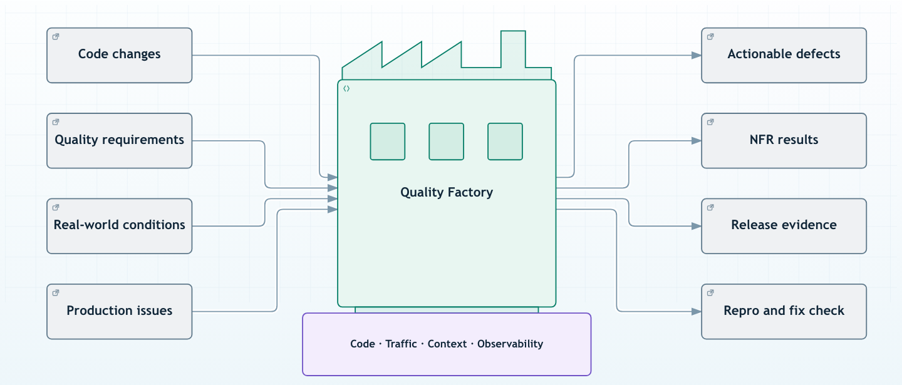

A Quality Factory is a repeatable verification workflow for new code and production incidents. It runs a candidate service against selected traffic and defined scenarios, then produces validation reports and failures engineers can reproduce. The goal is to reduce review and rework time so useful changes reach production sooner.

Speedscale supplies traffic capture, transformation, mocking, and replay. Your SCM, CI, observability, and cloud systems supply the surrounding workflow. AI coding and review tools remain in the SDLC. Independent validation checks the running candidate before merge into trunk.

## Independent validation before merge

Keep planning, AI-assisted coding, code review, and existing CI tests. Add the Quality Factory as a required check before merge. After merge, release and observe the software. Production incidents feed new reproduction scenarios back into the same workflow.

A PR must carry a passing report for the exact candidate revision, build, dataset, and scenario configuration. Missing, failed, or incomplete checks block merge. Revalidate a changed candidate, including changes from a rebase or merge queue. An asynchronous job that runs only after merge does not enforce this boundary.

Agents can propose repairs. Configured assertions determine whether the repair passes. Humans retain authority over merge, release, and approved exceptions.

## Supporting foundation

The factory rests on four sources of evidence:

- **Code:** the candidate revision, build, configuration, and dependency versions.
- **Traffic:** approved request and response recordings, including dependency interactions.
- **Context:** API contracts, business expectations, test scenarios, and normalization rules.
- **Observability data:** incident time windows, affected services, errors, and performance signals.

Traffic records observed behavior. Contracts and assertions determine whether that behavior is acceptable. A captured defect must not become the expected result simply because it occurred in production.

## Factory workflows

### Challenge new code

Exercise a candidate with captured requests and deliberately difficult scenarios. Keep existing unit tests, static analysis, AI review, and human review. Add checks for behaviors those steps don't exercise, such as an unexpected dependency response or a request shape missing from the unit-test suite.

### Validate non-functional requirements

Define separate suites for load, resilience, and selected security behaviors. Set measurable expectations, such as a latency threshold at a specified load or the response to a dependency timeout. These are configured scenarios, not automatic proof of every non-functional requirement. Keep vulnerability scanning, security review, and other controls appropriate to your system.

### Test real-world conditions

Use representative traffic and mock dependencies when isolation is required. [Transforms](/concepts/transforms) can normalize dynamic fields and adjust scenarios. Preserve relevant behavior when masking sensitive data; a transform that removes the failure condition makes the test ineffective.

### Reproduce production issues

Use an incident's service and time window to select traffic. Run the scenario against the affected revision in an isolated environment, confirm the failure, and hand off a repeatable test. Rerun that test against the fix and retain it as a regression scenario.

Replay is the execution mechanism. Reproduction means the scenario demonstrates the relevant failure and an engineer can run it again. Successfully launching a replay is insufficient.

## Verification boundary

Deterministic verification evaluates configured requests and explicit expectations. It does not depend on an AI model grading the result. Repeatability still requires controlled data and state: pin the dataset and build, manage credentials out of band, and document any external dependencies that remain live.

A passing suite covers only its selected cases and assertions. Report ignored fields, missing requests, mock misses, and excluded checks. An empty dataset or incomplete run must not count as a passing quality gate. Human owners retain release authority.

## Evidence for merge or break/fix

Retain the candidate revision, dataset identity, scenario or blueprint version, expected and observed behavior, and validation report. Include instructions to rerun the scenario. Separate application failures from setup failures so engineers know whether to fix code or the test environment.

An alert, PR, release event, or manual request can start a run. A release event can trigger an additional regression check or refresh a dataset; it does not replace the pre-merge gate. The factory publishes evidence to the systems that own the next action: a required SCM check for a PR, or reproduction details for an incident. A report link must identify which revision and scenario it validates.

Observability partners contribute incident context and receive selected telemetry and results. Cloud partners host isolated workloads, retain approved traffic, and route work. The same factory can use different partners without changing how it determines pass or fail. See the [partner mappings](/reference/quality-factory#partner-mappings) for the supported components and the integrations that still require implementation.

Start with one service and one known failure. Confirm that a bad revision fails and a corrected revision passes before using the scenario as a gate. Compare time to a validated fix, repair retries, token usage, and validation infrastructure cost with the team's current process. These are measurements for a pilot, not promised savings.

See the [Quality Factory reference design](/reference/quality-factory) for system responsibilities and implementation steps.
