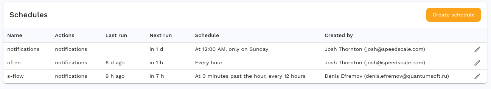
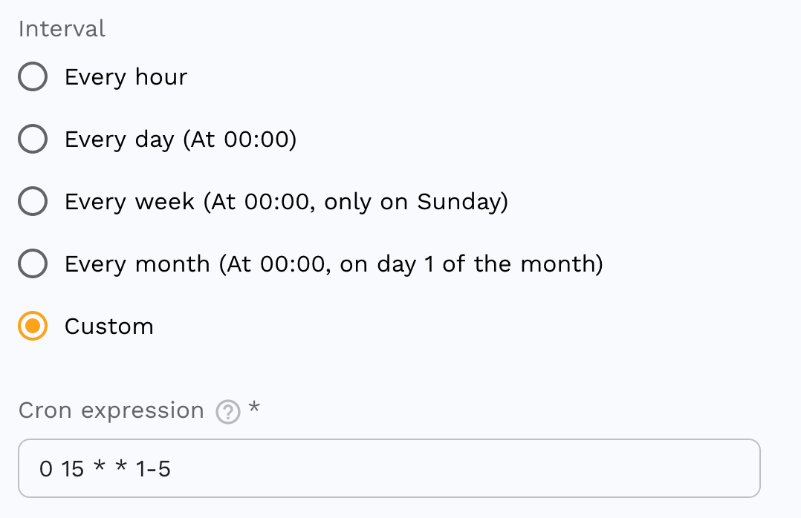

# Schedules

Schedules provide a way to run Speedscale actions on a regular basis.  Actions like
creating a fresh snapshot from a running service or running a replay.  Running
replays on a schedule enables regular testing when running Speedscale inside
CI/CD is not feasible.

## Cron Expressions

Speedscale schedules use a
[cron expression](https://en.wikipedia.org/wiki/Cron) to define when the actions
should run, but there are several predefined intervals to get up and running
right away.

The cron expression here, `0 15 * * 1-5`, defines a schedule which will run every
day at 15:00 UTC, Monday through Friday.

Visit [crontab.guru](https://crontab.guru/) for help creating and
understanding cron expressions.

## Actions

There are several actions to choose from which can be re-ordered as necessary.

### Snapshot

Creates a fresh snapshot from a service running in your cluster. The service
must have recorded traffic during the window specified or the snapshot will fail.

### Replay

Runs a replay, generating a report, from an existing snapshot. The replay may
use an existing snapshot, or one created from a previous action.

### Sidecar

Ensures the Speedscale sidecar exists, or does not exist, on a workload running
in your cluster.  A workload must have the sidecar attached to capture traffic.
This action is useful for ensuring a workload is capturing traffic, or turning
capture on and off to capture for a schedule without capturing traffic
continuously.

:::info
The sidecar action asynchronously sends a command to add the sidecar to a
workload but does not wait for it to complete.  Traffic will also take up to 2
minutes to be visible in the Speedscale cloud after capture so it may be
necessary to use a Wait action after the sidecar action to achieve consistent
results.
:::

### Wait

Waits before advancing to the next action. This is useful for waiting for
traffic after ensuring a sidecar exists on a workload, or when some out of band
work is performed in between actions.

