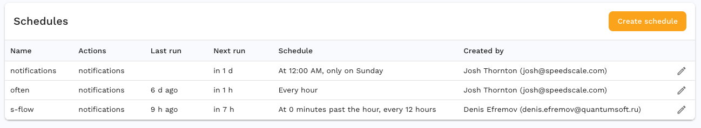
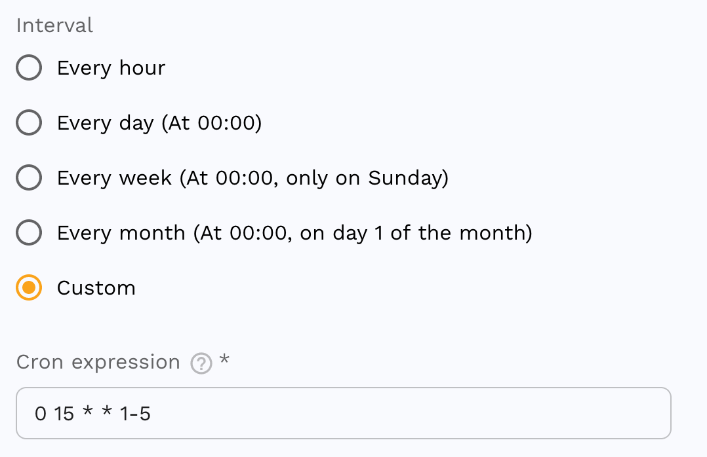

# Schedules

Schedules provide a way to run Speedscale actions on a regular basis.  Actions like
creating a fresh snapshot from a running service or running a replay.  Running
replays on a schedule enables regular testing when running Speedscale inside
CI/CD is not feasible.



## Cron Expressions

Speedscale schedules use a
[cron expression](https://en.wikipedia.org/wiki/Cron) to define when the actions
should run, but there are several predefined intervals to get up and running
right away.



The cron expression here, `0 15 * * 1-5`, defines a schedule which will run every
day at 15:00 UTC, Monday through Friday.

Visit [crontab.guru](https://crontab.guru/) for help creating and
understanding cron expressions.

## Actions

There are several actions to choose from which can be re-ordered as necessary.

### Snapshot

Creates a fresh snapshot from a service running in your cluster. The service
must have recorded traffic during the window specified or the snapshot will fail.

### Replay

Runs a replay, generating a report, from an existing snapshot. The replay may
use an existing snapshot, or one created from a previous action.

### Sidecar

Ensures the Speedscale sidecar exists, or does not exist, on a workload running
in your cluster.  A workload must have the sidecar attached to capture traffic.
This action is useful for ensuring a workload is capturing traffic, or turning
capture on and off to capture for a schedule without capturing traffic
continuously.

:::info
The sidecar action asynchronously sends a command to add the sidecar to a
workload but does not wait for it to complete.  Traffic will also take up to 2
minutes to be visible in the Speedscale cloud after capture so it may be
necessary to use a Wait action after the sidecar action to achieve consistent
results.
:::

### Wait

Waits before advancing to the next action. This is useful for waiting for
traffic after ensuring a sidecar exists on a workload, or when some out of band
work is performed in between actions.

### Notify

Sends a notification when the action is reached during execution. Place this
action anywhere in the sequence — for example, at the end to report the overall
outcome, or immediately after a replay to alert on test failures.

#### Trigger conditions

| Trigger | When it fires |
|---------|---------------|
| **Always** (default) | Every time the action is reached, regardless of prior results |
| **On failure** | Only when at least one earlier action in the job recorded an error |
| **On success** | Only when all earlier actions completed without error |

#### Channels

**Webhook** sends an HTTP POST to a URL you provide. By default the request
body is a structured JSON object:

```json
{
  "job_id": "my-job",
  "job_description": "Nightly regression",
  "execution_id": "3f7a...",
  "start_time": "2024-05-01T15:00:00Z",
  "status": "failure",
  "failed_tasks": [
    { "index": 1, "message": "Error: report completed with errors: [timeout]" }
  ],
  "snapshot_id": "abc123",
  "report_id": "def456",
  "schedule_url": "https://app.speedscale.com/schedules/my-job",
  "report_url": "https://app.speedscale.com/reports/def456"
}
```

To pass additional headers (for example, an authorization token) use the
**Headers** field when configuring the action.

#### Message template

Some services — including Slack — require a specific JSON shape and will reject
the default payload. Set the **Message template** field to a
[Go template](https://pkg.go.dev/text/template) string; when present the
request body becomes `{"text": "<rendered>"}` instead.

Available template variables:

| Variable | Description |
|----------|-------------|
| `{{.JobID}}` | Schedule ID |
| `{{.JobDescription}}` | Schedule description |
| `{{.ExecutionID}}` | Unique ID for this run |
| `{{.StartTime}}` | Execution start time (UTC) |
| `{{.Status}}` | `success` or `failure` |
| `{{.FailedTasks}}` | Slice of failed actions; each has `.Index` and `.Message` |
| `{{.SnapshotID}}` | ID of the most recent snapshot created in this run |
| `{{.ReportID}}` | ID of the most recent replay report created in this run |
| `{{.ScheduleURL}}` | Link to this schedule in the Speedscale dashboard |
| `{{.ReportURL}}` | Link to the most recent replay report in the dashboard |

#### Slack

1. [Create a Slack incoming webhook](https://api.slack.com/messaging/webhooks)
   for the channel you want to post to and copy the webhook URL.
2. Paste the URL into the **URL** field.
3. Set **Message template** to a string such as:

   ```
   *{{.JobID}}* finished with status *{{.Status}}*
   Started: {{.StartTime}}
   Schedule: {{.ScheduleURL}}{{if .ReportURL}}
   Report: {{.ReportURL}}{{end}}
   ```

   The dashboard's **Use Slack default** button pre-fills this template for you.

   For failure details you can iterate over `FailedTasks`:

   ```
   *{{.JobID}}* failed — {{range .FailedTasks}}task {{.Index}}: {{.Message}} {{end}}
   ```

Slack validates that the posted JSON contains a `text` field and returns
`400 no_text` without one, so the Message template field is required when
posting to Slack.

**Email** support is coming in a future release.

:::tip
Combine the Notify action with **On failure** and `continue_on_failure` enabled
to get an alert any time a scheduled replay misses its goals without stopping
the rest of the job.
:::


