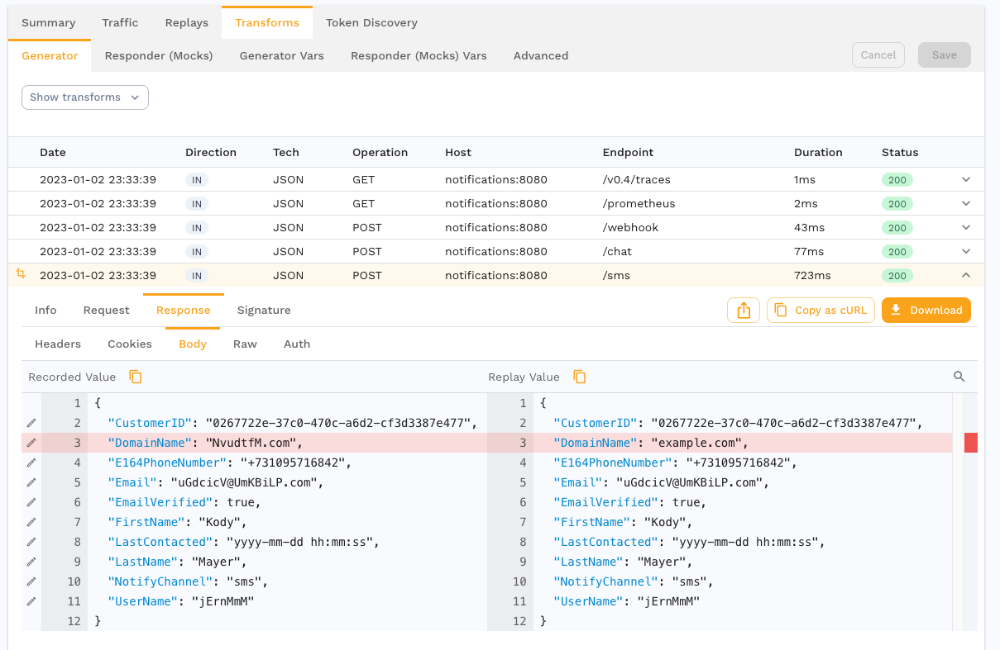
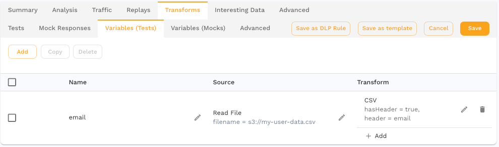

# Transforms

<iframe src="https://player.vimeo.com/video/918429952?h=44c28051e7" width="640" height="582" frameborder="0" allow="autoplay; fullscreen; picture-in-picture" allowfullscreen></iframe>
<p><a href="https://vimeo.com/918429952">Stop scripting and use AI</a> from <a href="https://vimeo.com/speedscale">Speedscale</a> on <a href="https://vimeo.com">Vimeo</a>.</p>

Automatically modify traffic before it is replayed.

### Basic Principles

In order to replay properly, most apps require traffic to contain up to date JWTs, timestamps and more. Speedscale provides a general purpose data transformation system very similar to Unix pipes for this purpose.


First, data is extracted from the RRPair using an **Extractor**. For example, an extractor might pull the value of a particular HTTP header in an request. Extractors always produce a string that can be further transformed. The extracted string is called a **token** throughout this documentation.

Next, the token is mutated or further isolated using a **Transform**. Transforms can do simple things like change the data to a hard coded text value. They can also do more complex things like parse and shift a date or insert a value selectively like a switch statement in a programming language. Transforms are always executed sequentially.

Transforms also have a data cache where **variables** can be stored. Variables function as named short term storage for the life of the request, just like in a programming language hashmap.

Last, the transformed data is re-inserted into the RRPair in exactly the same location. Each transform runs in reverse order to re-encode the new **token** and place it back in its correct place.


### Where to Transform Traffic

Modify traffic and see the effects with the transform editor.



Data can be transformed at several points during a replay:

- **generator**
  - **RRPair request** - modify data before the generator sends it to the service under test (SUT)
  - **RRPair response** - extract data from the response the generator receives from the SUT
- **responder**
  - **RRPair request** - modify a request received by the responder before attempting to pattern match a response
  - **RRPair response** - modify captured response data before the responder sends it back to the SUT

Variable caches store data extracted from traffic in one location and apply it in another:



- **Variables (Tests)** - used to pre-load the variable cache when the generator starts up
- **Variables (Mocks)** - used to pre-load the variable cache when the responder starts up

:::note
Test variables are scoped to the [vUser](/reference/glossary.md#vuser). For example, a random string variable would be new and different for each VU, but the same for all requests within the same VU.
:::

How can the request and response both use the same transforms? Because each transform chain starts with an extractor that specifically targets the request or the response. In the generator, that means if the extractor references the HTTP Request Body, then the request will be modified before it is sent to the SUT. If an HTTP Request Body is extracted in a responder chain, then the request is modified before signature matching (response lookup) is run.

A complete set of traffic transformation configuration is stored as a Traffic Transform Template (TTT). You can view and edit these in the main [UI](https://app.speedscale.com/trafficTransforms). Although TTT's can be edited graphically, they are stored as JSONs for easy portability.  The JSON structure is fairly straightforward:

```json
{
  "id": "sample_transforms",
  "generator": [
    {
      "extractor": {
        "type": "http_req_body"
      },
      "transforms": [
        {
          "type": "json_path",
          "config": {
            "path": "UserName"
          }
        },
        {
          "type": "one_of",
          "config": {
            "options": "ken,liz,mike",
            "strategy": "sequential"
          }
        }
      ]
    }
  ],
  "generatorVariables": [
  ],
  "responder": [
  ],
  "responderVariables": [
  ]
}
```

The id must be unique for your tenant. Each top level section (generator, responder, etc) follows the same internal format.  A single "extractor" must be defined and then an array of transforms that will be run sequentially.
