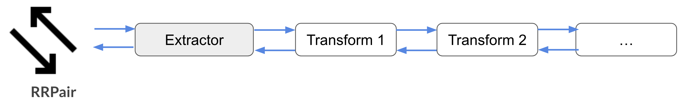

# Transforms

Automatically modify traffic before it is replayed.

### Structure

In order to replay properly, most apps require traffic to contain up to date JWTs, timestamps and more. Speedscale provides a general purpose data transformation system very similar to Unix pipes for this purpose.

First, data is extracted from the RRPair using an **Extractor**. For example, an extractor might pull the value of a particular HTTP header in an request. Extractors always produce a string that can be further transformed. The extracted string is called a **token** throughout this documentation.

Next, the token is mutated or further isolated using a **Transform**. Transforms can do simple things like change the data to a hard coded text value. They can also do more complex things like parse and shift a date or insert a value selectively like a switch statement in a programming language. Transforms are always executed sequentially.

Transforms also have a data cache where **variables** can be stored. Variables function as named short term storage for the life of the request, just like in a programming language hashmap.

Last, the transformed data is re-inserted into the RRPair in exactly the same location. Each transform runs in reverse order to re-encode the new **token** and place it back in its correct place.

### Example

As an example, let's assume we need to shift the date in an HTTP header. We would extract that header and apply a date offset. This is a complete transform chain.

For a second example, let's extract part of the request body and change a JSON key. That would also be a complete transform chain.