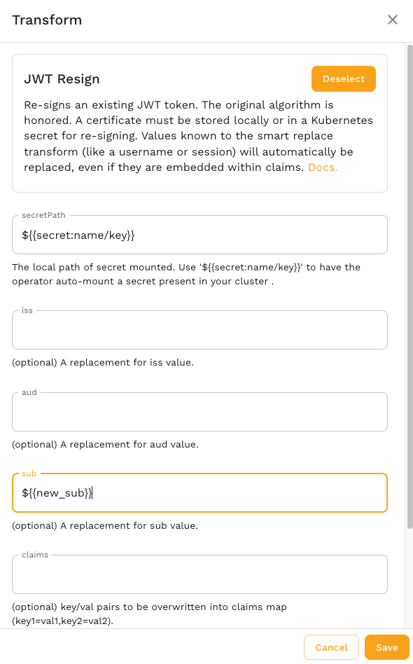

# Variables

Variable scoping in Speedscale's transform system addresses the accessibility and lifetime of variables within the generator and responder. Here’s an overview of how variables work in Speedscale and how they are scoped.

## Variable Store

Variables can be thought of as a large hash map of key=value pairs. Once set, they can be retrieved and modified using a set of transforms including:

- **[var_store](../reference/transform-traffic/transforms/variable_store.md)** - Assign a new value to a variable
- **[var_load](../reference/transform-traffic/transforms/variable_store.md)** - Replace current value with the value of a variable

This is the simplest way to interact with the variable storage system, but not necessarily the most powerful. Keep in mind that the smart [replace](../reference/transform-traffic/transforms/smart_replace.md) transforms are independent of the variable cache and changes made in one will not be reflected in the other. Variables are for custom use cases. Smart replace is for more automated use cases and is a better starting place for most users.

## Scope

Variables are scoped to the current vUser or "thread" within the load generator. When the vUser completes, the variable cache is reset. This is similar to how many front end load testing tools work. If you need more of a "global replace" functionality you should try Smart Replace instead.

## Embedded

Variable values can be embedded within other transforms by using the following format:

```
${{variable1}}
```

This string will be replaced with the value of that variable (if known) wherever it is found in the transform configuration. For example, you may want to embed a variable inside of another constant to produce the result `new_value=<some new value from variable 1>`:


This also works inside of configuration fields in other transforms, like `jwt_resign`:



By understanding these scoping rules, engineers using the Speedscale transform system can effectively replicate some aspects of scripting languages.