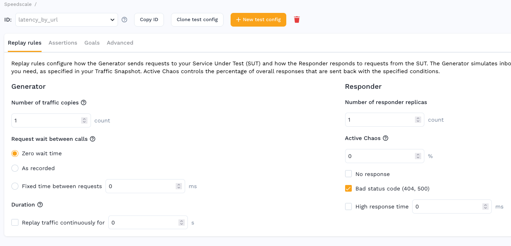

# Replay Rules



## Generator

This section controls the behavior of the Speedscale load generator.

**Number of traffic copies** - Determines how many replicas of the traffic the generator will start concurrently. This is similar to the vUser setting in a traditional testing tool but not exactly because a single traffic recording could have multiple users.

Request wait between calls:

1. **Zero wait time** - calls will be sent as fast as possible with no artifical delay
2. **As recorded** - calls will be made with the same delay as observed in the real traffic (note: long snapshots will take a long time to run)
3. **Fixed time between requests** - each request will be sent the specified number of milliseconds after the last response is received

Duration:

**Replay traffic continuously** - keeps the generator running the same traffic over and over for the specified timeframe

## Responder

This section controls how the automatic mocking system (responders) will respond to requests sent from the service under test.

### Active Chaos

The Speedscale Responder can be configured to provide API request-level chaos
responses. This is complimentary to traditional infrastructure chaos
engineering because instead of breaking entire components, the application
resiliency is tested for a single bad or slow response.

Three kinds of chaos are currently available:
1. **No Response** - the responder will provide no response and allow the app to timeout waiting
2. **Bad status code (404, 500)** - the responder will provide a 404 or 500 response instead of the correct status code
3. **High response time** - the responder will respond correctly, but after a specified duration

Chaos, by definition, is random but we allow you to configure how frequently
bad responses will be sent. Set the **Active Chaos** parameter to determine the
probability of the app receiving a bad response. For example, if the Active
Chaos is set to 100% all mock responses will experience some kind of chaos. If
Active Chaos is set to 0%, no bad responses will be sent.

The responder rotates through each type of bad response that is selected. For
instance, if Active Chaos is set to 50% and all three options are checked (No
response, Bad status code and High response time) then the app will receive
roughly 16.6% No Response, 16.6% Bad status code and 16.6% High response time
(16.6+16.6+16.6 = 50%).

## JSON

The UI provides a nice experience, but test configs are represented with simple JSON and accessible via `speedctl`.

Let's look at some sample test config JSON and associated values.

```
{
  "id": "sample",
  "chaos": {
    "chaosPercent": 10,
    "badStatusCodes": true,
    "randomLatency": true,
    "randomHighLatencyFactor": 3,
    "randomHighlatencyMs": 5000
  },
  "generator": {
    "numReplicas": 1,
    "replicaDelay": 50,
    "requestTiming" "FLAT",
    "runDuration": 5m
  },
  "assertionGroups": [
    {
      "configs": [
        {
          "type": "httpStatusCode"
        }
      ]
    },
    {
      "configs": [
        {
          "type": "httpHeaders"
        }
      ]
    },
    {
      "configs": [
        {
          "type": "httpResponseCookies"
        }
      ]
    }
  ],
  "rules": [
    {
      "metricName": "avgLatency",
      "type": "TOO_HIGH",
      "value": 100,
      "action": "ALERT",
    },
    {
      "metricName": "p95Latency",
      "value": 500,
      "action": "ALERT",
      "location": "/orders"
    },
    {
      "metricName": "p99Latency",
      "value": 750,
      "action": "ALERT",
      "location": "/users"
    },
  ],
  "version": 2,
  "responder": {
    "numReplicas": 1
  }
}
```

Let's discuss what goes in each section:

### `id`

A common identifier for the test config.

### `chaos`

Chaos configuration for adding gremlins to your replay.  These settings affect responder traffic from your "mocked" dependencies.

- `chaosPercent` - The percentage of responses the chaos settings affect
- `badStatusCodes` - Inject bad status codes like 404 and 500 into responses
- `randomLatency` - Add random latency to the response
- `randomHighLatencyFactor` - Scale the latency factor
- `randomHighlatencyMs` - Milliseconds of latency to inject

### `generator`

Configuration to control how the generator process creates load with your recorded traffic

- `numReplicas` - The number of "virtual users" to run, with each virtual user replaying a full copy of the snapshot traffic
- `replicaDelay` - Amount of time, in milliseconds, to wait in between starting each virtual user
- `requestTiming` - One of "NONE", "FLAT", "RECORDED", or "MULTIPLE" to set the delay pattern between virtual user requests
- `flatRequestDelay` - Milliseconds to wait between virtual user requests when the requestTiming is "FLAT"
- `requestTimeoutSeconds` - Maximum number of seconds to wait for a virtual user request to complete
- `runDuration` - When set, the replay will cycle through snapshot traffic for this period of time

### `responder`

Configuration to control how the responder creates "mock" instances of your dependencies.

### `assertionGroups`

Configuration for various "asserters" which validate replay traffic against the
original traffic.  The various asserters are disussed in subsequent sections.

### `rules`

Rules or "goals" to determine whether a replay has passed or failed.

- `metricName` - Name of the metric to validate
- `value` - Threshold for the alert rule
- `type` - One of "TOO_HIGH" or "TOO_LOW" determines how to evaluate the value, whith "TOO_HIGH" meaning the rule will trigger if the observed value is higher than the set value
- `action` - Action taken on failure
- `location` - An optional URI location limits the rule evaluation to specific requests

