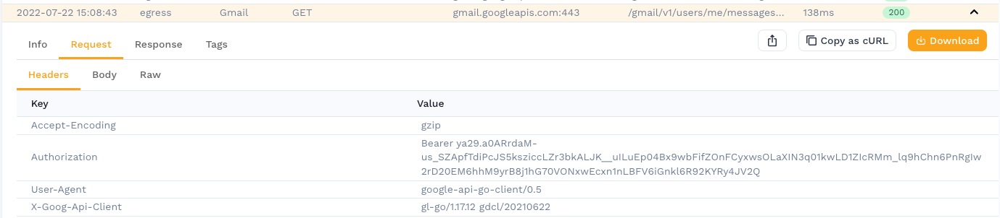
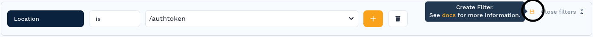

# Guide: Signing JWTs

When replaying traffic, it is important to re-sign JWTs that have expired so that the application accepts these new calls. If you are seeing 401 or 403 errors during replay, that is a strong indicator you need to re-sign your JWTs.

#### Before you begin

* Find the location of the secret or certificate used to sign the JWTs in your Kubernetes cluster. The Speedscale Generator and your application must both use this secret for re-signing to work.

#### Identify and filter transactions that need re-signing

:::note
If you already have your traffic selected, just open the snapshot, click View Traffic, and skip to step 3.
:::
1. Open the traffic viewer and isolate the traffic that needs JWT resigning.



JWT tokens are stored in the `Authorization` HTTP request header. The token itself is prefixed with `Bearer `.

2. Create a filter for the transactions containing JWT tokens. For this example, you would click on the magnifying glass next to the location to capture all transactions for endpoint `/authtoken`. There will be more than one so don't define your filter too narrowly.


3. Store the filter for later use by clicking the Save button in the top right of the filter pane. Give it a unique name.



4. Click the `Advanced` tab to see the raw filter JSON. Copy it to the clipboard, we will be pasting it in a couple steps.

#### Create a traffic transform rule

1. Create a new [Traffic Transform](https://app.speedscale.com/trafficTransforms)
2. Edit the JSON and change the `id` string to a unique name that you will remember (no spaces)
3. Paste your traffic filter into your new transform and modify it to fit in the "generator->filters->filters" section as shown below
4. Replace `/home/speedscale/secret/secret_name/key` with the name of the secret from your kubernetes cluster and the key you want to use within that secret. As a reminder, secrets are stored in Kubernetes as key/value pairs so you must specify both the secret name and the key.

As an example, let's assume we have a secret like the one below:
```
$ kubectl get secret secret_name -o yaml

apiVersion: v1
data:
  key: S3ViZXJuZXRlc1JvY2tzIQ==
kind: Secret
metadata:
  annotations:
    kubectl.kubernetes.io/last-applied-configuration: |
      {"apiVersion":"v1","data":{"key":"S3ViZXJuZXRlc1JvY2tzIQ=="},"kind":"Secret","metadata":{"annotations":{},"name":"secret_name","namespace":"demo"},"type":"Opaque"}
  creationTimestamp: "2022-07-28T23:33:29Z"
  name: secret_name
  namespace: default
  resourceVersion: "470465"
  uid: f4924324-88ea-43b3-9f17-18bb63a5e4c9
type: Opaque
```

That would yield a transform configuration like the below:
```
{
  "id": "standard_jwt",
  "generator": [
    {
      "filters": {
        "filters": [
          {
            "include": true,
            "detectedLocation": "/authtoken"
          }
        ]
      },
      "extractor": {
        "type": "http_req_header",
        "config": {
          "name": "Authorization"
        }
      },
      "transforms": [
        {
          "type": "http_auth",
          "config": {
            "secret": "/home/speedscale/secret/secret_name/key"
          }
        }
      ]
    }
  ]
}
```

#### Apply transform to your snapshot

Next time you create a snapshot, use `standard_jwt` as the transform configuration. This will tell the generator to utilize the secret during replay. If you already have a snapshot then copy/paste the above transform configuration into your snapshot transform configuration JSON section and reanalyze. This can be done from the Snapshot Summary page for your snapshot.

#### Replay with secrets mounted

If you are using the operator to manage replays you must instruct it to mount the secret used for re-signing the JWT token to the generator pod. Accomplish this by adding the `replay.speedscale.com/secrets` annotation to your workload while initiating replay. For example, your complete replay annotations may look something like the following:

```
    replay.speedscale.com/snapshot-id: "a125995c-e8d8-4c8b-ae31-b70a48e78052"
    replay.speedscale.com/testconfig-id: "standard"
    replay.speedscale.com/cleanup: "inventory"
    sidecar.speedscale.com/inject: "true"
    replay.speedscale.com/secrets: "secret_name"
```

If you need mulitple secrets, then seperate them with commas (no spaces). For example, the value of `replay.speedscale.com/secrets` would change to `secret_name,secret2,secret3`.
