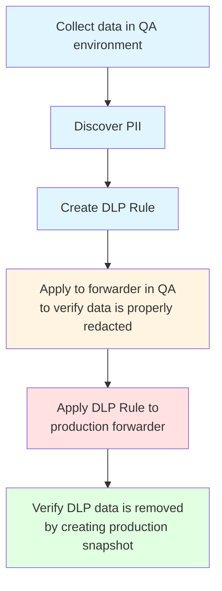

# Applying Rules to Production

Once you've created DLP rules from recommendations, the next step is to apply them to forwarders in your production environment. This enables real-time data redaction before traffic reaches Speedscale's cloud storage.

## Overview of Production Application

Applying DLP rules to production forwarders:

- **Real-Time Protection**: Redacts PII as traffic flows through forwarders
- **No Application Changes**: Works without modifying application code
- **Immediate Effect**: Rules take effect immediately after application
- **Reversible**: Rules can be removed or changed at any time

### DLP Workflow

This page covers steps 4-6 of the DLP workflow:

### Production vs. Test Environment Considerations

Before applying rules to production:

- **Test First**: Test rules in staging/test environments first
- **Gradual Rollout**: Consider gradual rollout to production
- **Monitor Performance**: Monitor performance impact
- **Validate Redaction**: Verify redaction is working correctly

### Safety and Validation Steps

Before applying:

1. **Review Rules**: Carefully review rule configuration
2. **Test in Staging**: Test rules in staging environment
3. **Validate Filters**: Ensure filters are correct and not too broad
4. **Check Performance**: Verify performance impact is acceptable
5. **Plan Rollback**: Have a rollback plan ready

## Accessing Infrastructure Configuration

### Navigating to Infrastructure Tab

1. **Open Speedscale Dashboard**: Log into Speedscale
2. **Navigate to Infrastructure**: Click on "Infrastructure" in the main navigation
3. **Select Cluster**: Choose the cluster containing your forwarders
4. **View Forwarders**: See list of forwarders in the cluster

### Infrastructure Overview

The Infrastructure section shows:

- **Clusters**: List of Kubernetes clusters
- **Forwarders**: Forwarders in each cluster
- **Workloads**: Workloads monitored by forwarders
- **Configuration**: Forwarder configurations

### Understanding Forwarders

Forwarders are components that:

- **Capture Traffic**: Intercept traffic from your applications
- **Apply Rules**: Apply DLP rules to redact data
- **Forward Traffic**: Forward redacted traffic to Speedscale cloud
- **Monitor Health**: Report forwarder health and status

## Applying DLP Rules to Forwarders

To apply DLP rules to forwarders, follow these high-level steps:

1. **Select a Forwarder**: Navigate to the Infrastructure section, select the cluster, and choose the forwarder where you want to apply the DLP rule. Verify the forwarder is healthy before proceeding.

2. **Configure DLP Rule Assignment**: Open the forwarder configuration and locate the `SPEEDSCALE_DLP_CONFIG` setting. Select the DLP rule from the dropdown menu and save the configuration.

3. **Verify Rule Application**: After applying the rule, verify that the configuration is active and the forwarder is using the rule. Send test traffic to confirm that PII is being properly redacted.

## DLP Rule Scope and Filtering

### Filter Criteria in Transform Chains

#### How Filters Work

Filters in transform chains determine:

- **Which RRPairs**: Which request/response pairs are processed
- **Processing Scope**: Scope of rule application
- **Performance Impact**: How many RRPairs are processed
- **Precision**: How precisely rules target specific traffic

#### Filter Expression Syntax

Filters use expressions like:

- **Equality**: `service="payment-service"`
- **Contains**: `endpoint CONTAINS "/api/users"`
- **Regex**: `header REGEX "Authorization.*Bearer"`
- **Combinations**: `service="api" AND method="POST"`

#### Filter Matching Logic

- **Exact Match**: Exact value matching
- **Pattern Match**: Pattern/regex matching
- **Case Sensitivity**: Case-sensitive or case-insensitive
- **Multiple Conditions**: AND/OR logic for multiple conditions

### Narrow Filtering for Performance

#### Why Narrow Filtering Matters

Narrow filters:

- **Reduce Processing**: Process fewer RRPairs
- **Improve Performance**: Lower performance overhead
- **Increase Precision**: More precise targeting
- **Reduce False Positives**: Fewer unintended redactions

#### Filter Optimization Strategies

Optimize filters by (ordered from least to most computationally expensive):

- **Specific Services**: Target specific services
- **Specific Endpoints**: Target specific endpoints
- **Specific Methods**: Target specific HTTP methods
- **Specific Headers**: Target specific headers

#### Performance Best Practices

- **Start Narrow**: Start with narrow filters
- **Measure Impact**: Measure performance impact
- **Widen Gradually**: Widen filters if needed
- **Monitor Continuously**: Monitor performance continuously

#### Filter Testing

Test filters:

- **Test Environment**: Test in test environment first
- **Sample Traffic**: Use sample traffic to test
- **Verify Matching**: Verify filters match expected traffic
- **Check Performance**: Measure performance impact

### Multiple Rules on Same Forwarder

#### Rule Precedence

When multiple rules apply:

- **Order Matters**: Rules are processed in order
- **First Match**: First matching rule takes precedence
- **No Overlap**: Avoid overlapping rules when possible
- **Clear Priority**: Define clear priority order

#### Rule Combination Strategies

- **Complementary Rules**: Use rules that complement each other
- **Service-Specific**: Different rules for different services
- **Endpoint-Specific**: Different rules for different endpoints
- **Layered Protection**: Layer rules for comprehensive coverage

#### Conflict Resolution

Handle conflicts:

- **Identify Conflicts**: Identify overlapping rules
- **Resolve Conflicts**: Resolve conflicts by adjusting filters
- **Test Resolution**: Test conflict resolution
- **Document**: Document rule relationships

## Next Steps

After applying rules to production:

- [Generating Test Data](./test-data-generation.md) - Create test data from redacted snapshots

## Related Documentation

- [Creating DLP Rules](./creating-rules.md) - Rule creation guide
- [Cluster Inspector](../observe/infra.md) - Infrastructure and forwarder configuration
