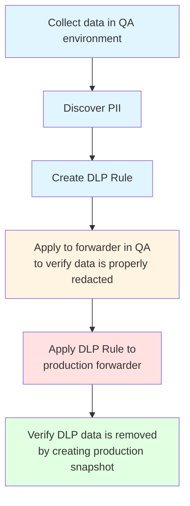

# Data Loss Prevention (DLP)

Welcome to the Data Loss Prevention (DLP) documentation. This guide will help you understand how to use Speedscale's DLP feature to automatically discover, mask, and manage Personally Identifiable Information (PII) and sensitive data in your API traffic.

## What You'll Learn

This documentation covers:

- **Setting up DLP** in your environment
- **Discovering PII** in test environments
- **Creating DLP rules** to protect production data
- **Applying rules** to production forwarders
- **Generating test data** from redacted snapshots
- **Best practices** and troubleshooting
- **Troubleshooting** common issues

## Quick Start

If you're new to DLP, follow these steps:

1. **[Introduction](./introduction.md)** - Understand what DLP is and why you need it
2. **[Discovering PII](./discovering-pii.md)** - Start discovering sensitive data in test environments

### DLP Workflow

## Documentation Structure

### Getting Started
- [Introduction to DLP](./introduction.md)

### Core Workflows
- [Discovering PII in Test Environment](./discovering-pii.md)
- [Understanding DLP Recommendations](./recommendations.md)
- [Creating DLP Rules](./creating-rules.md)
- [Applying Rules to Production](./applying-rules.md)
- [Generating Test Data](./test-data-generation.md)

### Advanced Topics
- [Best Practices](./best-practices.md)
- [Troubleshooting](./troubleshooting.md)

### Reference
- [CLI Reference](./cli-reference.md)

## Key Concepts

Before diving in, familiarize yourself with these key concepts:

- **DLP Rule**: A configuration that defines how data should be redacted and transformed
- **PII**: Personally Identifiable Information (email, SSN, credit card, etc.)
- **REDACTED Token**: A placeholder value that replaces PII in production traffic
- **Transform Chain**: A sequence of filters, extractors, and transforms that process data
- **Forwarder**: A component that forwards traffic to Speedscale cloud
- **Snapshot**: A captured set of API traffic at a point in time

## Need Help?

- Check the [Troubleshooting](./troubleshooting.md) section for common issues
