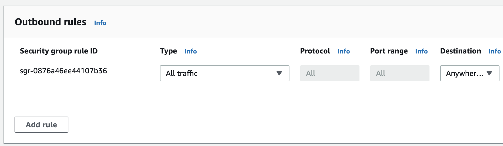
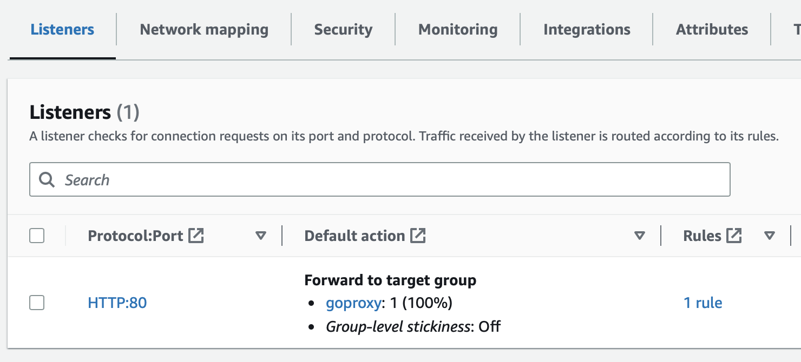

### Create a new target group/backend

We have an existing target group going to our app which serves on port `8080`. We're going to create a new one with identical settings, the only difference will be the port `4143`.

Make sure to configure the health check correctly, it should be identical to the existing one.

### Check the security groups

Make sure the security groups/firewall rules for the load balancer and the VM allow traffic to flow between them.

The inbound group for the EC2 should allow traffic on `4143`

The outbound group for the ALB should allow traffic out to `4143` as well

### Modify the listener

We have an existing listener where HTTP traffic is forwarded to our listener called `user` that hit our app directly. We're going to edit this so that the load balancer forwards traffic to our new target group.

That's it! Now all traffic will be forwarded to the Speedscale proxy and be available for analysis
