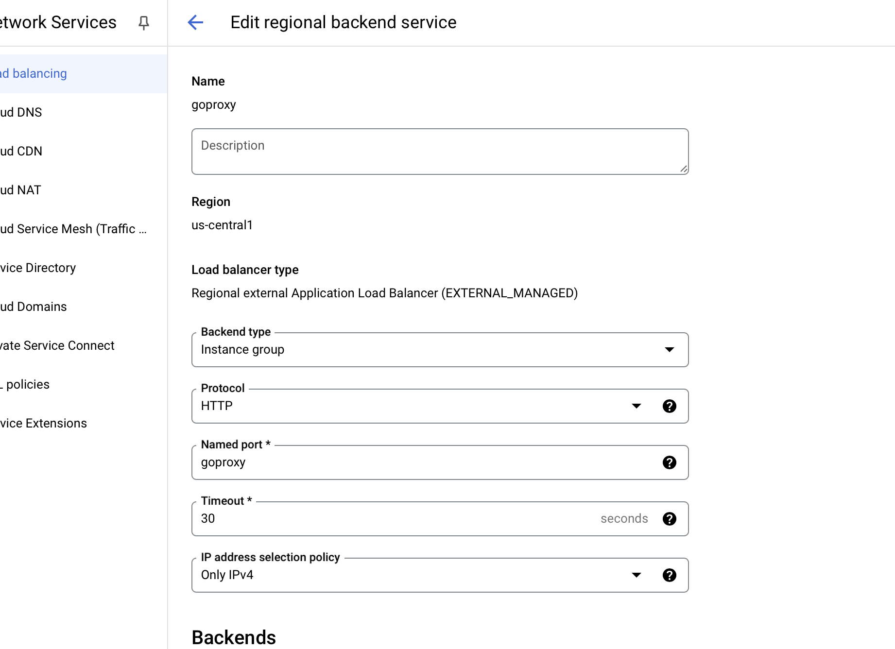

### Add a named port

We have an existing instance group going to our app with a defined port `8080`. We're going to add `4143` to our instance group for the proxy.

### Create a backend

Create a new backend which points to the instance group but with our new port.

### Modify the Load Balancer

We have an existing load balancer where HTTP traffic is forwarded to our original backend that hit our app directly. We're going to edit this so that the load balancer forwards traffic to our new target group.

That's it! Now all traffic will be forwarded to the Speedscale proxy and be available for analysis
