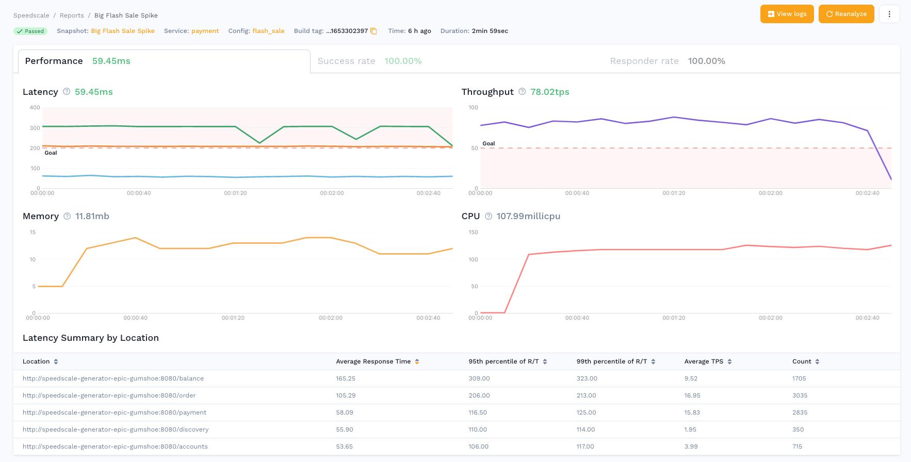

# Getting Started

You've got to start somewhere. Why not here?

For the first time in the space, Speedscale provides a modern way to develop, execute and scale API quality automation as fast as
releases take place. The old days of manually generating and maintaining load / chaos, smoke, and integration tests are gone.

Speedscale combines observability technology with cloud data warehouses to make test maintenance obsolete. The cost to generate
regression and performance validation suites is so low, you no longer edit/modify old tests -- you simply generate a new one.

Speedscale is a 3 part process: **Observe**, **Analyze**, and **Replay**.

### Observe 

In **Observe**, the Speedscale proxy (goproxy) picks up traffic in a late stage environment (eg. UAT, Staging, or even Production). The
environment is instrumented via Kubernetes sidecars or proxy servers, depending on your platform.

The proxy is picking up 2 things -- inbound traffic into your API, as well as outbound traffic to its dependencies and the resulting responses.
We do this so we can transform inbound requests into replayable test cases, and the backend requests/responses into mocked services to
stand in for the real systems during traffic replay.

The data we observe is being sent to Speedscale’s cloud data warehouse for storage and analysis.

Once you have Speedscale installed, [view your services](https://app.speedscale.com/).

### Analyze 

In the **Analyze** step, you peruse the historical data collected on a per-API basis. Users can explore this data and learn how a system really works.
The traffic is broken down into understandable components like requests and responses.

There are a variety of ways to filter and subset the data to find the really interesting traffic.

Once your application receives traffic, [view your traffic in Speedscale](https://app.speedscale.com/analyze)

### Replay 

In the **Replay** step, you replay your recorded application traffic back against your running application, like the same service on the version
that's about to be released to production! Speedscale can orchestrate the replay environment and run the replay test automatically.

But what if you don't want to make the same outbound requests to your database or another web service?  A responder can be used to stand in for
those dependencies during traffic replay, responding with your captured traffic.

Once you have run a replay, [view your test reports](https://app.speedscale.com/reports).

