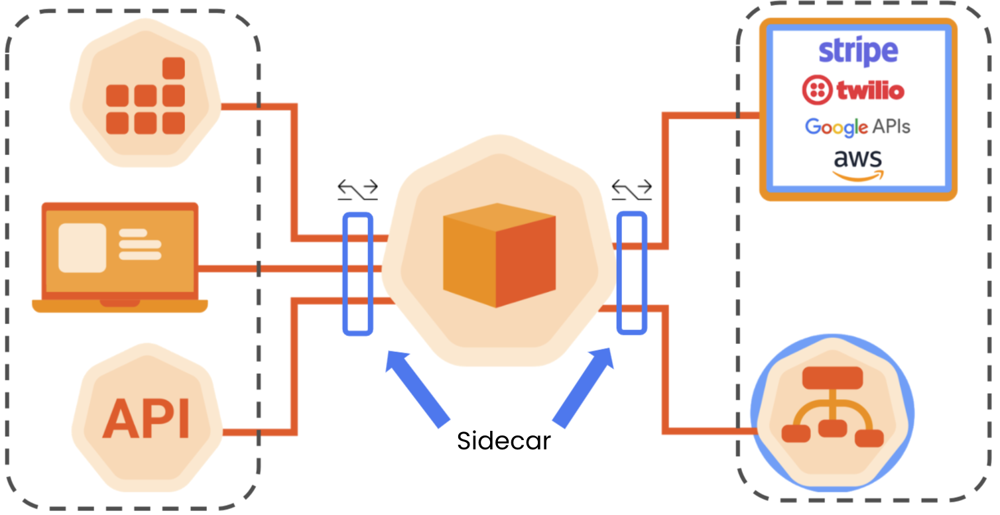
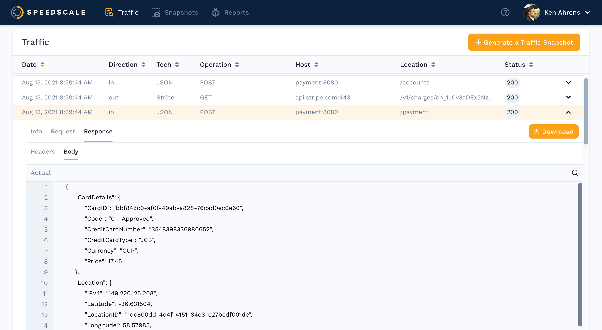
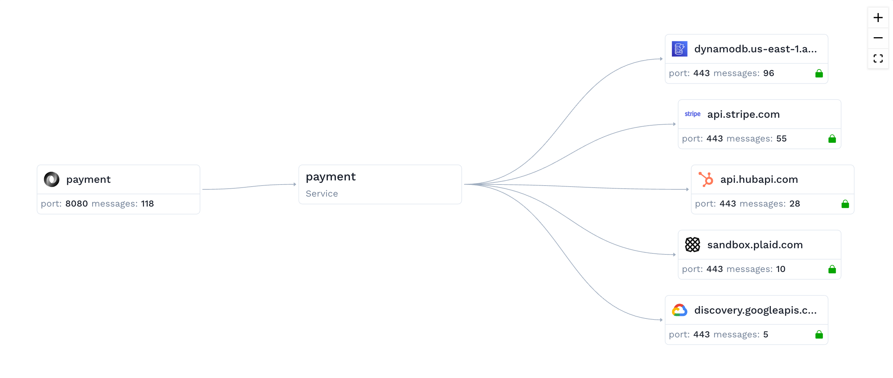
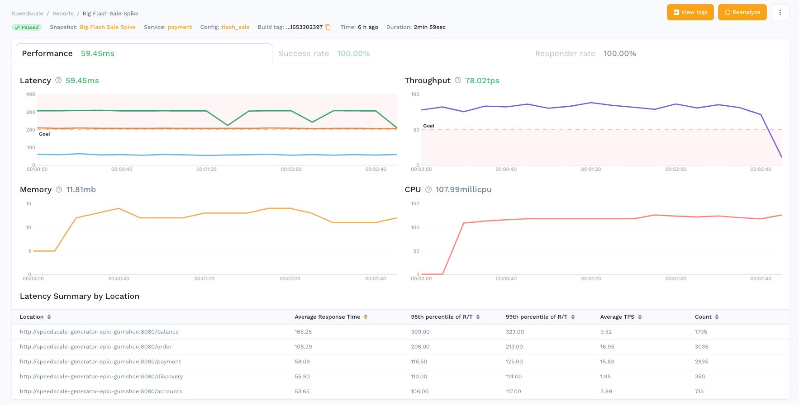

# Getting Started

Speedscale captures real API traffic from your running services and replays it against code changes before release. In Kubernetes environments, Speedscale can collect traffic with eBPF-based collection first and goproxy sidecars as a fallback, including encrypted traffic paths, so teams can validate behavior without rewriting services.

When proxy-based collection is needed, use proxymock for local workflows and goproxy for containerized workloads.

Use Speedscale if you need to:

- Reproduce production behavior in a controlled test environment
- Catch API regressions before merge or deploy
- Validate AI-generated code changes against real traffic patterns

Speedscale is different from static checks and synthetic-only tests because it validates runtime behavior using real request and response data.

## Security and data control options

Choose the operating model that matches your security requirements:

- **Local recording with proxymock:** For local workflows, proxymock keeps captured traffic on your machine by default and does not share traffic unless you explicitly authorize it. See [proxymock data and privacy](/proxymock/how-it-works/data_and_privacy/).
- **Bring Your Own Cloud (BYOC):** For enterprise cloud isolation, run Speedscale in your own cloud account and keep network and data boundaries under your control. See [Bring Your Own Cloud](/guides/byoc/).
- **Data Loss Prevention (DLP):** Redact sensitive fields before traffic leaves your network during ingest. See [DLP guides](/guides/dlp/) and [Data Protection](/security/data_protection/).

### AI Assistant

The fastest way to get started is the **AI assistant** on the home screen. Ask it questions in natural language — it can help you record traffic, find snapshots, run replays, and interpret results. See the [AI Chat Assistant guide](/guides/ai-assistant) for details on what it can do.

Speedscale follows a 3-part workflow: **Observe**, **Analyze**, and **Replay**.

### Observe 

In **Observe**, use eBPF collection first in late-stage containerized environments (for example UAT, staging, or production). If eBPF is not suitable, use goproxy sidecars. For local workflows outside Kubernetes, use proxymock for the same record/mock/replay pattern.

The proxy captures two data flows: inbound traffic to your API and outbound traffic to dependencies, including responses. This allows Speedscale to transform inbound requests into replayable tests and dependency traffic into mocked services for isolated replay.

Captured traffic is sent to Speedscale for storage and analysis.

Once you have Speedscale installed, [view your services](https://app.speedscale.com/).

### Analyze 

In **Analyze**, you inspect historical traffic by API to understand real system behavior. Traffic is broken into requests and responses so you can investigate normal and failure paths.

Use filters to isolate the specific traffic patterns you want to test.

Once your application receives traffic, [view your traffic in Speedscale](https://app.speedscale.com/analyze)

### Replay 

In **Replay**, you run recorded traffic against the candidate version of your service before release. Speedscale can orchestrate this replay environment and execute the run automatically.

If you do not want outbound calls to hit real dependencies during replay, use a responder to stand in for those systems with captured responses.

Once you have run a replay, [view your test reports](https://app.speedscale.com/reports).
