import Tabs from '@theme/Tabs';
import TabItem from '@theme/TabItem';

# Tutorial

<iframe src="https://player.vimeo.com/video/984892688?badge=0&amp;autopause=0&amp;player_id=0&amp;app_id=58479" width="640" height="582" frameborder="0" allow="autoplay; fullscreen; picture-in-picture" allowfullscreen></iframe>
<p><a href="https://vimeo.com/986454551">Speedscale Installation</a> from <a href="https://vimeo.com/speedscale">Speedscale</a> on <a href="https://vimeo.com">Vimeo</a>.</p>

In this guide we're going to use [this repo's](https://github.com/speedscale/demo) example app in the `java` directory to [capture](../concepts/capture.md), [transform](../concepts/transforms.md) and [replay](../concepts/replay.md) traffic with [mocks](../concepts/service_mocking.md).

## Prerequisites

1. CLI [speedctl is installed](./installation/install/cli.md)
2. CLI [proxymock is installed](../proxymock/getting-started/installation.md)
3. After installing CLI, `SPEEDSCALE_HOME` should be set correctly, if you don't see it run `proxymock init` again and allow it to update your rcfile.
4. Clone the repo: https://github.com/speedscale/demo
5. [Java](https://jdk.java.net/) is present and `JAVA_HOME` is set correctly (on MacOS you can run `/usr/libexec/java_home` to find the correct `JAVA_HOME`)
6. Install `jq` and `make` if not already on your desktop (`brew install jq` and `brew install make` on MacOS for example)

## The App

The app is a Java Spring Boot web server with authenticated endpoints that makes requests out to a few external services. The project README (at `java/README.md`) shows ways to run the app locally, in Docker and in Kubernetes. Speedscale can be configured to be compatible with whichever way you choose to deploy the app. Note that for this test run we'll disable DLP but you can find instructions on how to enable it near the end.

## Capture

Make sure you navigate to the `java` subdirectory within the `demo` repository.

<Tabs>

<TabItem value="Kubernetes">

1. [Install the operator](./quick-start.md#install-speedscale-operator-optional)
2. To deploy the demo app and sidecar, run:

```bash
make kube-capture
```

3. Validate the app was deployed properly with:

```bash
kubectl -n default get pods
```

Which should show `2/2` for the java-server pod indicating there are 2 containers (the application and the sidecar).

```bash
NAME                           READY   STATUS    RESTARTS   AGE
java-client-54ccddd5cd-tthld   1/1     Running   0          37s
java-server-597577977-bthvl    2/2     Running   0          37s
```

This should start generating traffic that you can see in the Speedscale UI within a couple of minutes.

</TabItem>

<TabItem value="Docker">

1. Generate a jks for the Java app:

```bash
docker run --rm -v ~/.speedscale/certs:/speedscale openjdk bash -c 'keytool -importcert -noprompt -cacerts  -storepass changeit  -alias speedscale -file  /speedscale/tls.crt && cp ${JAVA_HOME}/lib/security/cacerts /speedscale/cacerts.jks'
```

2. Run:

```bash
speedctl install
```

Choose the `Docker` option and then the `Capture` option (option 1). You can name the service anything you want, the default port setting of `8080` is necessary.

3. Run the following to bring up the Speedscale capture components:

```bash
docker compose --file speedscale-docker-capture.yaml up -d
```

4. Run in your current terminal window:

```bash
make compose-capture
```

5. Open a new terminal window and run:

```bash
make client-capture
```

This should start generating traffic that you can see in the Speedscale UI within a couple of minutes.

</TabItem>

<TabItem value="Local">

1. Generate local certs by running the following command (it should say "Certificate was added to keystore"):

```bash
proxymock certs --jks
```

2. Start the capture system with this command:

```bash
proxymock record --app-port 8080
```

3. Open another terminal window to run the `java-server` program:

```bash
make local-capture
```

4. Open a third terminal window to run the client application:

```bash
make client-capture
```

5. This will generate traffic, and you can view the traffic with this command:

```bash
proxymock inspect --in proxymock/recorded-YOUR_TIMESTAMP
```

6. If you want to push this data to Speedscale cloud you can with the command:

```bash
proxymock cloud push snapshot --in proxymock/recorded-YOUR_TIMESTAMP
```

</TabItem>

</Tabs>

## Analyze

<iframe src="https://player.vimeo.com/video/983558864" width="640" height="582" frameborder="0" allow="autoplay; fullscreen; picture-in-picture" allowfullscreen></iframe>
<p><a href="https://vimeo.com/983558864">Exploring Speedscale Traffic Viewer</a> from <a href="https://vimeo.com/speedscale">Speedscale</a> on <a href="https://vimeo.com">Vimeo</a>.</p>

After a few minutes you should be able to see your traffic in the [Speedscale dashboard](https://app.speedscale.com). Make sure to select the the same service name that you entered in `speedctl install` from the traffic dropdown. You should be able to see the inbound and outbound calls for this app as shown below.

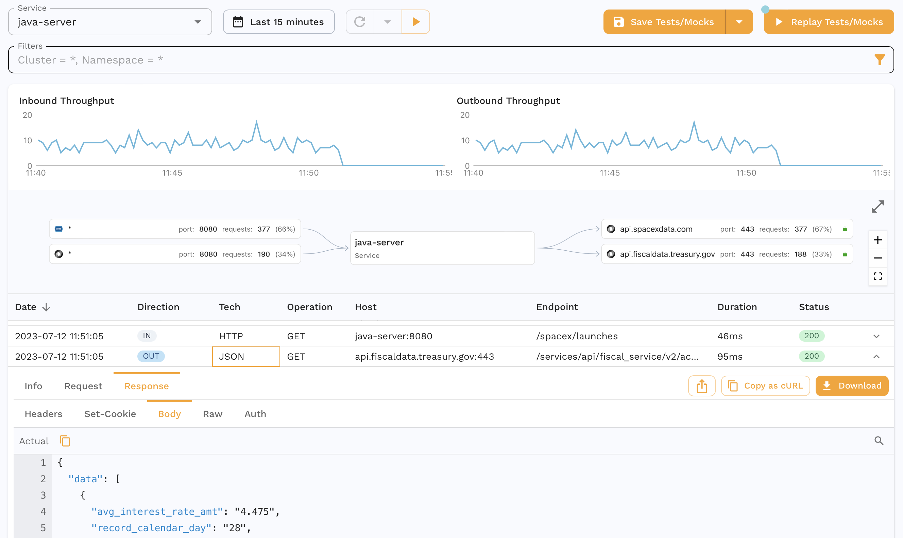

You can also drill down into specific requests-response pairs (RRPairs). For eg. we see the request we make to our app to get the max interest rate for treasuries.

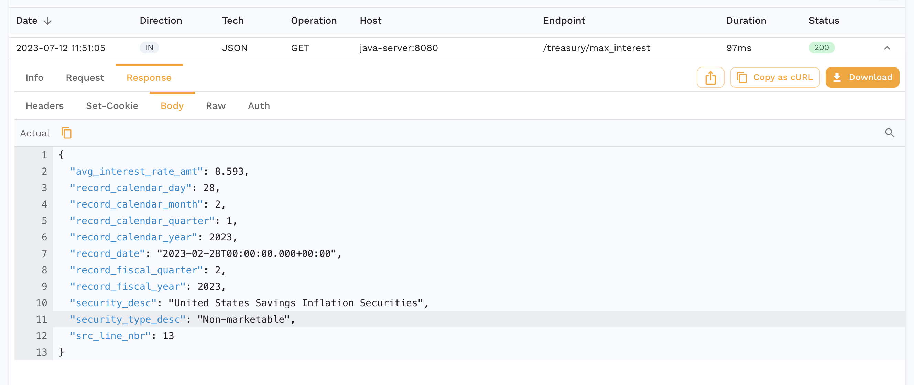

And we can also see the outbound request our app makes to the Treasury API to fulfill this request.

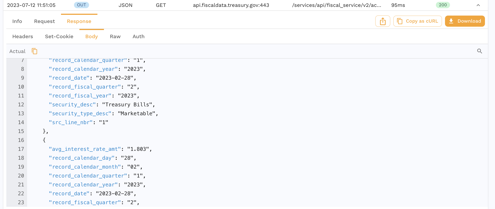

You can and inspect it further or you can skip ahead to running a replay which will also create a snapshot as a side effect.

## Replay

We're now going to run a replay for this captured traffic.

<Tabs>

<TabItem value="Kubernetes">

Click the `Replay as Tests/Mocks` button on the top right and walk through the wizard. All the default settings are ok here. You can also do this outside of the UI with more instructions [here](../guides/replay/kube.md).

</TabItem>

<TabItem value="Docker">

1. Click the `Save to Tests/Mocks` button in the top right. All the default settings are ok here. You can find more detailed instructions in the [Create a Snapshot](../guides/creating-a-snapshot.md) section.
2. Once you see the Snapshot summary, copy the snapshot ID from the URL or by clicking the `Copy Snapshot ID` option from the three dot menu.
3. Run:

```bash
speedctl install
```

Choose the `Docker` option and then `Replay` (option 3).

4. Select your service and the standard test config. Make sure you select the same service name you entered during the capture phase.
5. Input the Snapshot ID from step 1, the port should still be `8080`
6. Run in one terminal window:

```bash
make compose-replay
```

7. Run in another window to start the replay:

```bash
export TEST_REPORT_ID=$(uuidgen |  tr '[:upper:]' '[:lower:]'); docker compose --file speedscale-docker-replay.yaml up -d && echo "Your test report can be found at: https://app.speedscale.com/reports/${TEST_REPORT_ID}"
```

</TabItem>

<TabItem value="Local">

1. Click the `Save to Tests/Mocks` button in the top right. All the default settings are ok here. You can find more detailed instructions in the [Create a Snapshot](../guides/creating-a-snapshot.md) section.
2. Once you see the Snapshot summary, copy the snapshot ID from the URL or by clicking the `Copy Snapshot ID` option from the three dot menu.
3. This is how you run the application:

```bash
make local-replay
```

4. In another terminal window, download the modified snapshot locally with:
```bash
proxymock cloud pull snapshot SNAPSHOT_ID
```

5. Now you can run the mock server like so:
```bash
proxymock mock --in proxymock/snapshot-SNAPSHOT_ID
```

6. In a third terminal window, you can run the test replay:
```bash
proxymock replay --in proxymock/snapshot-SNAPSHOT_ID
```

</TabItem>

</Tabs>

## Making sense of a Replay

If you are already viewing the Snapshot you recorded, you can see your replay appear in the `Replay` tab. Alternatively, you can find a report for your Replay in the [dashboard](https://app.speedscale.com/reports). It should look something like this.

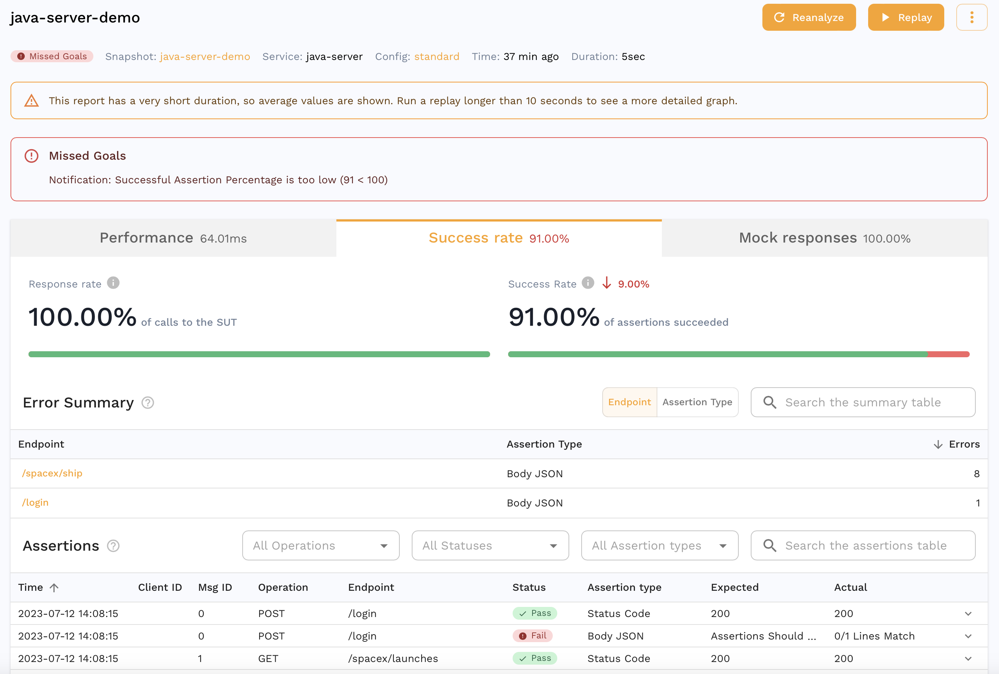

We can see that all the requests our app makes to third party APIs were mocked out with 100% accuracy. For eg. we can see the request our app made to the Treasury API that was actually mocked out which is great for isolation during tests but we can also do this for other parts of our development cycle as detailed [here](../guides/replay/mocks/README.md#responder-only).

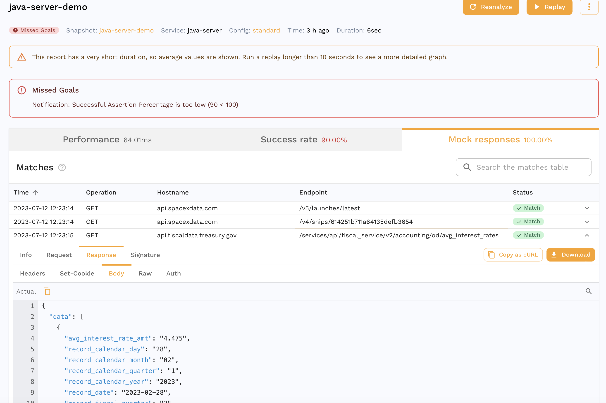

You can also see that the accuracy isn't 100%. We can drill down into a specific assertion to see why.

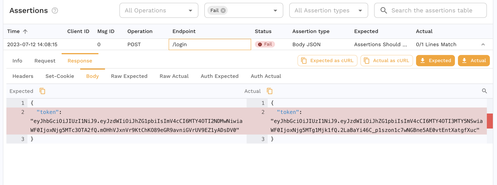

### Transform

The JWT we get from the login request is different which is expected. If we were replaying in a different environment, we might need different credentials entirely for the login request. Another pattern might be a set of traffic where we don't have a login request and instead we need to [resign the JWT](../guides/replay/resign-jwt.md) from our captured traffic. This is where [Transforms](../concepts/transforms.md) come into play and we can edit our captured data to parameterize parts of it. As an example, we can transform our snapshot to edit the password.

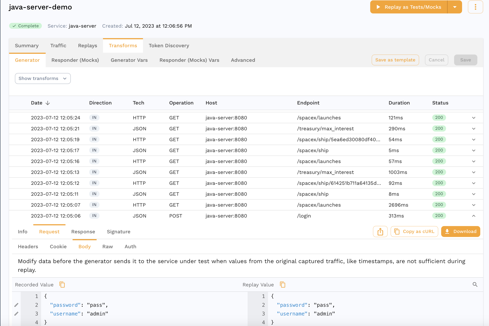

When you find the request in the transform editor, you can click the pencil icon next to the field you want to edit which in our case is the password.


For now we'll just replace it with a constant but there are all sorts of options that can be chained together.

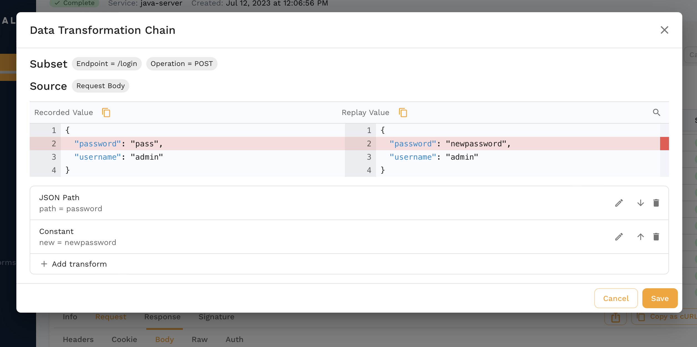

We just did a transform for the traffic coming into our app during a replay. We can also use transforms for mocks in case we have to parameterize fields like session ids, dates, etc. Check out [this guide](../guides/replay/mocks/edit-sig.md) for a deep dive.

### Assertions

Another assertion that failed in our report is for the `/spacex/ship` endpoint.

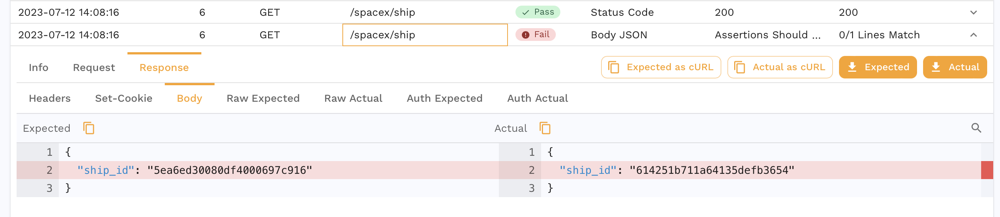

Our app returns a different ship ID every time we make a request so this is an expected failure. We can edit the test config for our Report to account for this.

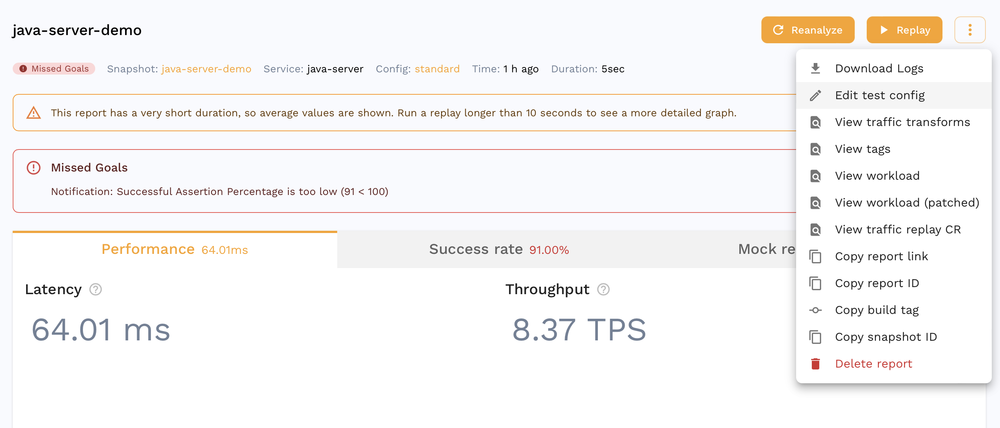

Click the pencil next to the `HTTP Response Body` assertion and we can add `ship_id` as a json path to ignore.

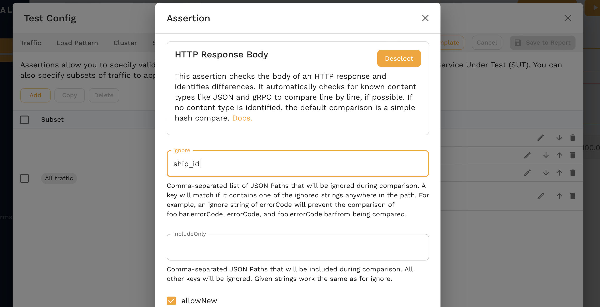

After saving, we can reanalyze the report and we see much better results!

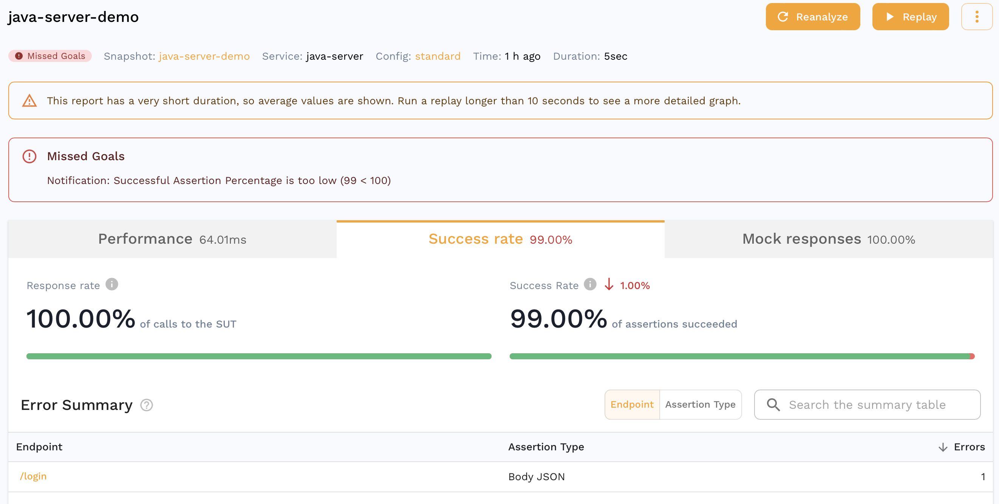

## Overview

In this demo we:

1. Captured some traffic
2. Analyzed it in the Traffic Viewer
3. Optionally configured DLP
4. Ran a replay and created a snapshot
5. Used auto generated mocks during the replay
6. Transformed some snapshot traffic
7. Edited the assertions
8. Reanalyzed the report for a higher accuracy

# Next Steps

This is just a small subset of things you can do with Speedscale, other things to try out could be:

1. Capture traffic from one of your own apps
2. [Replay traffic from one cluster into another](../guides/replay/guide_other_cluster.md)
3. [Run a load test](../guides/replay/load-test.md)
4. [Integrate with CI/CD](../guides/integrations/cicd/cicd.md)

## Uninstall

If you'd like to remove the demo from your environment follow these instructions:

<Tabs>

<TabItem value="Kubernetes">

```bash
make kube-clean
```

</TabItem>

<TabItem value="Docker">

```bash
docker compose -f speedscale-docker-capture.yaml down
```

</TabItem>

</Tabs>

### (Optional) Data loss Protection

If we drill down into a request, we can also see data we may not want to leave our environment.

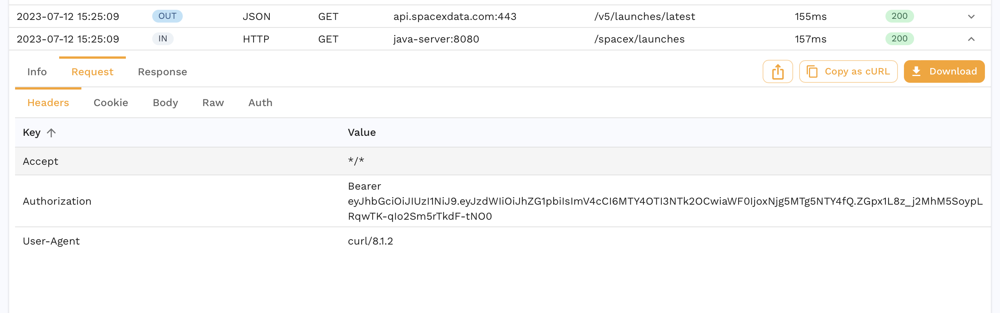

You can enable DLP to redact certain fields from an RRPair at capture time. Note that this will cause your replays to have low accuracies because necessary information will be masked. Check out the [dlp](https://docs.speedscale.com/guides/dlp/) section for more information on DLP configuration. As a starter, you cna follow the instructions below.

<Tabs>

<TabItem value="Kubernetes">

Run:

```bash
speedctl infra dlp enable
```

</TabItem>

<TabItem value="Docker">

Edit `speedscale-docker-capture.yaml` to add the following two environment variables.

```yaml
services:
  forwarder:
    environment:
      - SPEEDSCALE_REDACT=true
      - SPEEDSCALE_DLP_CONFIG=standard
```

</TabItem>

<TabItem value="Local">

When running `proxymock` the files are stored locally but don't run through data loss prevention.

</TabItem>

</Tabs>

Now we see the authorization header is redacted and never makes it to Speedscale.

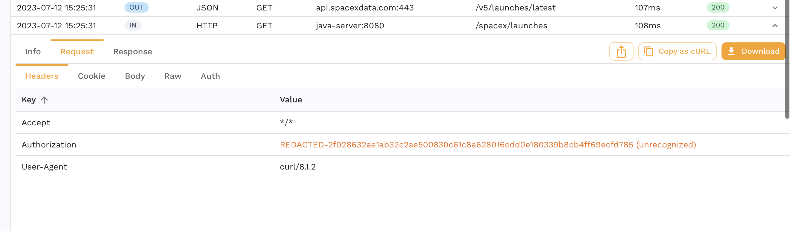

For more complex DLP configuration you can use [this guide](../guides/dlp.md).
