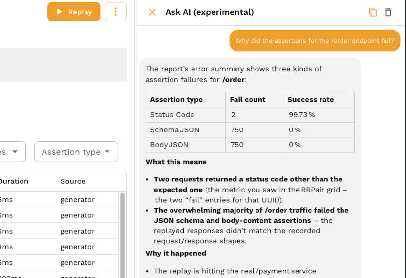

# AI Chat Assistant

The Speedscale AI assistant is a chat interface built into the dashboard that lets you interact with Speedscale using natural language. Instead of navigating menus and forms, you can ask the assistant to replay traffic, analyze reports, browse snapshots, configure tests, and search through captured requests.

## Where to Find It

The AI chat panel is on the home screen of the Speedscale dashboard. It's the first thing you see when you log in. You can also access it from the chat icon available throughout the dashboard.

The assistant shows suggested prompts to help you get started, and you can type any question in the input bar at the bottom.

## Context-Aware Assistance

The assistant knows what you're looking at. When you're on a report page, the assistant automatically has the report in scope, so you don't have to paste a report ID or describe what you're viewing. The same applies to snapshot pages, cluster views, and other parts of the dashboard.

This means you can ask direct questions like "Why did the assertions fail?" or "Is this ready to replay?" without any setup. The assistant picks up your current context from the page and uses it to give precise, relevant answers.

## What the Assistant Can Do

The assistant can take real actions on your behalf: searching traffic, analyzing reports, running replays, and navigating the dashboard. Here are just a few examples:

- **Find snapshots and traffic:** "Show me the latest snapshots for the payments service" or "Find all POST requests to `/api/orders` that returned a 500"
- **Analyze reports:** "Why did the assertions for the `/order` endpoint fail?" or "Give me an error summary for this report"
- **Debug mock misses:** "Why didn't this request match a mock?"
- **Check replay readiness:** "Is this snapshot ready to replay?"
- **Search logs:** "Show me errors in the operator logs"
- **Start replays:** "Replay snapshot `abc123` against the payments service"
- **Navigate:** "Take me to the most recent report for the checkout service"

## Tips for Effective Prompts

- **Be specific.** "Show me the latest report for the payments service" works better than "Show me reports."
- **Ask in context.** On a report or snapshot page, you can ask directly about what you're viewing without pasting IDs.
- **Ask follow-up questions.** The assistant remembers context within a conversation, so you can drill in: "Show me that report" then "What failed?" then "Show me the request that caused the first error."
- **Use natural language.** You don't need to know the exact API or filter syntax. Describe what you want in plain English.

## Limitations

- The assistant can read and query data, but destructive operations (deleting snapshots, removing clusters) require confirmation or are not available through chat.
- The assistant works with the data in your Speedscale tenant. It doesn't have access to your source code, CI/CD pipelines, or external systems.
- Response quality depends on the specificity of your prompt. Vague questions may produce vague answers.

## Privacy and Security

The AI assistant follows Speedscale's [AI governance policies](/security/ai):

- **Enterprise customers:** Your data is never shared between tenants or used for general model training.
- **Secure AI infrastructure:** All LLM processing runs on AWS Bedrock in a SOC 2 compliant environment. Customer data never leaves your hosted environment and is never sent to external providers like OpenAI or Anthropic.
- **Disable if needed:** The AI assistant can be turned off for your account by contacting Speedscale support.

## Feedback

If the assistant gives an incorrect answer, misunderstands your question, or could do something better:

- Use the feedback controls in the chat interface to rate responses
- Report issues on [Slack](https://slack.speedscale.com) or via [email](mailto:support@speedscale.com)

Your feedback directly improves the assistant for everyone.
