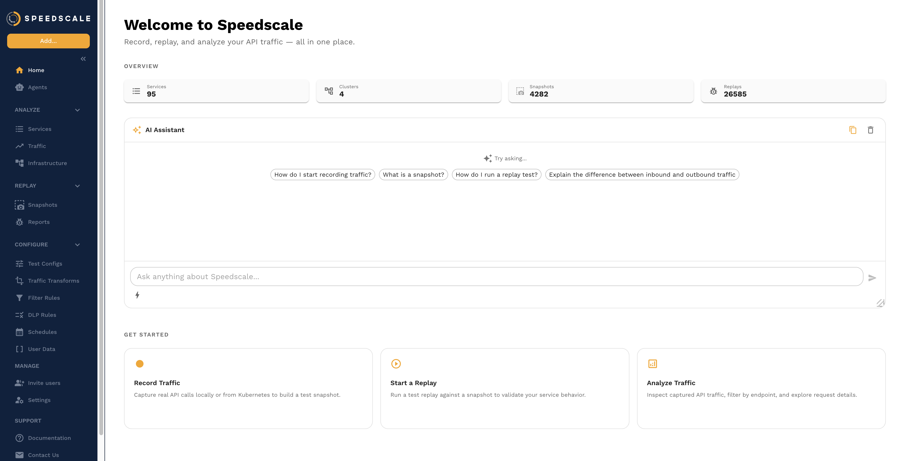
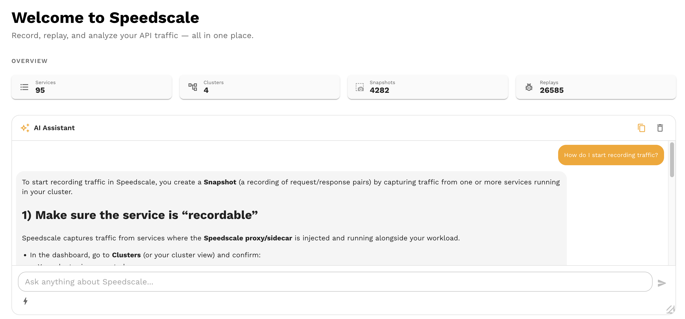

# AI Chat Assistant

The Speedscale AI assistant is a chat interface built into the dashboard that lets you interact with Speedscale using natural language. Instead of navigating menus and forms, you can ask the assistant to replay traffic, analyze reports, browse snapshots, configure tests, and search through captured requests — all from one place.

## Where to Find It

The AI chat panel is on the home screen of the Speedscale dashboard. It's the first thing you see when you log in. You can also access it from the chat icon available throughout the dashboard.

The assistant shows suggested prompts to help you get started, and you can type any question in the input bar at the bottom.

## What the Assistant Can Do

The assistant has access to a set of tools that let it take real actions on your behalf. These tools map to Speedscale's core capabilities:

### Browse and Search Snapshots

Ask the assistant to find snapshots by name, service, time range, or other criteria. You can drill into a snapshot to see what traffic it contains.

**Example prompts:**
- "Show me the latest snapshots for the payments service"
- "Find snapshots from the last 24 hours"
- "What's in snapshot `snap_abc123`?"

### Search RRPairs

The assistant can search through captured request/response pairs using filters. This is useful for tracking down specific requests without manually building filter queries.

**Example prompts:**
- "Find all POST requests to `/api/orders` in the last hour"
- "Show me requests that returned a 500 error"
- "Search for requests containing the header `X-Request-ID: abc`"

### View and Analyze Reports

Ask the assistant to pull up a replay report and summarize the results. It can highlight failures, surface recommendations, and point you to the most important findings.

**Example prompts:**
- "Summarize the latest report for the checkout service"
- "What failed in report `rpt_xyz`?"
- "Are there any latency regressions in my last replay?"

### Browse Test Configs

The assistant can list and describe available test configurations, helping you choose the right config for a replay.

**Example prompts:**
- "List my test configs"
- "What does the `standard` test config do?"

### Cluster and Infrastructure Operations

The assistant can query cluster state, view workloads, and check capture status.

**Example prompts:**
- "What clusters are connected?"
- "Show me the workloads in the `default` namespace"
- "Is the payments service currently being captured?"

### Replay Traffic

You can ask the assistant to kick off a replay against a service using a specific snapshot and test config.

**Example prompts:**
- "Replay snapshot `snap_abc123` against the payments service"
- "Run a replay using the standard test config"

### View Snapshot Performance

The assistant can pull up throughput and latency data from a snapshot, giving you a quick performance overview without leaving the chat.

**Example prompts:**
- "Show me the performance data for snapshot `snap_abc123`"
- "What's the average latency in my latest snapshot?"

## Tips for Effective Prompts

- **Be specific** — "Show me the latest report for the payments service" works better than "Show me reports"
- **Reference by name or ID** — If you know the snapshot or report ID, include it for faster results
- **Ask follow-up questions** — The assistant remembers context within a conversation, so you can drill in: "Show me that report" → "What failed?" → "Show me the request that caused the first error"
- **Use natural language** — You don't need to know the exact API or filter syntax. Describe what you want in plain English

## Limitations

- The assistant can read and query data, but destructive operations (deleting snapshots, removing clusters) require confirmation or are not available through chat
- Complex multi-step workflows (like creating a full test config from scratch) are better done through the UI
- The assistant works with the data in your Speedscale tenant — it doesn't have access to your source code, CI/CD pipelines, or external systems
- Response quality depends on the specificity of your prompt. Vague questions may produce vague answers

## Privacy and Security

The AI assistant follows Speedscale's [AI governance policies](/security/ai):

- **Enterprise customers:** Your data is never shared between tenants or used for general model training
- **Secure AI infrastructure:** All LLM processing runs on AWS Bedrock in a SOC 2 compliant environment. Customer data never leaves your hosted environment and is never sent to external providers like OpenAI or Anthropic
- **Human in the loop:** The assistant suggests actions, but you confirm before anything is executed
- **Disable if needed:** The AI assistant can be turned off for your account by contacting Speedscale support

## Feedback

If the assistant gives an incorrect answer, misunderstands your question, or could do something better:

- Use the feedback controls in the chat interface to rate responses
- Report issues on [Slack](https://slack.speedscale.com) or via [email](mailto:support@speedscale.com)

Your feedback directly improves the assistant for everyone.
