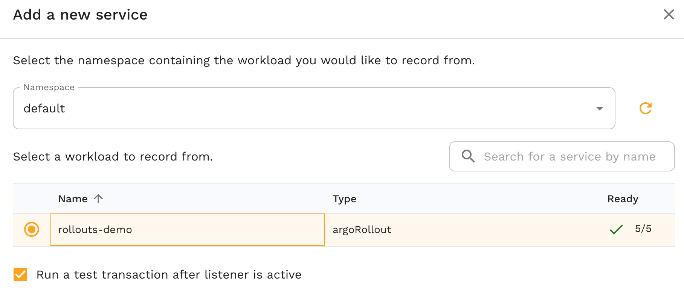
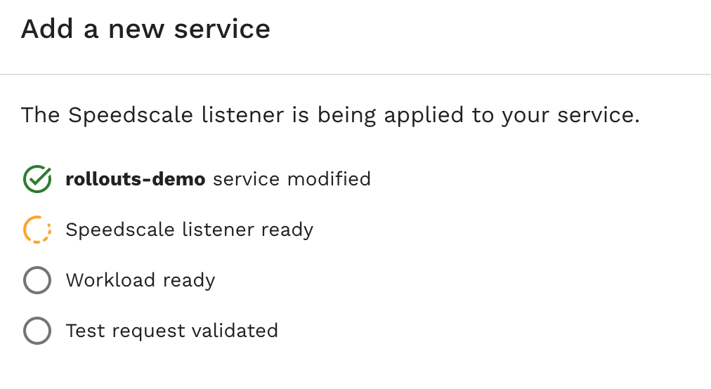

import Tabs from '@theme/Tabs';
import TabItem from '@theme/TabItem';

[Argo Rollouts](https://argoproj.github.io/argo-rollouts/) are a popular way to
gain more control over application deployment in Kubernetes but their design
requires special consideration when used in conjunction with Speedscale.

## Installation

Please ensure the [Kubernetes Operator](/setup/install/kubernetes-operator.md)
is running in your cluster before moving on.

:::important Inspector Restart Required
If you install Argo Rollouts after Speedscale is already running in your cluster, you must restart the Speedscale inspector pod for it to detect and watch Argo Rollouts resources:

```bash
kubectl rollout restart deployment/speedscale-inspector -n speedscale
```

This restart is necessary because the inspector only creates watchers for Argo Rollouts if they're detected at startup.
:::

One of the primary selling points of a rollout is the ability to perform a
partial deployment, promote it forward, or roll it back if it doesn't work. We
respect your choice to maintain this control and for that reason all rollout
modifications through Speedscale will require an extra step on your part to
fully promote the change.

<Tabs>

<TabItem value="webapp" label="Web App">

From the [Speedscale web app](https://app.speedscale.com/) click on `Add
service` and select your cluster configuration.



Once the sidecar has been added to the rollout the sidecar will be added to
some pods. The status on the wizard will spin until the rollout has been
promoted.



Verify changes and promote the rollout to apply to the rest of the pods:

```bash
kubectl argo rollouts get rollout <rollout-name>
kubectl argo rollouts promote <rollout-name>
```

The status on the wizard should complete and send a test request.

</TabItem>

<TabItem value="speedctl" label="speedctl CLI">

Make sure you have [speedctl installed](/setup/install/cli.md) before you
start.  Verify you have the [inspector](/reference/glossary.md#inspector)
running in your cluster with:

```bash
speedctl infra inspectors -o pretty
```

Using the proper cluster name, add the sidecar to the rollout:

```bash
speedctl infra sidecar add <rollout-name> --cluster <cluster-name> -n <namespace> --workload-type argorollout
```

This will apply the sidecar to some pods. Verify changes and promote the
rollout to apply to the rest of the pods:

```bash
kubectl argo rollouts get rollout <rollout-name>
kubectl argo rollouts promote <rollout-name>
```

</TabItem>

<TabItem value="annotation" label="Kubernetes Annotation">

With cluster access you can add the sidecar with an annotation on your
workload.

Add the following annotation to the rollout:

```yaml
annotations:
  sidecar.speedscale.com/inject: "true"
```

Unlike a deployment we need to patch the rollout to trigger the change:

```bash
now=$(date) && kubectl patch rollout rollouts-demo -p '{"spec": {"template": {"metadata": {"annotations": {"speedscale.com/restartedAt": "'$now'"}}}}}' --type merge
```

This will apply the sidecar to some pods. Verify changes and promote the
rollout to apply to the rest of the pods:

```bash
kubectl argo rollouts get rollout <rollout-name>
kubectl argo rollouts promote <rollout-name>
```

</TabItem>

</Tabs>


## Uninstall

To uninstall the sidecar on an argo rollout, do the following.

Modify the following annotation to the rollout, setting it to `false`:

```yaml
annotations:
  sidecar.speedscale.com/inject: "false"
```

Depending on how your rollout is configured, it may not immediately change. In order to force it to change, you can add an annotation like this and your should see the rollout cycle and your sidecar is removed.

```
now=$(date) && kubectl patch rollout rollouts-demo -p '{"spec": {"template": {"metadata": {"annotations": {"speedscale.com/restartedAt": "'$now'"}}}}}' --type merge
```
