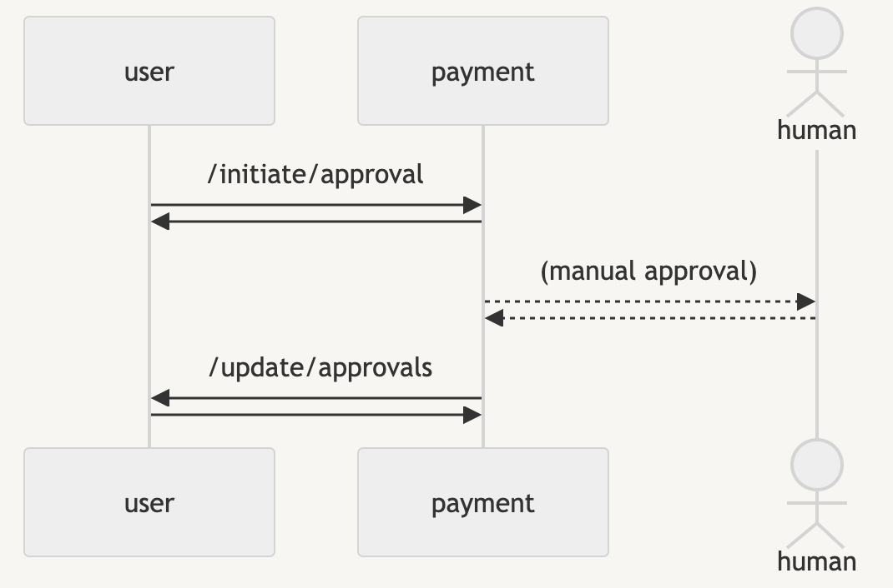
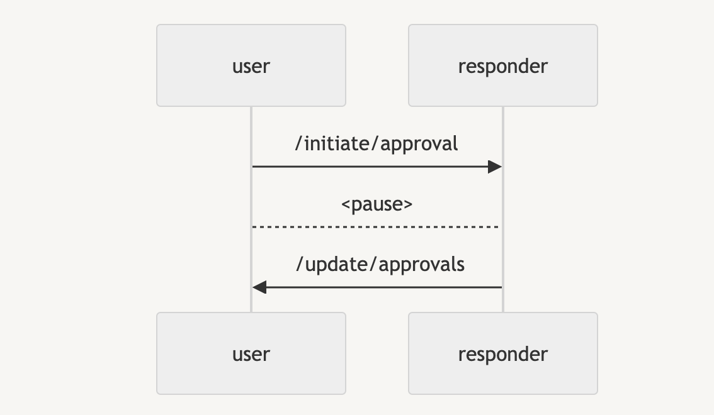

# Adding a response trigger

## Overview

Speedscale's **Responder Triggers** feature allows you to initiate workflows in response to specific requests, ensuring faster and more accurate environment replication. This guide walks you through setting up and using Responder Triggers within the Speedscale UI for an asynchronous application. This guide assumes normal HTTP REST API calls for simplicity but the same process should be used to simulate asynchronous requests for message buses like Kafka. The central question answered in this guide is how to initiate seemingly asynchronous messages from a message broker. We will do that by allowing the client to login and then instructing the Speedscale Responder to send some data after a period of time. From the client's perspective this will appear to be an asynchronous message sent by the server.

## Prerequisites

Before setting up Responder Triggers, ensure you haver deployed the Speedscale demo application.

To set up the demo application and create a snapshot, refer to the [Speedscale tutorial](https://docs.speedscale.com/tutorial/).

## Step-by-Step Guide to Using Responder Triggers

### Step 1: Create Snapshots
The demo application used in this tutorial is designed to be part of an approvals workflow involving human interaction. The **user** service attempts to start a payment workflow by calling the **payment** service. The payment service then waits an indeterminate amount of time for a user to approve the request. Once complete the **payment** service sends an asynchronous response back to the client as a separate call. These are two distinct REST API calls initiated by different services. The first request goes from **user** to **payment** but the downstream approval is a separate request sent from **payment** to **user**. The following sequence diagram may be helpful. Notice the direction of the arrows as they indicate which process is initiating the request.

During environment replication, Speedscale will mock the **payment** service as shown in the new sequence diagram:

We will capture two snapshots, one for each of the requests.

Capture a snapshot containing the outbound request that initiates the workflow. This snapshot must contain the outbound call to the `/initiate/approval` endpoint on the **user service**. We will refer to this snapshot as the **request snapshot** in this guide. You may notice that this call also has a header identifying the request called `sm_sessionid`. This ID is how the client knows which request has been approved when it receives a response. Keep in mind that this request will show up under the `Mocks` section of the snapshot transform editor.

Capture a second snapshot for the **user** containing an inbound request from the **payment** service. The request endpoint is `/update/approvals`. We will refer to this snapshot as the the **reply snapshot** in this guide.

### Step 2: Define a Trigger
The Responder Trigger is activated by a specific request signature which we captured in the **request signature**. The Responder will still reply normally but it will also initiate the desired trigger workflow. Once we receive the request, we want the Responder to wait roughly 30 seconds to simulate human think time before sending the **reply snapshot**.

Configure this behavior by following these steps:
1. Open the **request signature** snapshot and navigate to the 'Mocks' section of the transform editor.
2. Click on the **three-dot menu** next to the `/initiate/approval` request.
3. From the dropdown menu, select **Trigger Response**. This action will initiate the process of configuring the Responder Trigger for the selected request.
4. A pop up will appear and display a dropdown menu of available snapshots. These snapshots represent recorded states of your service interactions.
5. Select the **reply snapshot** you captured in the previous step.
6. Enter '30s' as the response time.

### Step 3: Configure the Response Endpoint
Next, choose the HTTP endpoint to which the Speedscale Responder should send the response after the trigger is activated. The Speedscale UI will present the following options:

- **Reply to client**: Speedscale will send the response directly to the original client that initiated the request. This will not work in non-Kubernetes environments or if Speedscale cannot identify the two workloads on its own.
- **Manually enter HTTP endpoint**: Specify a custom HTTP endpoint to which Speedscale should send the response. Use this if you know the URI of the **user service**.
- **Select a Kubernetes Service**: Choose an existing Kubernetes service within your environment.
- **Select a Kubernetes workload**: Choose a specific workload running in your Kubernetes cluster.

Select **Reply to client** since the demo application is running in Kubernetes.

## Conclusion

Using Responder Triggers in Speedscale, you can easily automate the response process for specific requests, making environment replication more efficient and realistic. Follow these steps to configure triggers based on your application’s needs, ensuring fast and reliable service responses. For more advanced configurations, please reach out on the Speedscale Slack [community](https://slack.speedscale.com).