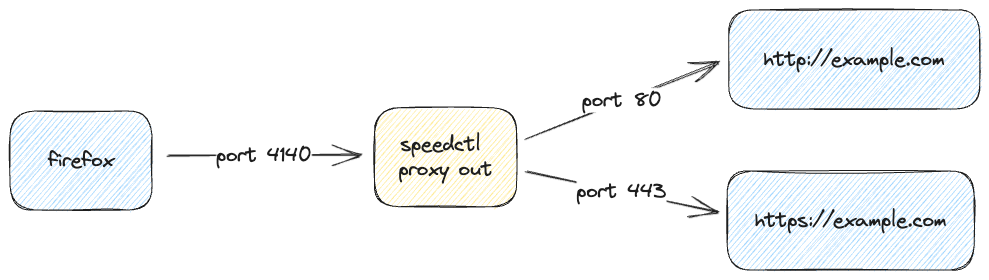
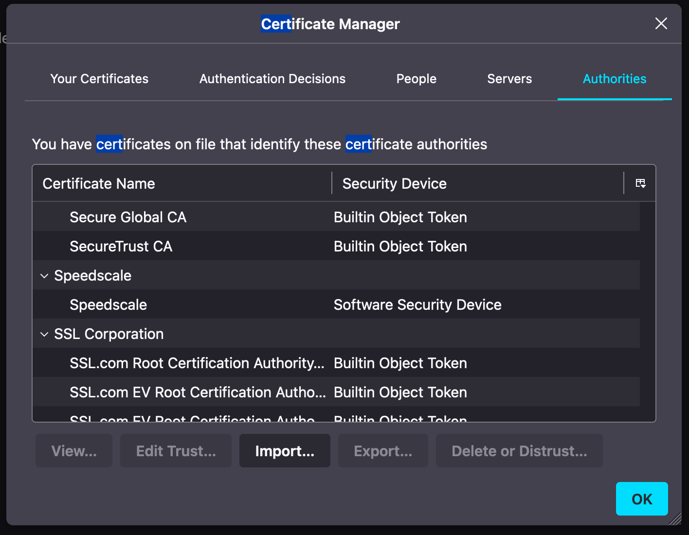
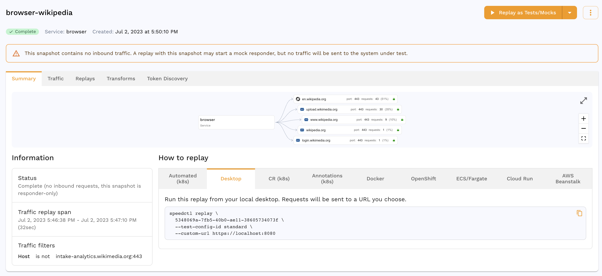
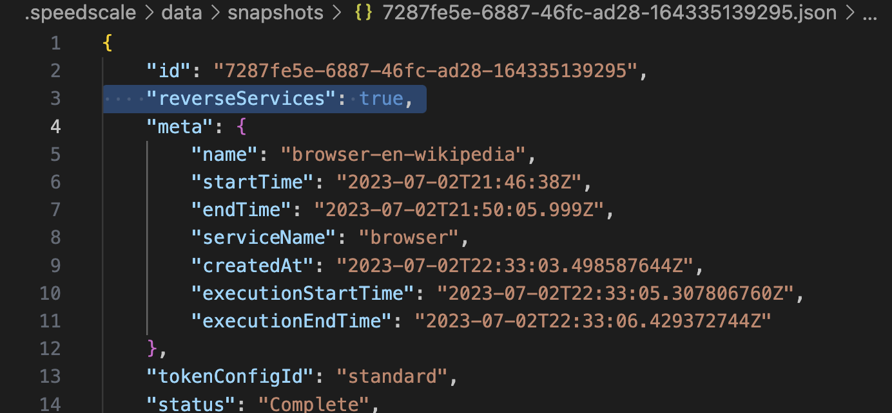
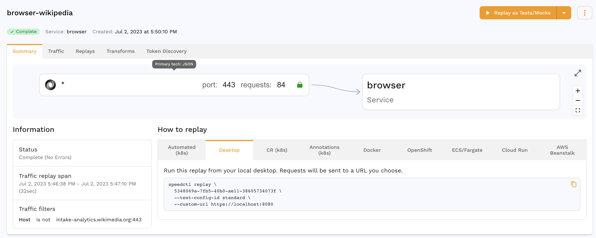
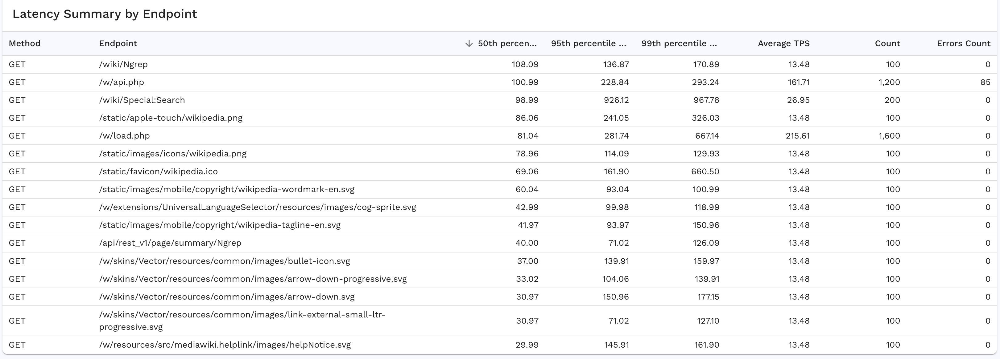

## Setup

### Prerequisites

1. [Speedctl is installed](../setup/install/cli.md)
1. Firefox (or Firefox Developer Edition) required

### Prepare Environment

Now that you have `speedctl` installed, make sure you have TLS certificates created.

```
ls -al ~/.speedscale/certs
```

If you have certificates, great! If you got an error `No such file or directory` then you can create the certificates with the following steps. First create the directory, then create the certificates in that directory.

```
mkdir ~/.speedscale/certs
speedctl create certs --output-dir ~/.speedscale/certs
```

You should be able to see your certs are in the directory:

```
ls ~/.speedscale/certs
tls.crt tls.key
```

### Start the Capture Session with CLI

You can start the capture session using the `speedctl` command. This is a super convenient way to capture traffic locally on your own desktop. Note that this is actually creating 2 listeners, one for inbound traffic to your browser (not used in this case because inbound activity is you clicking around on sites) and one for outbound traffic from your browser to other systems (using port 4140).

```
speedctl capture --proxy-out-port 4140 browser 9999
```



### Trust Certificate in Firefox

Now copy the public certificate `tls.crt` to a location where Firefox can read it:

```
cp ~/.speedscale/certs/tls.crt ~/Documents
```

1. Open the Settings in Firefox, and go to the Certificates section (it is easy to just search for `cert` and you should find it).
1. Click the `View Certificates` button.
1. Select the `Authorities` tab.
1. Click the `Import` button.
1. Select the `tls.crt` file from your `Documents` directory.
1. Check the box that says `Trust this CA to identify websites.`



## Start the Capture Session in Firefox

Now you need to set up Firefox so it will send the traffic to goproxy, this is done by configuring in the proxy settings. First open settings,

1. Open the Settings in Firefox, and go to the Proxy section (it is easy to just search for `proxy` and you should find it).
1. Select `Manual proxy configuration` radio button.
1. Put `[localhost](http://localhost)` and port `4140`
1. Check the box that says `Also use this proxy for HTTPS`
1. Select `OK` to save your settings.

### Clear Browser Cache

Before you start browsing to a site, it’s always a good practice to clear your cache so that your browser makes fresh calls to the backend system.

1. Open the Settings in Firefox, and go to the Cookies and Site Data section (it is easy to just search for `cache` and you should find it).
1. Click the `Clear Data` button.
1. Make sure both checkboxes are checked.
1. Click `Clear` to clear cache.
1. On the warning click `Clear Now` to delete all your cache.

## Browsing a Site

Now you’re ready, feel free to browse a site. Within 1-2 minutes, you should see the traffic showing up in Speedscale:

:::note
The traffic shows up as outbound because it is leaving your browser and going to another backend system, the important thing is that traffic is showing up at all.
:::

You may be surprised to see how many different systems your browser is accessing. Feel free to add filters to specify the subset of traffic you are really interested in. Once you see the traffic you like then you can create a snapshot by hitting the `Save Tests/Mocks` button and keeping all the defaults. This will create a snapshot with an ID that you will need in the next steps.



## Replay Traffic

Now that you have a snapshot, you have 2 options.
1. **Service Mocks** - You can turn the traffic into service mocks so that you can develop locally on your machine without depending on external systems.
1. **Test Cases** - You can turn the traffic into test cases that you can drive against the backend system for functional, contract or performance tests.

### Replay Service Mocks

Your snapshot is ready, now you can run `speedctl` in a different mode to mock out the endpoints it was previously capturing. Make sure you end your current capture session with `CTRL-C` first. Then start the replay with the following command:

```
speedctl replay --mode=mocks-only --http-port 4140 --verbose SNAPSHOT_ID
```

Now if you refresh your browser or click on the same pages, everything loads as it was before, but you can see the traffic in the logs. Here is an example from our wikipedia use case:

```
2023-07-02 18:16:11 INFO  populating tokenizer  ( configuration:Name:"standard"  Out:{Type:"http_match_request_body"  Filters:{}}  ID:"standard"  protected:true )
2023-07-02 18:16:11 INFO  started provider  ( name:mongodb )
2023-07-02 18:16:11 INFO  started provider  ( name:postgres )
2023-07-02 18:16:11 INFO  started provider  ( name:amqp_091 )
2023-07-02 18:16:11 INFO  starting HTTP server  ( address::4140 )
2023-07-02 18:16:11 INFO  starting HTTPS server  ( address::30124 )
2023-07-02 18:16:14 DEBUG HIT  ( msgNum:1 sig:{"host":"www.wikipedia.org", "method":"GET", "httpVersion":"2.0", "url":"/"} uuid:dB3ADZ/wSMKifIi1/hzmOA== )
```

The service mock is providing the responses which lets you develop independently from these downstream systems. If you hit `CTRL-C` on your `speedctl` session you'll see the next page on your browser doesn't work.

### Replay Test Cases

In order to turn the traffic into test cases you need to "reverse" the outbound calls so they will appear as inbound traffic and can be used for tests. Let's create a new snapshot just for the traffic going to a single site `en.wikipedia.org` which you can do by using a filter. Once you have created that snapshot, then this is the process to turn it into tests:

1. Download the snapshot locally
1. Reverse the traffic so the outbound traffic become inbound
1. Upload the snapshot again
1. Replay it against the backend

```
speedctl pull snapshot SNAPSHOT_ID
```

The snapshot definition as well as all the traffic has now been downloaded to your local machine in the directory `~/.speedscale/data/snapshots`. You want to open the snapshot file itself which is named: `~/.speedscale/data/snapshots/SNAPSHOT_ID.json`. Use your favorite editor such as VSCode or vim or even emacs. You'll want to add this value to the JSON.

```
"reverseServices": true,
```



Make sure to save your changes, and then upload with the following command:

```
speedctl push snapshot SNAPSHOT_ID
```

It will ask you if you're sure `▸ Snapshot already exists, overwrite? [Y/n]: y` (yup you're sure), and then you will see the snapshot changes inside the Speedscale UI. The outbound traffic is gone and now you can see it showing up as inbound.



Now you can run the replay with the following command. This uses the 100 replicas snapshot which will take the small number of calls and multiply them into a larger number of transactions.

```
speedctl replay --replay-host en.wikipedia.org --test-config-id performance_100replicas SNAPSHOT_ID
```

Even running 100 copies of the traffic is actually done fairly quickly (Wikipedia is pretty fast after all), and you'll see a report in the Speedscale UI. You can observe that the calls were each executed 100x as many times as they were recorded. This whole process only took a couple of minutes and much faster than writing a test case with all of these steps.



## Cleaning Up

Once you are finished with your testing, you can simply turn off the proxy settings in Firefox and it will go back to normal.

## Summary

In this guide you learned how to:
* Capture traffic from the browser to various sites and backend systems
* Analyze and filter the data returned
* Convert this traffic into service mocks and test cases
* Easily replay the traffic from your own machine

If you thought this was pretty useful, feel free to try it out on some sites of your own, if you have any questions feel free to join us in the [Speedscale Community](https://slack.speedscale.com)!
