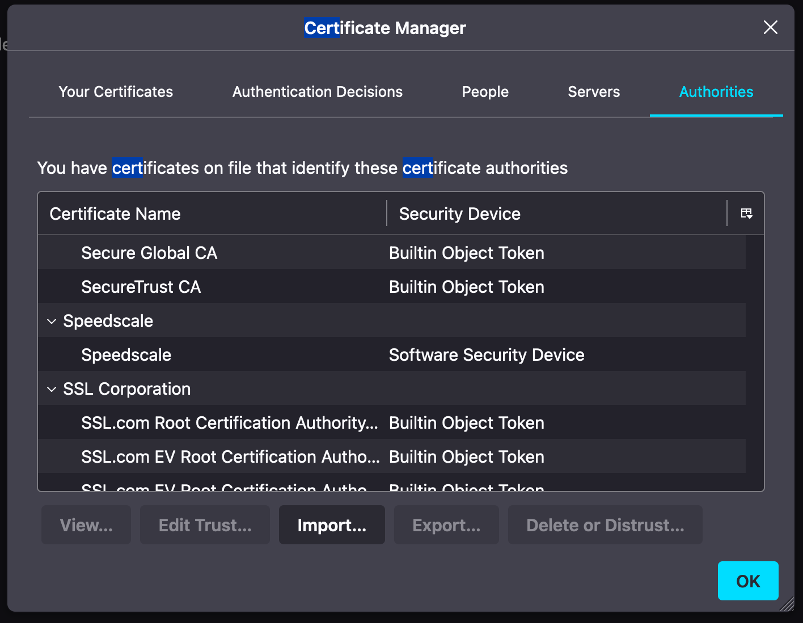

## Setup

### Prerequisites

1. [proxymock is installed](/proxymock/getting-started/installation/)
1. proxymock is initialized with `proxymock init`
1. Firefox or Firefox Developer Edition

proxymock records traffic locally by default. Browser traffic flows through the outbound proxy on port `4140`, and proxymock writes request / response pair (RRPair) files under the output directory you choose.

:::tip
Use a private Firefox window or a separate Firefox profile for recording. Browsers make background calls to many domains, so a clean session keeps the recording easier to inspect and reuse.
:::

## Prepare TLS Certificates

Create the proxymock root certificate if it does not already exist:

```shell
proxymock certs
```

This creates the local certificate files under `~/.speedscale/certs`. On many desktop environments proxymock can add the certificate to the system trust store automatically, but Firefox uses its own certificate store. Import the proxymock CA into Firefox before recording HTTPS sites.

1. Open Firefox settings.
1. Search for `cert`.
1. Click **View Certificates**.
1. Select the **Authorities** tab.
1. Click **Import**.
1. Select `~/.speedscale/certs/tls.crt`.
1. Check **Trust this CA to identify websites**.



## Start Recording

Start proxymock in one terminal:

```shell
proxymock record --out proxymock/browser-recording
```

Leave this command running. It starts the outbound proxy on `localhost:4140` and writes captured browser traffic to `proxymock/browser-recording`.

## Route Firefox Through proxymock

Configure Firefox to send HTTP and HTTPS requests through the proxymock proxy.

1. Open Firefox settings.
1. Search for `proxy`.
1. Click **Settings** in the Network Settings section.
1. Select **Manual proxy configuration**.
1. Set **HTTP Proxy** to `localhost` and **Port** to `4140`.
1. Check **Also use this proxy for HTTPS**.
1. Click **OK**.

### Clear Browser Cache

Clear the browser cache before browsing so Firefox makes fresh requests through proxymock.

1. Open Firefox settings.
1. Search for `cache`.
1. Click **Clear Data** in the Cookies and Site Data section.
1. Select both checkboxes.
1. Click **Clear**.

## Browse the Site You Want to Capture

Open the site you want to record and exercise the pages or flows you care about. proxymock writes each captured request and response as an RRPair file under the recording directory.

When you are done browsing, stop the recorder with `CTRL-C`.

To inspect the recording in the terminal:

```shell
proxymock inspect --in proxymock/browser-recording
```

To inspect it in the local web UI:

```shell
proxymock web
```

You can also inspect the files directly:

```shell
find proxymock/browser-recording -name '*.md' | head
```

## Run the Browser Against Mocks

Start the mock server with the recording you just created:

```shell
proxymock mock --in proxymock/browser-recording --out proxymock/browser-mock-results
```

Keep Firefox pointed at `localhost:4140` and reload the same pages. Requests that match the recording return local mock responses. Requests that do not match are passed through to the real destination by default and are written under `proxymock/browser-mock-results`.

If you want the browser to fail instead of passing through unrecorded requests, run:

```shell
proxymock mock --in proxymock/browser-recording --no-passthrough
```

This mode is useful for checking whether a flow is fully covered by the recording. Modern web pages often include analytics, ads, fonts, and background polling, so expect to refine the recording if you use `--no-passthrough`.

## About proxymock Replay

`proxymock replay` sends recorded inbound requests back to an application. A browser-only recording is outbound browser traffic, so the browser workflow above usually uses `proxymock mock` rather than `proxymock replay`.

If you want generated tests for your own application, record the app itself instead:

```shell
proxymock record -- <your-app-command>
```

Then exercise the app through the inbound proxy on port `4143`, stop the recorder, and replay those inbound transactions:

```shell
proxymock replay --test-against http://localhost:8080
```

See the [proxymock CLI quickstart](/proxymock/getting-started/quickstart/quickstart-cli/) for the full record, mock, and replay loop.

## Cleaning Up

When you are finished, turn off manual proxy configuration in Firefox. If you used a temporary Firefox profile, you can delete it after recording.

## Summary

In this guide you learned how to:

- Route Firefox through proxymock
- Record browser traffic locally as RRPair files
- Inspect captured browser requests
- Serve the captured traffic back as local mock responses
- Use app-side recording when you need `proxymock replay` tests
