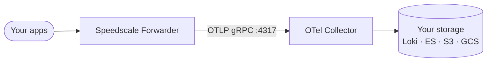

# Bring Your Own Cloud

Speedscale's **Bring Your Own Cloud (BYOC)** mode lets you keep all captured traffic inside your own infrastructure. The Speedscale Forwarder ships RRPairs as OTLP log records to a collector you run, which fans out to the storage backend of your choice. No traffic ever leaves your VPC.

:::info

BYOC requires a Speedscale Enterprise plan. Contact [support@speedscale.com](mailto:support@speedscale.com) to enable the `byoc_otel` exporter on your account.

:::

## How it works

The Forwarder exports captured traffic through an OpenTelemetry log exporter (`byoc_otel`) over OTLP/gRPC to a collector inside your cluster. The collector forwards to your chosen storage backend.



## What Is BYOC?

Bring Your Own Cloud is a deployment model where Speedscale software runs inside your own cloud account instead of a vendor-hosted SaaS. You keep data, networking, and runtime boundaries under your control while still receiving managed software updates and support from Speedscale.

**Advantages**

- Data sovereignty and compliance — sensitive payloads and metadata never leave your VPC.
- Lower latency — collectors and exporters run near your apps, reducing egress and round trips.
- Cost control — leverage your cloud pricing (reserved, spot, private links).

**Tradeoffs**

- You manage the cloud surface area — Kubernetes, ingress, IAM, and network policies must exist.
- Upgrades are simple, but you own cluster health, scale, and access control.
- Integration work — SSO, networking, and security reviews are usually part of the rollout.

## Reference architectures

Speedscale publishes four ready-to-install Helm charts at [github.com/speedscale/speedscale-byoc](https://github.com/speedscale/speedscale-byoc). Pick the one that matches your infrastructure:

| Chart | Stack | Best for |
|-------|-------|----------|
| `grafana` | OTel Collector → Loki → Grafana | Live dashboards, ad-hoc log queries, proxymock replay |
| `elasticsearch` | OTel Collector → Elasticsearch → Kibana | Full-text search, Kibana Discover, existing ES clusters |
| `fluentbit-gcs` | OTel Collector → Fluent Bit → Google Cloud Storage | GCS data lake, BigQuery external tables, compliance retention |
| `fluentbit-s3` | OTel Collector → Fluent Bit → Amazon S3 | S3 data lake, Athena/Glue queries, IRSA-native EKS |

Each chart ships its own OTel Collector ConfigMap pre-wired for its backend — you only supply credentials and bucket/cluster names.

## Prerequisites

- Kubernetes cluster (any flavor — minikube, EKS, GKE, AKS, k3s)
- `kubectl` pointed at the cluster and `helm` v3
- Speedscale API key with BYOC enabled
- Cloud credentials for your chosen backend (S3 bucket, GCS bucket — none needed for Grafana or Elasticsearch)

## Install

### 1. Add the Helm repos

```bash
helm repo add speedscale https://speedscale.github.io/operator-helm/
helm repo add speedscale-byoc https://speedscale.github.io/speedscale-byoc/
helm repo update
```

### 2. Create the API key secret

```bash
kubectl create namespace speedscale
kubectl -n speedscale create secret generic speedscale-apikey \
  --from-literal=SPEEDSCALE_API_KEY="<YOUR_API_KEY>" \
  --from-literal=SPEEDSCALE_APP_URL="app.speedscale.com"
```

### 3. Install your chosen backend

Each backend installs into its own namespace so you can run multiple side by side.

**Grafana + Loki**

```bash
helm upgrade --install byoc-grafana speedscale-byoc/grafana \
  -n byoc-grafana --create-namespace
```

**Elasticsearch + Kibana**

```bash
helm upgrade --install byoc-elasticsearch speedscale-byoc/elasticsearch \
  -n byoc-elasticsearch --create-namespace
```

**Fluent Bit → Google Cloud Storage**

```bash
# Create a Kubernetes secret with your GCS HMAC credentials first:
kubectl create namespace byoc-fluentbit-gcs
kubectl -n byoc-fluentbit-gcs create secret generic gcs-hmac \
  --from-literal=accessKeyId="<HMAC_ACCESS_KEY>" \
  --from-literal=secretAccessKey="<HMAC_SECRET>"

helm upgrade --install byoc-fluentbit-gcs speedscale-byoc/fluentbit-gcs \
  -n byoc-fluentbit-gcs --create-namespace \
  --set gcs.bucket="<YOUR_GCS_BUCKET>" \
  --set gcs.region="auto" \
  --set gcs.credentialsSecret="gcs-hmac"
```

**Fluent Bit → Amazon S3 (static credentials)**

```bash
kubectl create namespace byoc-fluentbit-s3
kubectl -n byoc-fluentbit-s3 create secret generic s3-creds \
  --from-literal=accessKeyId="<AWS_ACCESS_KEY_ID>" \
  --from-literal=secretAccessKey="<AWS_SECRET_ACCESS_KEY>"

helm upgrade --install byoc-fluentbit-s3 speedscale-byoc/fluentbit-s3 \
  -n byoc-fluentbit-s3 --create-namespace \
  --set s3.bucket="<YOUR_S3_BUCKET>" \
  --set s3.region="<YOUR_REGION>" \
  --set s3.credentialsSecret="s3-creds"
```

**Fluent Bit → Amazon S3 (EKS IRSA — no credentials in cluster)**

```bash
helm upgrade --install byoc-fluentbit-s3 speedscale-byoc/fluentbit-s3 \
  -n byoc-fluentbit-s3 --create-namespace \
  --set s3.bucket="<YOUR_S3_BUCKET>" \
  --set s3.region="<YOUR_REGION>" \
  --set irsa.enabled=true \
  --set irsa.roleArn="arn:aws:iam::<ACCOUNT_ID>:role/<ROLE_NAME>"
```

See each chart's README on GitHub for full prerequisites, IAM policy examples, and verify steps.

### 4. Install the Speedscale Operator wired to your backend

Replace `<NAMESPACE>` with your backend namespace (e.g. `byoc-grafana`):

```bash
helm upgrade --install speedscale-operator speedscale/speedscale-operator \
  -n speedscale --create-namespace \
  --set apiKeySecret=speedscale-apikey \
  --set clusterName=<YOUR_CLUSTER_NAME> \
  --set 'forwarder.exporters.byoc_otel.otel_endpoint=http://otel-collector.<NAMESPACE>.svc.cluster.local:4317' \
  --set 'forwarder.exporters.byoc_otel.filter_rule=standard' \
  --set 'forwarder.exporters.byoc_otel.dlp_config_id=standard'
```

Or equivalently in `values.yaml`:

```yaml
forwarder:
  exporters:
    byoc_otel:
      otel_endpoint: "http://otel-collector.byoc-grafana.svc.cluster.local:4317"
      filter_rule: standard
      dlp_config_id: standard
```

:::caution

The `otel_endpoint` value **must** include the `http://` scheme. A bare hostname causes a silent gRPC dial failure — traffic appears captured but nothing arrives at the collector.

:::

### 5. Annotate a workload to capture its traffic

```bash
kubectl patch deployment my-app -p \
  '{"spec":{"template":{"metadata":{"annotations":{"capture.speedscale.com/enabled":"true"}}}}}'
```

## OTLP transport: gRPC vs HTTP

The OTel Collector inside each BYOC chart listens on **gRPC port 4317**. The Speedscale Forwarder infers the transport from the port in `otel_endpoint`:

| Port in endpoint | Transport used |
|-----------------|---------------|
| `:4317` | OTLP/gRPC (recommended, used by all BYOC charts) |
| `:4318` | OTLP/HTTP |

The forwarder logs the chosen transport at startup:

```
INFO  starting OTLP log exporter  endpoint=… transport=grpc
```

:::caution

The two transports are not interchangeable on the wire. A gRPC client cannot talk to an HTTP receiver. If traffic is captured but nothing arrives at your backend, verify that `otel_endpoint` uses the same port as the collector's receiver protocol.

:::

If you're wiring a custom OTel Collector (not from the BYOC charts), enable the gRPC receiver:

```yaml
receivers:
  otlp:
    protocols:
      grpc:
        endpoint: 0.0.0.0:4317
      http:
        endpoint: 0.0.0.0:4318
```

## Verify

Check each hop in order after installation:

**1. Forwarder is wired**

```bash
kubectl -n speedscale get cm speedscale-forwarder \
  -o jsonpath='{.data.EXPORTERS}' | jq .
```

The output should contain `byoc_otel` with your endpoint. If `EXPORTERS` is missing `byoc_otel`, the Operator values were not applied — rerun step 4.

**2. OTel Collector is receiving**

```bash
kubectl -n <BACKEND_NAMESPACE> logs deploy/otel-collector | grep -i "log records"
```

**3. Backend is writing**

- **Grafana**: open Grafana → Explore → Loki data source → label filter `{exporter="OTLP"}`
- **Elasticsearch**: `kubectl -n byoc-elasticsearch exec -it deploy/elasticsearch -- curl -s localhost:9200/rrpairs/_count`
- **S3**: `aws s3 ls s3://<BUCKET>/year=`
- **GCS**: `gcloud storage ls gs://<BUCKET>/year=`

## Replay captured traffic with proxymock

Each chart ships a companion Python gather script in the [speedscale-byoc repo](https://github.com/speedscale/speedscale-byoc/tree/main/scripts):

| Backend | Script |
|---------|--------|
| Loki | `loki-gather.py` |
| Elasticsearch | `es-gather.py` |
| Google Cloud Storage | `gcs-gather.py` |
| Amazon S3 | `s3-gather.py` |

```bash
# Example: pull traffic from Loki and replay it
python3 scripts/loki-gather.py --service my-app --output ./snapshot
proxymock mock --dir ./snapshot
```

## Further reading

- [speedscale-byoc on GitHub](https://github.com/speedscale/speedscale-byoc) — chart source, detailed READMEs per scenario
- [speedscale.com/byoc](https://www.speedscale.com/byoc/) — product overview and use cases
- [Why autonomous agents require BYOC](https://www.speedscale.com/blog/byoc-autonomous-agents-sovereign-ai-factory/)
