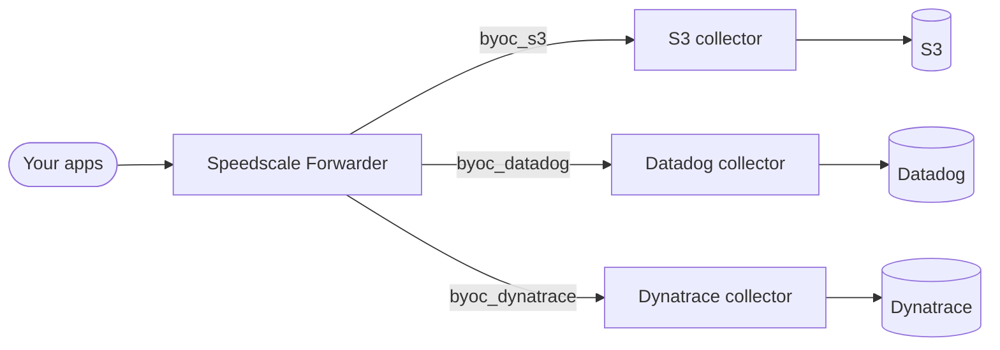

# Bring Your Own Cloud

Speedscale's **Bring Your Own Cloud (BYOC)** mode lets you route captured traffic to storage and observability systems that you control. The Speedscale Forwarder ships RRPairs as OTLP log records to a collector dedicated to one destination. Configure the cloud exporter separately if captured RRPairs must stay in your infrastructure. BYOC export does not disable cloud registration, configuration downloads, or operational telemetry.

:::info

BYOC requires a Speedscale Enterprise plan. Contact [support@speedscale.com](mailto:support@speedscale.com) to enable Forwarder BYOC exporters on your account.

:::

## How it works

The Forwarder exports captured traffic through named OpenTelemetry log exporters over OTLP/gRPC. Each exporter points to a collector for one destination. This keeps credentials, DLP rules, filters, retry queues, failures, and enablement independent.


```mermaid
flowchart LR
    apps([Your apps]) --> fwd[Speedscale Forwarder]
    fwd -->|byoc_s3| s3col[S3 collector]
    fwd -->|byoc_datadog| ddcol[Datadog collector]
    fwd -->|byoc_dynatrace| dtcol[Dynatrace collector]
    s3col --> s3[(S3)]
    ddcol --> dd[(Datadog)]
    dtcol --> dt[(Dynatrace)]
```

## What is BYOC?

Bring Your Own Cloud is a deployment model where Speedscale software runs inside your own cloud account instead of a vendor-hosted SaaS. You keep data, networking, and runtime boundaries under your control while still receiving managed software updates and support from Speedscale.

**Advantages**

- Data control: choose where captured RRPairs are stored and apply filters and DLP before export.
- Lower latency: collectors and exporters run near your apps, reducing egress and round trips.
- Cost control: use your cloud pricing for reserved, spot, and private-link capacity.

**Tradeoffs**

- You manage the cloud surface area: Kubernetes, ingress, IAM, and network policies must exist.
- Upgrades are simple, but you own cluster health, scale, and access control.
- Integration work: SSO, networking, and security reviews are usually part of the rollout.

## Reference architectures

Speedscale publishes ready-to-install Helm charts at [github.com/speedscale/speedscale-byoc](https://github.com/speedscale/speedscale-byoc). Install one independent channel for each enabled destination:

| Chart | Stack | Best for |
|-------|-------|----------|
| `grafana` | OTel Collector → Loki → Grafana | Live dashboards, ad-hoc log queries, proxymock replay |
| `elasticsearch` | OTel Collector → Elasticsearch → Kibana | Full-text search, Kibana Discover, existing ES clusters |
| `gcs` | OTel Collector → Google Cloud Storage | Native GCS archive, BigQuery external tables, compliance retention |
| `fluentbit-gcs` | OTel Collector with `awss3` exporter → Google Cloud Storage | GCS data lake, BigQuery external tables, compliance retention |
| `fluentbit-s3` | OTel Collector with `awss3` exporter → Amazon S3 | S3 data lake, Athena/Glue queries, IRSA-native EKS |
| `datadog` | OTel Collector → Datadog | APM, traces, metrics, correlated RRPair logs |
| `dynatrace` | OTel Collector → Dynatrace OTLP API | Services, distributed traces, metrics, correlated RRPair logs |
| `newrelic` | OTel Collector → New Relic OTLP API | APM, distributed traces, metrics, correlated RRPair logs |

The `fluentbit-gcs` chart is the legacy GCS path that uses the S3-compatible API and HMAC credentials. New GCS installations should use the native `gcs` chart. The `fluentbit-s3` name is historical; the chart now writes OTLP-JSON directly with the OpenTelemetry `awss3` exporter.

Each chart ships its own OTel Collector ConfigMap wired for its backend. You supply credentials and bucket or cluster names.

For a deployment without Kubernetes, see [BYOC on ECS/Fargate](byoc-ecs.md). It uses a forwarder and collector in one ECS task with an S3 task role. The Helm instructions below apply to Kubernetes.

### Azure Blob storage

The [`azureblob` chart](https://github.com/speedscale/speedscale-byoc/tree/main/charts/azureblob) writes captured RRPairs to Azure Blob Storage through the OpenTelemetry `azureblob` exporter. It supports storage archival, but proxymock cannot pull directly from Azure Blob Storage.

Azure Blob Storage does not expose an S3-compatible API. `proxymock import s3`, the `pull_byoc_bucket` MCP tool, and the `proxymock web` BYOC source picker do not support it. Changing `--s3-endpoint-url` to an Azure Blob URL does not add support.

For manual retrieval, the chart repo includes [`scripts/azure-gather.py`](https://github.com/speedscale/speedscale-byoc/blob/main/scripts/azure-gather.py). The script documents its usage and requires Python 3, the Azure CLI, and a storage connection string. Choose Amazon S3 or Google Cloud Storage if your workflow requires a direct proxymock bucket pull.

## Prerequisites

- Kubernetes cluster such as minikube, EKS, GKE, AKS, or k3s
- `kubectl` pointed at the cluster and `helm` v3
- Speedscale API key with BYOC enabled
- Credentials for each enabled destination, stored in separate Kubernetes Secrets

## Install

### 1. Add the Helm repos

```bash
helm repo add speedscale https://speedscale.github.io/operator-helm/
helm repo add speedscale-byoc https://speedscale.github.io/speedscale-byoc/
helm repo update
```

### 2. Create the API key secret

```bash
kubectl create namespace speedscale
kubectl -n speedscale create secret generic speedscale-apikey \
  --from-literal=SPEEDSCALE_API_KEY="<YOUR_API_KEY>" \
  --from-literal=SPEEDSCALE_APP_URL="app.speedscale.com"
```

### 3. Install your chosen backend

Each backend installs into its own namespace so you can run multiple side by side.

**Grafana + Loki**

```bash
helm upgrade --install byoc-grafana speedscale-byoc/grafana \
  -n byoc-grafana --create-namespace
```

**Elasticsearch + Kibana**

```bash
helm upgrade --install byoc-elasticsearch speedscale-byoc/elasticsearch \
  -n byoc-elasticsearch --create-namespace
```

**OpenTelemetry → Google Cloud Storage**

Grant a Google service account `roles/storage.objectCreator` on the bucket and configure GKE Workload Identity in `values-gcs.yaml`:

```yaml
gcs:
  project: <GCP_PROJECT>
  bucket: <GCS_BUCKET>
  region: <GCS_REGION>
serviceAccount:
  annotations:
    iam.gke.io/gcp-service-account: byoc-gcs@<GCP_PROJECT>.iam.gserviceaccount.com
```

```bash
helm upgrade --install byoc-gcs speedscale-byoc/gcs \
  -n byoc-gcs --create-namespace \
  -f values-gcs.yaml
```

**OpenTelemetry → Amazon S3 (static credentials)**

```bash
kubectl create namespace byoc-fluentbit-s3
kubectl -n byoc-fluentbit-s3 create secret generic s3-creds \
  --from-literal=accessKeyId="<AWS_ACCESS_KEY_ID>" \
  --from-literal=secretAccessKey="<AWS_SECRET_ACCESS_KEY>"

helm upgrade --install byoc-fluentbit-s3 speedscale-byoc/fluentbit-s3 \
  -n byoc-fluentbit-s3 --create-namespace \
  --set s3.bucket="<YOUR_S3_BUCKET>" \
  --set s3.region="<YOUR_REGION>" \
  --set s3.credentialsSecret="s3-creds"
```

**OpenTelemetry → Amazon S3 (EKS IRSA)**

```bash
helm upgrade --install byoc-fluentbit-s3 speedscale-byoc/fluentbit-s3 \
  -n byoc-fluentbit-s3 --create-namespace \
  --set s3.bucket="<YOUR_S3_BUCKET>" \
  --set s3.region="<YOUR_REGION>" \
  --set irsa.enabled=true \
  --set irsa.roleArn="arn:aws:iam::<ACCOUNT_ID>:role/<ROLE_NAME>"
```

See each chart's README on GitHub for full prerequisites, IAM policy examples, and verify steps.

### 4. Install the Speedscale Operator wired to each backend

Add one named entry under `forwarder.exporters` for every destination you want to enable. This example installs one S3 channel:

```bash
helm upgrade --install speedscale-operator speedscale/speedscale-operator \
  -n speedscale --create-namespace \
  --set apiKeySecret=speedscale-apikey \
  --set clusterName=<YOUR_CLUSTER_NAME> \
  --set 'forwarder.exporters.byoc_s3.otel_endpoint=http://otel-collector.byoc-fluentbit-s3.svc.cluster.local:4317' \
  --set 'forwarder.exporters.byoc_s3.filter_rule=standard' \
  --set 'forwarder.exporters.byoc_s3.dlp_config_id=standard'
```

Or equivalently in `values.yaml`:

```yaml
forwarder:
  exporters:
    byoc_s3:
      otel_endpoint: "http://otel-collector.byoc-fluentbit-s3.svc.cluster.local:4317"
      filter_rule: standard
      dlp_config_id: standard
    byoc_datadog:
      otel_endpoint: "http://byoc-datadog-datadog.byoc-datadog.svc.cluster.local:4317"
      filter_rule: standard
      dlp_config_id: standard
    byoc_dynatrace:
      otel_endpoint: "http://byoc-dynatrace-dynatrace.byoc-dynatrace.svc.cluster.local:4317"
      filter_rule: standard
      dlp_config_id: standard
    byoc_newrelic:
      otel_endpoint: "http://byoc-newrelic-newrelic.byoc-newrelic.svc.cluster.local:4317"
      filter_rule: standard
      dlp_config_id: standard
    byoc_grafana:
      otel_endpoint: "http://otel-collector.byoc-grafana.svc.cluster.local:4317"
      filter_rule: standard
      dlp_config_id: standard
```

:::caution

The `otel_endpoint` value **must** include the `http://` scheme. A bare hostname causes a silent gRPC dial failure. Traffic appears captured but nothing arrives at the collector.

:::

### 5. Annotate a workload to capture its traffic

```bash
kubectl patch deployment my-app -p \
  '{"spec":{"template":{"metadata":{"annotations":{"capture.speedscale.com/enabled":"true"}}}}}'
```

## OTLP transport: gRPC vs HTTP

The OTel Collector inside each BYOC chart listens on **gRPC port 4317**. The Speedscale Forwarder infers the transport from the port in `otel_endpoint`:

| Port in endpoint | Transport used |
|-----------------|---------------|
| `:4317` | OTLP/gRPC (recommended, used by all BYOC charts) |
| `:4318` | OTLP/HTTP |

The forwarder logs the chosen transport at startup:

```
INFO  starting OTLP log exporter  endpoint=… transport=grpc
```

:::caution

The two transports are not interchangeable on the wire. A gRPC client cannot talk to an HTTP receiver. If traffic is captured but nothing arrives at your backend, verify that `otel_endpoint` uses the same port as the collector's receiver protocol.

:::

If you're wiring a custom OTel Collector (not from the BYOC charts), enable the gRPC receiver:

```yaml
receivers:
  otlp:
    protocols:
      grpc:
        endpoint: 0.0.0.0:4317
      http:
        endpoint: 0.0.0.0:4318
```

## Verify

Check each hop in order after installation:

**1. Forwarder is wired**

```bash
kubectl -n speedscale get cm speedscale-forwarder \
  -o jsonpath='{.data.EXPORTERS}' | jq .
```

The output should contain one entry for every enabled destination. If an entry is missing, the Operator values were not applied. Rerun step 4 with that destination configured.

**2. OTel Collector is receiving**

```bash
kubectl -n <BACKEND_NAMESPACE> logs deploy/otel-collector | grep -i "log records"
```

**3. Backend is writing**

- **Grafana**: open Grafana → Explore → Loki data source → label filter `{exporter="OTLP"}`
- **Elasticsearch**: `kubectl -n byoc-elasticsearch exec -it deploy/elasticsearch -- curl -s localhost:9200/rrpairs/_count`
- **S3**: `aws s3 ls s3://<BUCKET>/byoc/`
- **GCS**: `gcloud storage ls gs://<BUCKET>/byoc/`
- **Datadog**: open **APM > Traces** and **Logs > Explorer**; see the [Datadog guide](./integrations/export/datadog.md)
- **Dynatrace**: open **Services > Explorer** and **Distributed Tracing**; see the [Dynatrace guide](./integrations/export/dynatrace.md)
- **New Relic**: open **APM & Services** and **Logs**; see the [New Relic guide](./integrations/export/new-relic.md)

## Replay captured traffic with proxymock

Use `proxymock import s3` for Amazon S3 or `proxymock import gcs` for Google Cloud Storage to pull captured traffic into local RRPair files, then mock or replay the imported traffic.

```bash
proxymock import s3 --bucket my-bucket --prefix byoc/ \
  --service my-app --from now-1h --out ./snapshot
proxymock mock --in ./snapshot
```

For GCS, run `proxymock import gcs --bucket my-gcs-bucket --prefix byoc/ --from now-1h` with Google Application Default Credentials. The native pull uses Google credentials independently of the collector chart's HMAC credentials. See [Pull traffic from a BYOC bucket](/proxymock/guides/byoc-bucket.md) for the complete GCS command, filtering, and MCP workflow.

This object-store import does not query Loki or Elasticsearch. See those charts' READMEs for backend-specific retrieval.

## Further reading

- [speedscale-byoc on GitHub](https://github.com/speedscale/speedscale-byoc): chart source and detailed READMEs per scenario
- [speedscale.com/byoc](https://www.speedscale.com/byoc/): product overview and use cases
- [Why autonomous agents require BYOC](https://www.speedscale.com/blog/byoc-autonomous-agents-sovereign-ai-factory/)
