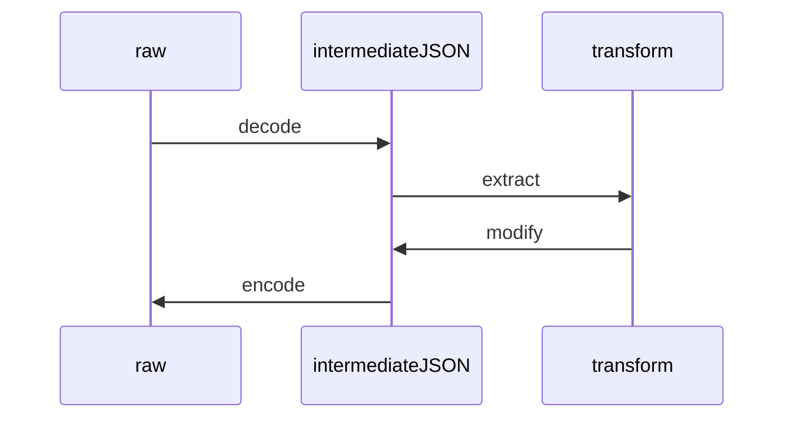

import Mermaid from '@theme/Mermaid';

# Understanding Request Bodies

For generic HTTP or JSON API requests, viewing requests and response bodies is very straightforward in Speedscale. The default RRPair viewer provides facilities for viewing as text, viewing as binary hexadecimal and JSON pretty print. Modifying this data with the transform system is equally straightforward since it is simply text.

However, Speedscale provides the ability to decode a wide variety of protocols, including binary or wire-format protocols. For these protocols, Speedscale translates the request and response payloads into whatever definition language will allow a mapping to JSON. Speedscale refers to this as the "intermediate JSON" or expanded payload. Speedscale's data analysis engine works on JSON by default and so once the protocol is rendered in this format it can be viewed, modified and then re-encoded. This allows you to modify the query using the transform system and then have it re-encoded by Speedscale into the proper format for your protocol.



Some protocols have no direct JSON-compatible mapping and so the formats are invented by Speedscale. Here are some examples to help you understand what is being shown in the UI:

## gRPC

gRPC is sent over HTTP 1.1 or 2 as a binary wire protocol. That means there is an HTTP request containing the usual headers and trailers wrapped around the gRPC binary payload. The binary [payload](https://protobuf.dev/programming-guides/encoding/) itself must be decoded and is converted into a JSON format that looks like this:

```json
{
  "fieldsMap": {
    "1": {
      "fields": [
        {
          "asString": "4",
          "id": "1",
          "type": "PROTOBUF_FIELD_TYPE_LENGTH_DELIM"
        }
      ]
    }
  }
}
```

Each `fieldsMap` is a hash map of fields sent over gRPC. To modify a field, modify the `asString` key with the new value. It is inadvisable to modify the `type` or `id` unless you are very familiar with the encoding format. Speedscale does not currently compile and import `.proto` files but the field numbers in this JSON should match to the protobuf definitions.

## GraphQL

GraphQL queries are converted into a JSON representation of GraphQL AST. See below snippet:

```json
{
  "operationName": "",
  "query": {
    "Definitions": [
      { "Directives": [], "Kind": "OperationDefinition", "Loc": null }
    ]
  }
}
```

These ASTs are very long and hard to interpret but most changes are made in the `variables` section of the AST. In well structured GraphQL, variables should extract many of the values that would need to be modified or inspected.

## Postgres

```json
{
  "query": {
    "query": "SELECT * FROM \"users\" WHERE email = 'frank.gutierrez@example.com' AND \"users\".\"deleted_at\" IS NULL ORDER BY \"users\".\"id\" LIMIT '1'"
  }
}
```

Postgres queries are straightforward to modify. Add a `json_path` transform targeting `query.query` to modify the query statement. The Postgres response is broken into two sections with the first being the columns:

```json
{
  "query": {
    "messages": [
      {
        "rowDescription": {
          "fields": [
            {
              "dataTypeOid": 20,
              "dataTypeSize": 8,
              "name": "id",
              "tableAttributeNumber": 1,
              "tableOid": 16388,
              "typeModifier": -1
            }
          ]
        }
      }
    ]
  }
}
```

The section part of the response are the actual row values and they look like this:

```json
{
  "query": {
    "messages": [
      {
        "rowDescription": {
          "fields": [
            {
              "dataTypeOid": 19,
              "dataTypeSize": 64,
              "name": "current_database",
              "typeModifier": -1
            }
          ]
        }
      },
      {
        "dataRow": {
          "values": [
            {
              "asString": "microservices"
            }
          ]
        }
      },
      {
        "complete": {
          "tag": "SELECT 1"
        }
      }
    ]
  }
}
```

You'll need to understand which columns attach to which columns but the JSON modification is straightforward with a `json_path` to `query.messages.dataRow...`

## Redis

The Redis wire protocol is mostly human readable and easily editable. Every field received is a set of strings that can be easily modified.

```json
"array": {
    "values": [
        {
            "bulkString": {
                "message": "HGET"
            }
        },
        {
            "bulkString": {
                "message": "PRODUCT_HASH"
            }
        },
        {
            "bulkString": {
                "message": "Bushcraft-Jet-Emergency-Fire-Starter-Magnesium-Kit-Camping-Hiking-Bushcraft"
            }
        }
    ]
}
```

## Kafka

When a request is initiated by a network client to your service, that is considered inbound traffic. Outbound traffic is any traffic where the service under observation is initiating the connection. Kafka traffic is always considered "outbound" because the client always dials the Kafka broker. This outbound traffic contains both `Produce` and `Fetch` messages along with other Kafka operations. For eg. this is what a `Produce` message looks like.

```json
{
  "ProduceRequest": {
    "acks": -1,
    "timeoutMs": 30000,
    "topics": [
      {
        "name": "topicName",
        "partitions": [
          {
            "records": {
              "attributes": ["ATTRIBUTE_NO_COMPRESSION"],
              "baseSequence": -1,
              "baseTimestamp": "1764787375659",
              "batchLength": 8205,
              "crc32": 3478581886,
              "magic": 2,
              "maxTimestamp": "1764787375659",
              "producerEpoch": -1,
              "producerId": "-1",
              "records": [
                {
                  "valueString": "data being sent"
                }
              ]
            }
          }
        ]
      }
    ]
  },
  "apiKey": "KAFKA_API_KEY_PRODUCE",
  "apiVersion": 7,
  "clientId": "client",
  "correlationId": 4
}
```

## Next Steps

Speedscale is continually adding protocols and this list is not exhaustive. If you need help interpreting the specific format of your protocol please reach out in the [community Slack](https://slack.speedscale.com).
