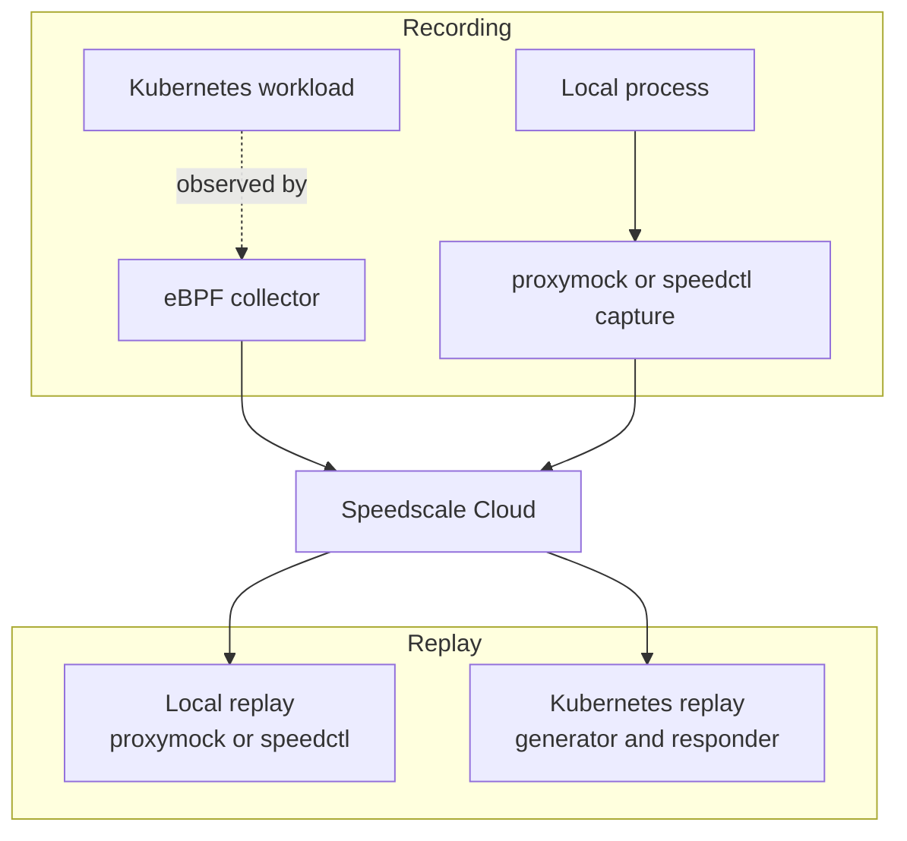
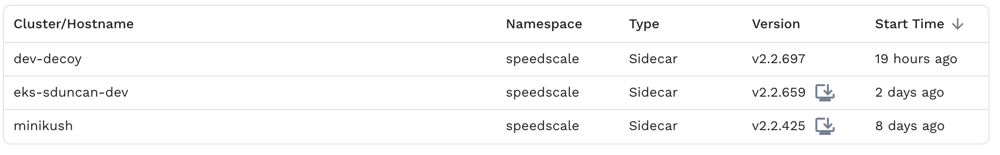
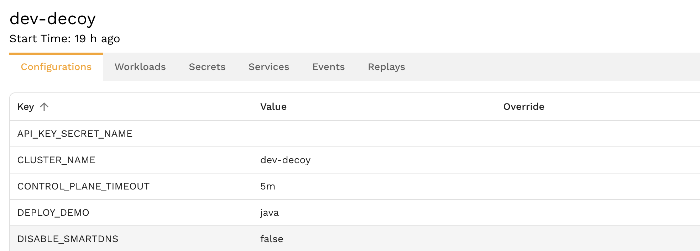
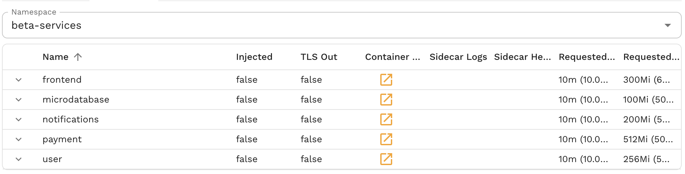
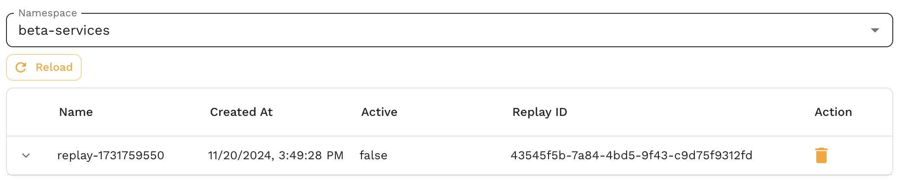

# Cluster Inspector

Speedscale is a cloud SaaS offering that provides both observability and replay of remote environments. The system is designed to record traffic from a remote environment, the local desktop or through data import. Replay works in a similar way on a similar set of platforms. When working remotely, Speedscale provides a point and click interface for starting and stopping replays.

The **Cluster Inspector** is a web interface for inspecting and managing Kubernetes clusters running Speedscale. It shows workloads, configuration, traffic, logs, and events while keeping operations within the configured Kubernetes RBAC boundaries.

To configure eBPF traffic capture or import a collection, follow the [tutorial](../../getting-started/tutorial.md).

## Overview

The Cluster Inspector presents cluster information in a tabular interface similar to K9s or kubectl. Use it to inspect the Speedscale deployment and the workloads it can access.

### Key Capabilities

- **Workload Management**: View cluster workloads and their Speedscale capture status
- **Traffic Monitoring**: Observe active traffic replays and analyze real-time traffic patterns
- **Configuration Management**: Inspect and validate Speedscale configuration across the cluster
- **Event & Log Analysis**: Access workload, Operator, and collector logs and events
- **Service Discovery**: Explore services, secrets, and node information
- **Remote Debugging**: Enhanced cluster debuggability for distributed teams

## Primary Features

### 1. Capture targeting and management

The Cluster Inspector shows which workloads are targeted for Speedscale capture. For new installations, enable the [eBPF collector](/reference/ebpf-traffic-collection) and use namespace and pod selectors or the `capture.speedscale.com/enabled` annotation to control the target set. This provides:

- **Selective capture** for specific workloads and namespaces
- **Capture status** without modifying application pods
- **Configuration visibility** for the Operator and collector
- **Fast rollback** by disabling a target annotation or selector

**Use cases:**
- Enable traffic capture on production workloads for testing
- Add monitoring to specific microservices
- Gradually roll out capture across your application stack

### 2. Debugging and observability

The Inspector also exposes workload logs and Kubernetes events for remote debugging:

- **Unified log viewing** for application workloads and Speedscale components
- **Real-time event monitoring** with filtering and search capabilities
- **Cross-reference logging** to correlate collector and application behavior
- **Historical event analysis** for troubleshooting past issues

**Benefits for remote teams:**
- Eliminates need for direct kubectl access
- Centralizes debugging information in a user-friendly interface
- Enables non-Kubernetes experts to troubleshoot effectively
- Provides context-rich debugging without cluster access credentials

## Security and Privacy

### Data Protection Guarantees

**No secret extraction**: The Cluster Inspector never extracts or exposes Kubernetes secrets from your cluster. All sensitive data remains secure within your environment.

**Local cluster access only**: All operations are performed within the cluster boundary using standard Kubernetes RBAC permissions.

**Audit trail**: All actions performed through the inspector are logged for security and compliance purposes.

### Optional Installation

The Cluster Inspector capability can be **completely disabled** by not installing the inspector service component. This provides organizations with full control over cluster access and debugging capabilities.

## Remote Replay and Data Collection

Speedscale provides the ability to remotely inspect and control Kubernetes clusters similar to [k9s](https://k9scli.io/) or [lens](https://k8slens.dev/). Unlike these inspection tools, Speedscale also allows clusters to be used for *remote replay*. Clusters assigned to Speedscale in this way can run replays on demand and can be treated as a shared resource for engineers or testers.

:::note
Clusters assigned to Speedscale can be used for other purposes. Speedscale consumes resources "just in time" to reduce cloud costs and does not lock down or otherwise monopolize a cluster when not in use.
:::

To enable remote data collection, please follow one of the installation [guides](../../getting-started/installation/install/kubernetes-operator.md). To enable remote replay, follow the same installation guide but ensure that the inspector is enabled (default).

## Clusters

Navigate to the [infrastructure](https://app.speedscale.com/infrastructure) page to view remote collectors. In most cases this will be a list of Kubernetes operators.

*Cluster/hostname* - name assigned during operator installation
*namespace* - the Kubernetes namespace the operator is running in (usually speedscale)
*version* - the operator version and an upgrade indicator

If you click on an operator you will see a list of tabs with different cluster attributes.

# Configurations

This tab shows the configuration of the operator itself. The operator provides a deprecated mechanism for altering remote configuration that will show up in the *overrides* column. When populate, the override value is used over the main value. This feature will be removed at later date.

Operator configuration is explained in greater detail in the [installation](../../getting-started/installation/install/kubernetes-operator.md) guides.

# Workloads

The Workloads tab shows all workloads in a namespace and their capture status. New deployments should use eBPF capture. The sidecar fields remain visible for existing sidecar deployments.

*Name* - Kubernetes name label for the workload
*Injected* - true if the legacy Speedscale sidecar is attached
*TLS Out* - true if legacy sidecar TLS unwrapping is enabled
*Container Logs* - click to view the logs of the main workload container (enhanced debugging capability)
*Sidecar Logs* - click to view the logs of the Speedscale sidecar (enhanced debugging capability)
*Sidecar Health* - a simple alert/caution indicator for the sidecar configuration and recording health
*Request CPU/Memory* - indicate how many resources are requested by the workload

### Capture management best practices
- Start with non-critical workloads to validate configuration
- Monitor [collector resource usage](/reference/ebpf-traffic-collection/resource-utilization) after enabling eBPF
- Use selective workload targets rather than cluster-wide capture
- Regularly review and remove capture targets that are no longer needed

# Secrets

The Secrets tab shows the name and key value of secrets in the namespace. **Critical security feature**: Unlike true Kubernetes management solutions, no secrets are transferred out of the cluster and cannot be remotely inspected. This ensures sensitive data remains secure within your environment.

# Services

The list of Kubernetes network services available in the namespace, including:
- Service discovery and endpoints
- Network policies and ingress configurations
- Load balancer and service mesh integration

# Events

Similar to watching the logs, you can also view events. This provides enhanced debugging capabilities for remote users by centralizing event monitoring in a user-friendly interface. Pay attention to this section to detect pod problems like CrashLoopBackoff.

**Event analysis features:**
- Real-time event monitoring with filtering and search capabilities
- Historical event analysis for troubleshooting past issues
- Cross-reference events with workload and collector behavior
- Export capabilities for offline analysis

# Replays

Use this tab to view currently running replays. Speedscale utilizes a Custom Resource Definition called a `trafficreplay` to manage cluster replays. This view shows CRDs in the namespace, whether currently active or not. Use the trash can icon to delete any running replays.

**Active traffic replay monitoring:**
- Running test scenarios with real-time status
- Traffic replay progress and completion indicators
- Performance metrics and results analysis
- Error rates and failure detection

## Getting Started with Cluster Inspector

### Prerequisites

- Speedscale operator deployed in the cluster
- Inspector service installed (optional component)
- Appropriate RBAC permissions configured

### Accessing the Inspector

The Cluster Inspector is accessible through the Speedscale web interface under the **Observe** section. Navigate to your cluster view and select the cluster name to begin exploring your Kubernetes environment through the tabular interface.

### Initial Setup

1. **Verify permissions**: Ensure your user account has appropriate cluster access
2. **Review workloads**: Start by exploring existing workloads and their current state
3. **Identify candidates**: Select workloads that would benefit from traffic capture
4. **Configure capture**: Enable the eBPF collector and target the selected workloads

## Troubleshooting

### Common Issues

**Inspector not accessible**: Verify the inspector service is installed and running in the cluster.

**Missing workloads**: Check RBAC permissions and namespace access rights.

**Capture is missing**: Review the eBPF system requirements, target selectors, and nettap logs.

**Log viewing problems**: Ensure proper logging drivers and log retention policies.

### Debugging Workflows
- Use the unified log view to correlate application, Operator, and collector behavior
- Filter events by workload or namespace to focus troubleshooting
- Leverage historical data for pattern analysis
- Export logs for offline analysis when needed

### Getting Help

For technical support with the Cluster Inspector:
- Check the Speedscale operator logs for error messages
- Verify network connectivity and DNS resolution
- Review Kubernetes events for the speedscale namespace
- Contact Speedscale support with cluster configuration details
