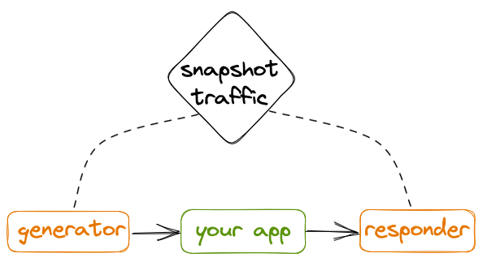

In this guide we will use [speedctl](../setup/install/cli.md) to capture
traffic, run a replay, and create local mocks, all from the command line.

## Prerequisites

- [speedctl](/reference/glossary.md#speedctl) installed
- an existing [snapshot](/reference/glossary.md#snapshot)
- an understanding of [Speedscale TLS certificate trust](../../setup/sidecar/tls#trusting-tls-certificates)

## Capture Traffic

:::caution
`speedctl capture` is not natively supported on Windows. Use
[WSL](https://learn.microsoft.com/en-us/windows/wsl/) to get capture support.
:::

In order to capture traffic from your application all inbound and outbound
[traffic](../reference/glossary.md#traffic) will need to be routed through the
Speedscale [proxy](../reference/glossary.md#proxy).

The traffic flow will look should look something like this:


The Speedscale components are in orange and your components are in green.

The curl HTTP client is used to make a request directly to the Speedscale proxy
which forwards that request to your app, capturing the inbound request. Your
app handles the inbound request and makes a database query to Postgres.
The outbound query is routed through the Speedscale proxy where the data is
captured, and since the responses follow the same path in reverse they are
captured as well.

We will need 3 terminal windows for this example.

#### Terminal 1

Run `speedctl capture` with the name of your application and the port it is
serving on, `9000` in this example. This starts the Speedscale proxy.

```
speedctl capture a_name_for_my_app 9000
```

#### Terminal 2

Set proxy variables to redirect outbound traffic to the Speedscale proxy and
start your server.

```
export http_proxy=http://127.0.0.1:4140
export https_proxy=http://127.0.0.1:4140
./my_app
```

#### Terminal 3

Make requests to your app, targeting the proxy instead of your server directly.

```
curl http://127.0.0.1:4143/foo/bar
```

After about a minute your application should show up in the services list at
https://app.speedscale.com.

## Run a Replay

Once you have captured traffic you can
[create a snapshot](./creating-a-snapshot.md) and replay it against your app.



The captured traffic is loaded into Speedscale components before the replay
starts. The [generator](../reference/glossary.md#generator) makes requests to
the your app and the [responder](../reference/glossary.md#responder) mocks
external resources.

We will need 2 terminal windows for this example.

#### Terminal 1

Set proxy variables to redirect outbound traffic to the Speedscale responder and
start your server.

```
export http_proxy=http://localhost:4141
export http_proxys=https://localhost:4141
./my_app
```

This ensures your application's outbound requests are routed to the responder.

#### Terminal 2

Run `speedctl replay` with the snapshot ID. The snapshot ID can be copied by
clicking the three dots in the top right corner of the screen when viewing a
snapshot. Snapshots are listed on the
[snapshots page](https://app.speedscale.com/snapshots).

The example here runs a replay with the traffic from the snapshot with ID
`310457d7-b17a-4802-897c-ac98004dab21`, using the test config
`standard-passthrough`, and targeting a local application serving traffic on
port 8081.

```
speedctl replay 310457d7-b17a-4802-897c-ac98004dab21 \
  --test-config-id=standard-passthrough \
  --custom-url='http://localhost:8081'
```

The `--replay-host` flag changes the host for outgoing generator requests while
keeping other details from recorded traffic whereas `--custom-url` fully
overwrites the URL, setting the protocol, host, and port.

This command will run both the generator and the responder in the same terminal
window and your app should receive all requests from the snapshot.

## Create Local Mocks

Local mocks are just another replay with no generator.

We will need 2 terminal windows for this example.

#### Terminal 1

Just as with the replay, set proxy variables to redirect outbound traffic to
the Speedscale responder and start your server.

```
export http_proxy=http://localhost:4141
export http_proxys=https://localhost:4141
./my_app
```

This ensures your application's outbound requests are routed to the responder.

#### Terminal 2

Run `speedctl replay`, but this time with the flag `--mode=mocks-only`. This
will only run the responder, allowing your app to make outbound requests that
respond with data from the snapshot.

Now you can test your application with predictable data. Outbound requests
will be routed to the responder and your app will receive mocked responses from
snapshot traffic.
