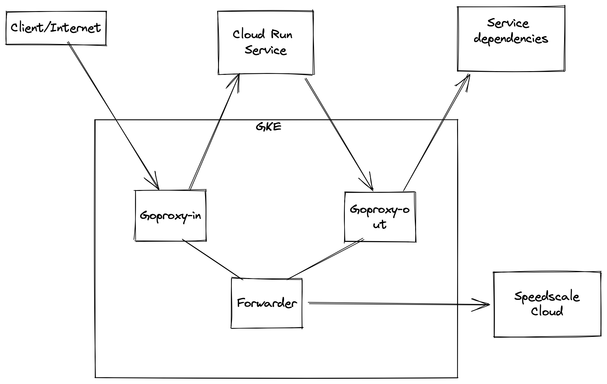

:::caution
This workflow is currently in preview status. Speedscale currently works best inside plain Kubernetes clusters
such as EKS and GKE.
:::

## Prerequisites
1. [Speedctl is installed](../setup/install/cli.md)

## Working with Google Cloud Run



In order to capture traffic from Cloud Run, we need to set up a few components shown in the diagram above.

### Create a cluster

We need to create a GKE cluster in order to run our proxy and forwarding components. Follow the prompts in the Google Cloud console to create a standard GKE cluster. Do not create an Autopilot cluster. All other standard settings should be fine. Cluster creation can take a few minutes and we need to wait till it's finished in order to deploy Speedscale components to it. Once it's done, setup `kubectl` access by running

```
gcloud container clusters get-credential <cluster-name> --region <region>
```


### Deploy Speedscale components

Now that the cluster is set up, deploy the needed components by applying the provided manifests. We'll need to modify the manifests with custom values from `~/.speedctl/config`. Replace the following values in the [capture.yaml](#manifest):

* `APP_LABEL`, `APP_POD_NAME`, `APP_POD_NAMESPACE` with your app name
* `REVERSE_PROXY_HOST` with the full URL of your cloud run app

Then run
```
kubectl create ns speedscale
speedctl deploy operator -e <cluster-name>
kubectl create ns capture
kubectl -n speedscale get secret speedscale-certs -o json | jq -r '.data["tls.crt"]' | base64 -D >> tls.crt
kubectl -n speedscale get secret speedscale-certs -o json | jq -r '.data["tls.key"]' | base64 -D >> tls.key
kubectl -n capture create secret tls tls-certs --cert=tls.crt --key=tls.key
kubectl apply -f capture.yaml
```

Now you'll need the IP of the goproxy instance you just created which you can get by running
```
kubectl -n capture get svc goproxy
NAME      TYPE           CLUSTER-IP    EXTERNAL-IP      PORT(S)                         AGE
goproxy   LoadBalancer   10.84.6.133   35.222.2.222   4143:30886/TCP,4140:31256/TCP   22h
```

Grab the external IP (35.222.2.222 here). It may take some time to show up as a TCP Load Balancer is provisioned when you deploy the manifests.

This step also creates a Network Endpoint Group (NEG) that can be used as a backend in a Load Balancer.
```
kubectl -n capture describe svc goproxy
Name:                     goproxy
Namespace:                speedscale
Labels:                   app=goproxy
Annotations:              cloud.google.com/neg: {"exposed_ports": {"4143":{}, "4140":{}}}
                          cloud.google.com/neg-status:
                            {"network_endpoint_groups":{"4140":"k8s1-0fb6446b-speedscale-goproxy-4140-e0c33991","4143":"k8s1-0fb6446b-speedscale-goproxy-4143-7e876f3b...
                          networking.gke.io/load-balancer-type: Internal
```
If you are using a Load Balancer to route to your Cloud Run service, you will need to configure it to use the backend NEG for 4143 in this case called `k8s1-0fb6446b-speedscale-goproxy-4143-7e876f3b...`.

### Create the Google secret

In order to establish TLS connections to our proxy, we'll need to add the TLS cert to our trust store. We'll use Google Secret Manager to do this.

```
gcloud secrets create speedscale-certs --replication-policy="automatic"
gcloud secrets versions add speedscale-certs --data-file=tls.crt
```
This pulls the TLS cert from Kubernetes and creates the same secret in Google Secret Manager. It is now available for our Cloud Run app to use.

### Configure the Cloud Run app

Now that all our infrastructure is setup, we can modify our app to capture traffic. In Cloud Run, navigate to the app and in the YAML tab, hit edit. We're going to add the env variables and mount the secret we created in the above step. The `ports` and `resources` section are shown just to indicate the level of indentation needed for our settings. Make sure to replace the IP in proxy settings to the one we grabbed from the Kubernetes service above (the port will remain unchanged ie. `4140`).

```yaml
containers:
- image: gcr.io/speedscale-demos/payment
  ports:
  - name: http1
    containerPort: 8080
  env:
  - name: SSL_CERT_FILE
    value: /etc/ssl/speedscale/tls.crt
  - name: HTTP_PROXY
    value: http://35.222.2.222:4140
  - name: HTTPS_PROXY
    value: http://35.222.2.222:4140
  resources:
    limits:
      cpu: 1000m
      memory: 512Mi
  volumeMounts:
  - name: tls
    readOnly: true
    mountPath: /etc/ssl/speedscale
volumes:
- name: tls
  secret:
    secretName: speedscale-certs
    items:
    - key: latest
      path: tls.crt
```

The environment variables depend on the language of your app so refer to [proxy server configuration](/setup/sidecar/proxy-modes/#configuring-your-application-proxy-server)
and [trusting TLS certificates](/setup/sidecar/tls/#trusting-tls-certificates).

### Verification

Now if you run `curl http://35.222.2.222:4143/<some path for your app>`, you should be able to access your Cloud Run app and also see the traffic in Speedscale.

## Running Replays

Replays can be run against the service through the Kubernetes cluster as detailed [here](./guides/replay/README.md). The HTTP Proxy settings and TLS settings set on the Cloud Run service above need to remain as is. It's recommended to set the `collect-logs` option to `false` since the Kubernetes service logs are not relevant in this setup.

:::info
Note that the CPU and memory graphs displayed in the report will be those for the proxy container and not the actual cloud run service.
:::

:::danger
Do not set the cleanup mode setting (`replay.speedscale.com/cleanup`) to `all` as this will delete the proxy container which is acting as the entrypoint and HTTP Proxy for your Cloud Run app.
:::

## Advanced setup

This setup assumes the Cloud Run service being instrumented is available publicly. If you want to make the service load balancer internal only, you can add this annotation `networking.gke.io/load-balancer-type: "Internal"` to the Kubernetes service definition. This requires the Cloud Run service to be on the same VPC as the GKE cluster and requires you to connect your Cloud Run app to your VPC as detailed [here](https://cloud.google.com/vpc/docs/configure-serverless-vpc-access)

## Manifest
```yaml
apiVersion: apps/v1
kind: Deployment
metadata:
  labels:
    app: goproxy
  name: goproxy
  namespace: capture
spec:
  progressDeadlineSeconds: 600
  replicas: 1
  revisionHistoryLimit: 10
  selector:
    matchLabels:
      app: goproxy
  template:
    metadata:
      labels:
        app: goproxy
    spec:
      containers:
      - image: gcr.io/speedscale/goproxy:v1.2
        imagePullPolicy: Always
        name: goproxy
        env:
        - name: APP_LABEL
          value: payment
        - name: APP_POD_NAME
          value: payment
        - name: APP_POD_NAMESPACE
          value: payment
        - name: CAPTURE_MODE
          value: proxy
        - name: FORWARDER_ADDR
          value: speedscale-forwarder.speedscale.svc:80
        - name: PROXY_TYPE
          value: dual
        - name: PROXY_PROTOCOL
          value: http
        - name: TLS_OUT_UNWRAP
          value: "true"
        - name: TLS_CERT_DIR
          value: /etc/ssl/capture
        - name: REVERSE_PROXY_HOST
          value: 'https://payment-cloud-run.a.run.app'
        - name: REVERSE_PROXY_PORT
          value: '443'
        - name: LOG_LEVEL
          value: info
        ports:
        - containerPort: 4143
          name: proxy-in
          protocol: TCP
        - containerPort: 4140
          name: proxy-out
          protocol: TCP
        volumeMounts:
        - mountPath: /etc/ssl/capture
          name: tls-out
          readOnly: true
        resources: {}
        securityContext:
          readOnlyRootFilesystem: false
          runAsGroup: 2102
          runAsUser: 2102
        terminationMessagePath: /dev/termination-log
        terminationMessagePolicy: File
      volumes:
      - name: tls-out
        secret:
          defaultMode: 420
          optional: false
          secretName: tls-certs
---
apiVersion: v1
kind: Service
metadata:
  labels:
    app: goproxy
  name: goproxy
  namespace: capture
  annotations:
    cloud.google.com/neg: '{"exposed_ports": {"4143":{}, "4140":{}}}'
spec:
  ports:
  - name: in
    port: 4143
    protocol: TCP
    targetPort: 4143
  - name: out
    port: 4140
    protocol: TCP
    targetPort: 4140
  selector:
    app: goproxy
  type: LoadBalancer

```
