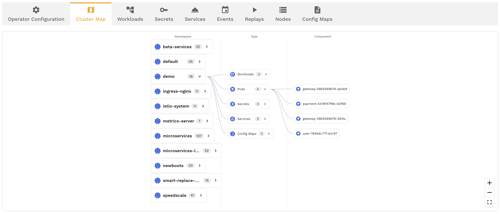

# Cluster Map

The cluster map is a visual representation of your Kubernetes infrastructure that shows namespaces, deployments, services, and the traffic flowing between them. It gives you a real-time view of how your services communicate, making it easy to identify dependencies, spot traffic patterns, and launch captures or replays directly from the map.

## Accessing the Cluster Map

Navigate to the **Infrastructure** section in the Speedscale dashboard and select a connected cluster. The cluster map is available as a view alongside the existing [Cluster Inspector](./capture/infra.md) tabular interface.

## Reading the Map

The cluster map displays your infrastructure as an interactive graph:

- **Namespaces** are shown as containing boundaries that group related workloads
- **Deployments and pods** appear as nodes within their namespace
- **Services** are shown with their associated endpoints
- **Traffic edges** are lines connecting nodes, representing observed traffic flow between services

The thickness and color of traffic edges indicate volume and health:

- **Thicker lines** represent higher traffic volume
- **Green edges** indicate healthy traffic (low error rates)
- **Red or orange edges** indicate elevated error rates on that path

## Filtering the Map

For large clusters, the full map can be noisy. Use filters to focus on what matters:

- **Namespace filter** — show only workloads in specific namespaces
- **Label filter** — filter by Kubernetes labels (e.g., `team=payments`, `env=staging`)
- **Service filter** — search for a specific service by name to center the view on it and its immediate dependencies

## Clicking Into a Node

Click on any node in the map to see details:

- **Workload metadata** — name, namespace, labels, replica count
- **Traffic summary** — inbound and outbound request rates, error rates, and latency
- **Capture status** — whether the workload is currently being captured (via sidecar or eBPF)
- **Recent snapshots** — snapshots that include traffic from this workload

## Launching Actions from the Map

The cluster map isn't just for viewing — you can take action directly:

- **Start a capture** — click a workload node and enable traffic capture without leaving the map
- **Launch a replay** — select a workload and kick off a replay using an existing snapshot
- **Open in Traffic Viewer** — jump directly to the [Traffic Viewer](./capture/filter.md) filtered to a specific service

This makes the cluster map a natural starting point for exploratory testing workflows: see your services, pick one, capture traffic, and replay it.

## Relationship to the Cluster Inspector

The cluster map and the [Cluster Inspector](./capture/infra.md) show the same underlying cluster data in different ways:

- **Cluster Inspector** — tabular, detail-oriented. Best for managing sidecars, viewing logs, inspecting configuration
- **Cluster Map** — visual, topology-oriented. Best for understanding service dependencies and traffic patterns

Both are available from the same Infrastructure section and complement each other.

## Tips

- Start with a namespace filter when exploring large clusters — showing everything at once can be overwhelming
- Use the cluster map to identify services with unexpected dependencies before setting up captures
- The traffic edges update as new traffic is observed, so leave the map open during a test to watch traffic flow in real time
