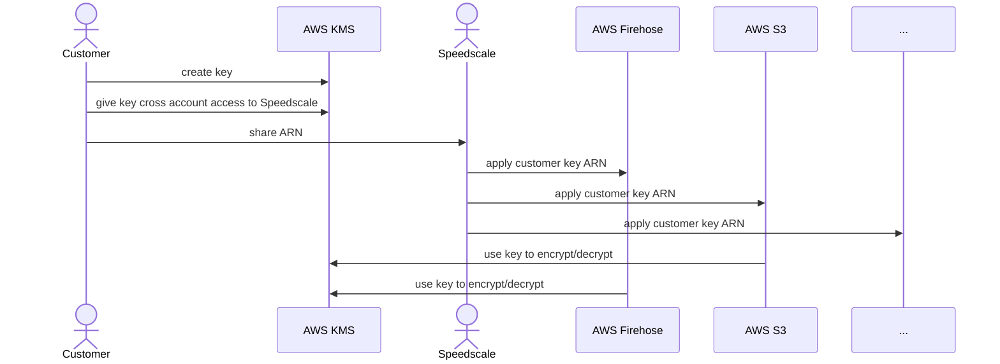

import Mermaid from '@theme/Mermaid';

# Customer Managed Encryption Keys (CMEK)

Customer Managed Encryption Keys (CMEK) allow customers with stringent security requirements to control the encryption keys that unlock their data at rest. CMEK gives customers the ability to manage their own encryption keys, adding an extra layer of security to their data. With CMEK, customers can exercise control over the lifecycle of their encryption keys, including creation, rotation, and deletion independent of Speedscale's involvement. If a customer disables access to the encryption key then Speedscale loses access. This is especially important for businesses operating in highly regulated industries, where data compliance is a critical concern. This approach is quickly becoming the standard as it is adopted by enterprise software vendors including AWS, Clari, Clickhouse, CockroachDB, DataBricks, GCP, MongoDB, Snowflake and many more. For more information about CMEK/CMK as a concept please visit [AWS](https://docs.aws.amazon.com/kms/latest/developerguide/concepts.html) or [Google](https://cloud.google.com/kms/docs/cmek) for their own customer managed encryption key services.

When CMEK is enabled, Speedscale still maintains the cloud infrastructure including databases, data transport and upgrades. The sole difference is that the customer has the ability to remove access completely at any time. In all other respects the Speedscale cloud service runs as another separate tenant.

# Customer Responsibilities

CMEK requires customers to maintain an AWS account that can be used for key storage. It is not necessary to have deep operational knowledge of AWS and its services. Speedscale still manages the cloud environment with customer permission.

# Enabling CMEK with Speedscale

1. If you are a Speedscale Enterprise customer wanting to activate CMEK, please reach out to Speedscale support through normal channels to begin the process.
2. Once initiated, Speedscale will request AWS admin contact information from the customer.
3. Speedscale will provide an AWS Cloud Formation Script that must be run in the customer AWS account. This script can and should be inspected before execution. This script will produce an AWS KMS ARN. This ARN should be provided to Speedscale.
4. Speedscale will enable CMEK for this customer using the provided ARN.
5. Speedscale Engineering will create the new database and other infrastructure instance using these credentials. The customer's tenant will be added to Speedscale's CMEK managed environment.

Below is an example diagram describing how the process works, including a bit of insight on what happens on the Speedscale side. Your specific implementation may be different based on your enterprise's requirements.

# Removing Access

:::caution
We do not currently support key rotation for customer managed keys and do not recommend implementing an automatic key rotation policy on the customer managed key.
:::

Customers control KMS keys and can turn them off at any time to remove Speedscale access to their data. However, deleting KMS keys can have unintended consequences and so AWS recommends deactivating. Please see the AWS [documentation](https://docs.aws.amazon.com/kms/latest/developerguide/enabling-keys.html) for more information.

# Non-AWS Cloud Provider Support

Speedscale customer components can be run in almost any environment, including on-premise Kubernetes, docker and desktops. However, Speedscale cloud components must currently be run in AWS due to dependencies on various services. A fully cloud-provider independent version of Speedscale under consideration but not generally available. Please contact Speedscale directly to learn more.
