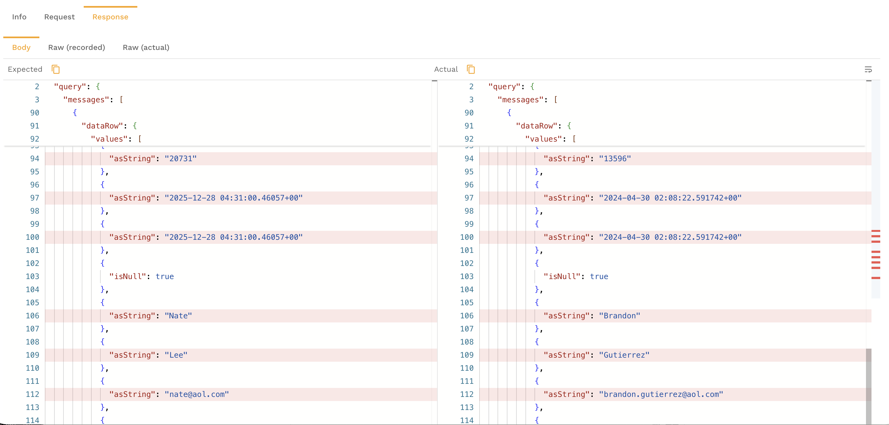

# Compare RRPairs Across Datasets

Speedscale lets you compare request/response pairs across two datasets — snapshots, replay reports, or mock recordings — to identify exactly what changed. This is useful for validating deployments, comparing environments, and catching regressions before they reach production.

## Use Cases

- **Before/after a deploy** — capture traffic before and after a code change, then compare to see what responses changed
- **Staging vs. production** — compare the same requests across environments to verify staging behaves like production
- **Version comparison** — replay the same snapshot against two versions of a service and diff the results
- **Mock validation** — compare mock responses against real service responses to verify mock accuracy

## Comparing in the Dashboard

### Selecting Two Datasets

1. Navigate to the **Snapshots** or **Reports** section in the dashboard
2. Select the first dataset (your baseline)
3. Select the second dataset (the one you're comparing against)
4. Click **Compare** to open the comparison view

### Reading the Diff View

The comparison view shows RRPairs side by side with differences highlighted:



- **Status code changes** — highlighted when the response code differs between datasets
- **Header differences** — added, removed, or modified headers are called out
- **Body differences** — field-level diffs show exactly which values changed in the response body, with additions in green and removals in red
- **Latency differences** — response time changes are shown so you can spot performance regressions

### Filtering to Changed RRPairs

By default, the comparison shows all RRPairs. Use the filter controls to narrow the view:

- **Show only changed** — hide matching RRPairs and focus on differences
- **Filter by change type** — show only status code changes, body changes, or header changes
- **Filter by endpoint** — focus on a specific API path

## Comparing via the CLI

The proxymock CLI includes a `files compare` command for diffing RRPair files locally when they share `refUuid` relationships - for example, traffic recorded with proxymock and the replay results generated from it:

```bash
proxymock files compare --in recorded/ --in replayed/
```

This compares RRPair files from the supplied directories or files and exits non-zero when differences are found. Add more verbosity if you want a more detailed diff:

```bash
# Compare recorded traffic and replay results with very verbose output
proxymock files compare --in recorded/ --in replayed/ -vvv
```

## Interpreting Diffs

When reviewing comparison results, focus on these categories:

### Status Code Changes

A status code change (e.g., 200 → 500) is the most obvious regression signal. Investigate these first.

### Body Field Changes

Not all body changes are regressions. Common expected changes include:

- **Timestamps** — naturally differ between runs
- **Request IDs and correlation IDs** — unique per request
- **Ordering** — array elements may appear in a different order

If you expect noisy fields such as timestamps or request IDs, normalize that data before comparing, or use the field ignore controls in the dashboard.

### Latency Changes

A significant latency increase on a specific endpoint may indicate a performance regression, a slower dependency, or infrastructure differences between the two environments.

### Header Changes

New or removed headers can indicate middleware changes, proxy configuration differences, or framework upgrades.

## Exporting a Comparison Report

From the dashboard comparison view, click **Export** to download the comparison as a report. The export includes:

- Summary statistics (total RRPairs, changed count, change rate)
- Per-endpoint breakdown of changes
- Full diff details for each changed RRPair

This is useful for attaching to pull requests, sharing with QA, or archiving for compliance.
