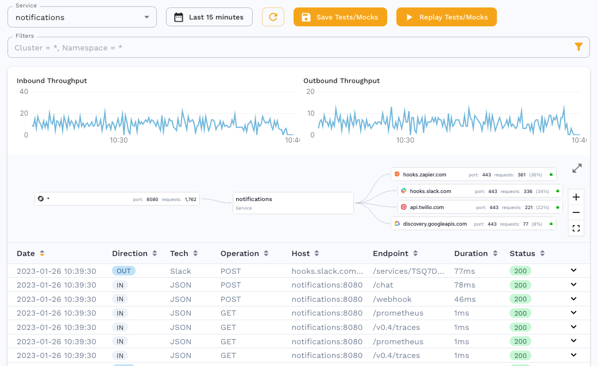
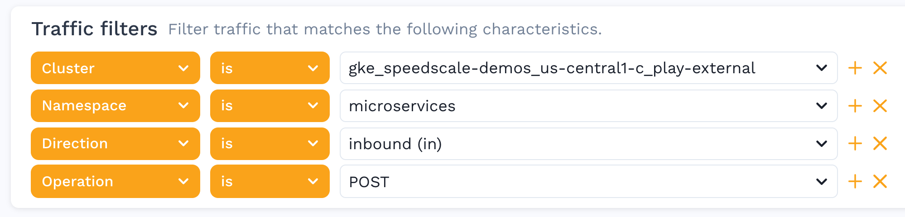
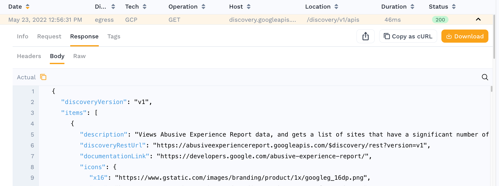
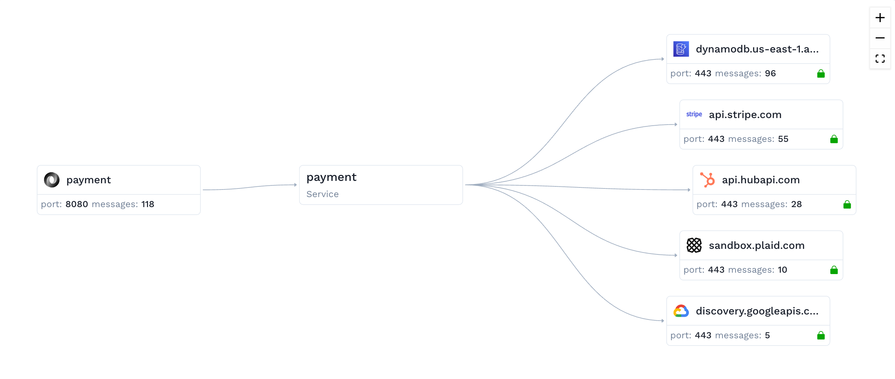

## Observe Traffic

The Traffic Viewer provides a detailed log of every transaction in the system.

Click on one of the instances to open the Traffic Viewer which provides:

* A time picker to look at trends during specific time windows
* Throughput graphs for inbound calls to the service and outbound calls to backend systems
* Filters for searching for specific transactions or otherwise customizing the list

### Filtering 

Utilize the filters to drill down even further into a subset of transactions or to filter out unwanted traffic like heartbeats.

:::info
Did you know that you can filter traffic so that it is never sent to Speedscale cloud? This can help you prevent noise, lower your bill and keep private data safe. Check out the [filters](../../reference/filters) section for suggestions.
:::

### Request Response Details 

Clicking on any individual row reveals a Request / Response Pair. This could be for an inbound transaction to the service,
or even a call from the service to a downstream system, even if it uses TLS. The following information is shown in the view:

* **Info** section includes high level details like response code, duration, URL, etc.
* **Request** section includes the Headers and Body that were sent
* **Response** section includes the Headers and Body that were received

Now that you have identified the subset of traffic that you would like to replay, it's time to create a snapshot.

## View Snapshot

A traffic snapshot is created from the selected traffic when running a replay so the same set of traffic can be reviewed and replayed again.

In addition to these details, a Service Map visually represents the inbound and outbound traffic, and how the replay will be orchestrated.

## Transform Traffic

Speedscale provides a sophisticated data transformation system to ensure that traffic replays successfully.

:::info
Before using any custom configuration, attempt a traffic replay with defaults. The default `standard` configuration works in many cases so most users should skip ahead to the next step.
:::

However, if after performing a test run your application has a very low success rate, or displays other unusual behavior, reach out on the Speedscale Slack [community](https://slack.speedscale.com) or via [email](mailto:support@speedscale.com). We will be happy to walk through your specific use case. The Speedscale team is working on a configuration UI but for now we're happier to do the work for you than to have you stumble through this complex topic. If you're feeling adventurous, you can jump over to [transforms](../reference/transform-traffic/README.md) to learn more.
