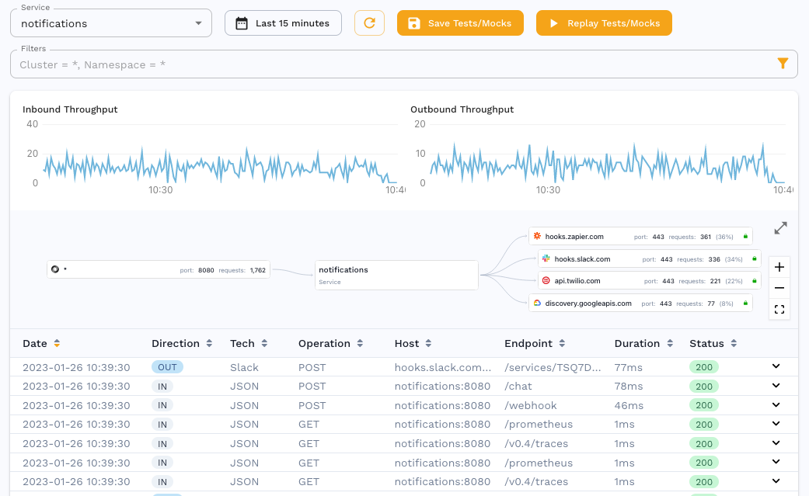
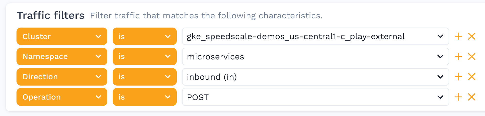
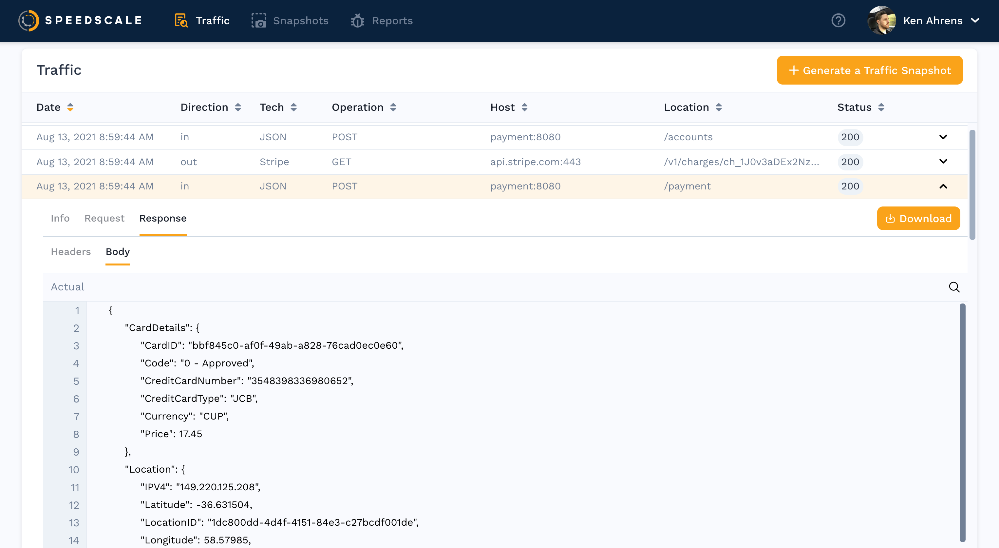
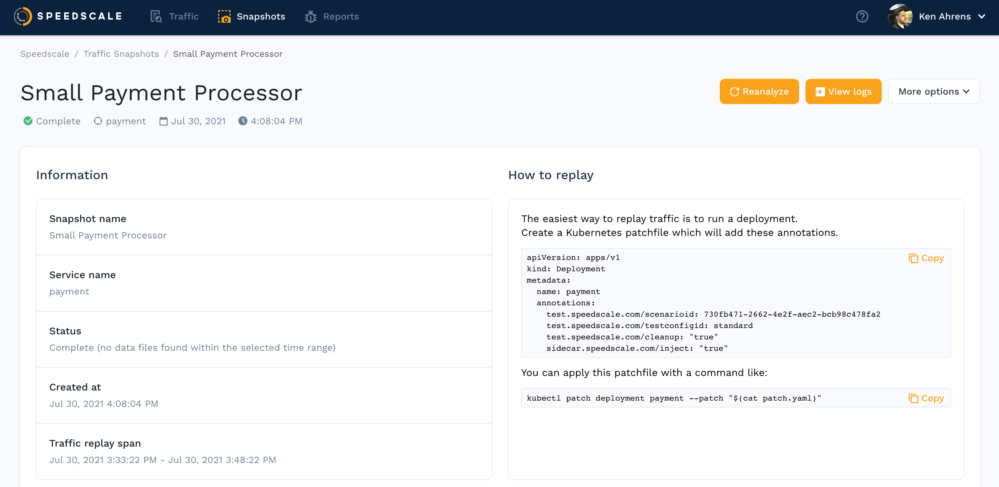
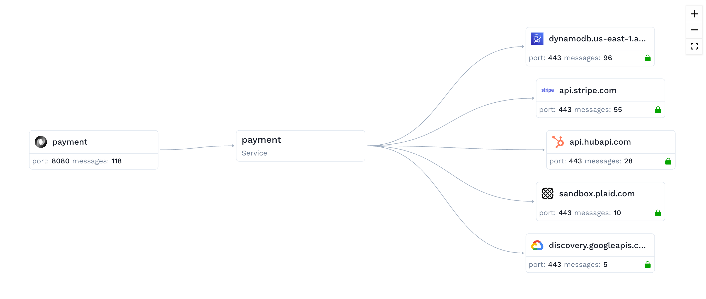
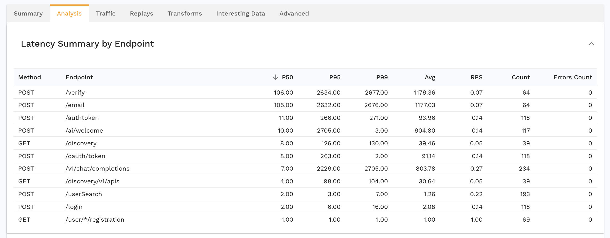
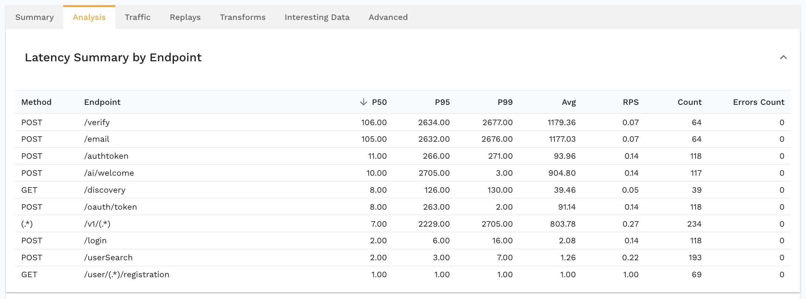

<iframe src="https://www.youtube.com/embed/uxymGbdm_v8?rel=0&modestbranding=1" width="640" height="582" frameborder="0" allow="autoplay; fullscreen; picture-in-picture" allowfullscreen></iframe>

## Observe Traffic

The Traffic Viewer provides a detailed log of every transaction in the system.

Click on one of the instances to open the Traffic Viewer which provides:

* A time picker to look at trends during specific time windows
* Throughput graphs for inbound calls to the service and outbound calls to backend systems
* Filters for searching for specific requests or otherwise customizing the list



### Filtering <a href="#analyze-steps" id="analyze-steps"></a>

Utilize the filters to drill down even further into a subset of requests or to filter out unwanted traffic like heartbeats.



:::info
Did you know that you can filter traffic so that it is never sent to Speedscale cloud? This can help you prevent noise, lower your bill and keep private data safe. Check out the [filters](/reference/filters/README.md) section for suggestions.
:::

:::tip Fitting a large selection into a snapshot
A snapshot supports up to 1,000,000 request/response pairs. Use a **Sampled** filter to reduce a large selection while keeping whole sessions together. For example, keeping one in five sessions reduces the amount of traffic to analyze and replay. See [Sampling a large selection](/guides/creating-filters.md#sampling-a-large-selection).
:::

### Request Response Details <a href="#overview" id="overview"></a>

Clicking on any individual row reveals a Request / Response Pair. This could be for an inbound transaction to the service,
or even a call from the service to a downstream system, even if it uses TLS. The following information is shown in the view:

* **Info** section includes high level details like response code, duration, URL, etc.
* **Request** section includes the Headers and Body that were sent
* **Response** section includes the Headers and Body that were received



Now that you have identified the subset of traffic that you would like to replay, it's time to create a snapshot.

## View Snapshot

A traffic snapshot is created from the selected traffic when running a replay so the same set of traffic can be reviewed and replayed again.



In addition to these details, a Service Map visually represents the inbound and outbound traffic, and how the replay will be orchestrated.



### Lock a snapshot

If other teams or CI pipelines depend on a snapshot, you can lock it from the **⋮** menu so it cannot be renamed, edited, reanalyzed, or deleted until the locking user or an Admin unlocks it. See [Locking a Snapshot](/guides/locking-a-snapshot.md).

## Tune and inspect a snapshot

The current snapshot page groups work into **Summary**, **Tuning**, **Traffic**, **Agents**, **Recommendations**, and **Replays**. Older screenshots may show separate Tests, Mocks, or Transforms tabs. Use the direction control in **Traffic** to switch between inbound and outbound requests.

In **Tuning**, inspect a recommendation, its proposed transform chains, and the traffic affected by each chain. Open the affected traffic in **Traffic** to check the scope. A warning that a chain matches no traffic means its filters need review before the chain can affect a replay. See [Traffic Transformation](./transformation/overview.md).

### Restore deleted traffic

If the snapshot has deleted RRPairs, its traffic toolbar offers **Restore deleted (N)**. Open it to see deleted IDs and available audit details. Select individual entries and choose **Restore selected**, or choose **Restore all**.

Restoring removes the deletion entries and triggers reanalysis. The list and traffic grid refresh afterward. The dialog lists IDs rather than the deleted request bodies. Snapshot write restrictions still apply, including locks and operations already in progress. If the control is unavailable on an older deployment, check that the backend supports snapshot restoration.

## Endpoint Grouping
As shown in the following picture, there's an auto URL grouping mechanism to group URLs that fall in the same category. For example, all `/user/{uuid}/registration` URLs have been grouped in the Latency Summary table to give a better view of the results.


But this grouping can also be defined manually in Snapshot definitions. For example, adding the following `endpoint_regexes` to Snapshot definitions will result in grouping all `v1` API calls into one row in the Latency Summary table.
```json
"endpoint_regexes":[
   {
     "url": "/v1/(.*)",
     "method":"(.*)"
   }
]
```



## Transform Traffic

Speedscale provides a sophisticated data transformation system to ensure that traffic replays successfully.

:::info
Before using any custom configuration, attempt a traffic replay with defaults. The default `standard` configuration works in many cases so most users should skip ahead to the next step.
:::

However, if after performing a test run your application has a very low accuracy, or displays other unusual behavior, reach out on the Speedscale Slack [community](https://slack.speedscale.com) or via [email](mailto:support@speedscale.com). We will be happy to walk through your specific use case. The Speedscale team is working on a configuration UI but for now we're happier to do the work for you than to have you stumble through this complex topic. If you're feeling adventurous, you can jump over to [transforms](/guides/transformation/overview) to learn more.
