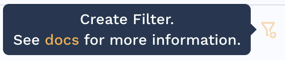
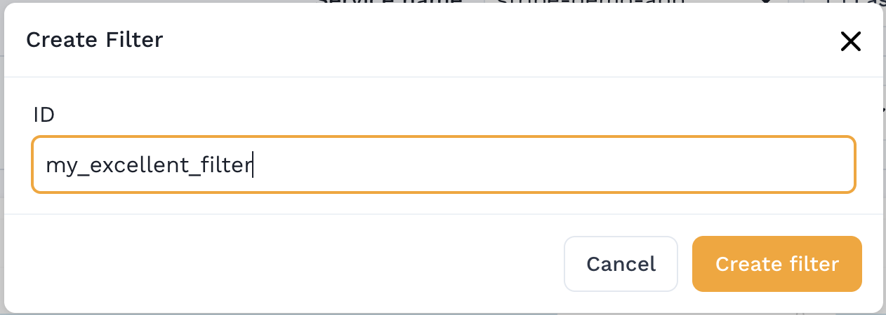

# Creating Traffic Filters

Filters can be saved from the traffic viewer and then used to prevent traffic from ever reaching Speedscale. Most users will create filters using this UI. Filter rules are stored in Speedscale cloud and applied by the Speedscale Forwarder. Once a filter is applied to the forwarder, no traffic will leave your network that is prohibited by the filter.

Here's how you create and apply them:

##  Create Filters From Dashboard

1. Open the Traffic Viewer and select your service
2. Apply filters to narrow down the traffic to only the request/response pairs that you want to allow.


3. Click the **Create Filter** button in the top right of the filter section:



4. Give the filter a unique ID (no spaces) - make sure to remember it.




## Create Filters with the CLI

### Prerequisites
1. [Speedctl is installed](/setup/install/cli.md)

### Pull Filter Using the CLI
You can pull your filter using `speedctl`.
```bash
speedctl pull filter my_excellent_filter
```
By default, your filter will be download to `~/.speedscale/data/filters/my_excellent_filter.json`.

After [editing](#edit-filter) the filter, you can use `push` command to update filter in speedscale cloud.
```bash
speedctl push filter my_excellent_filter
```

:::note
Filter files contain both a human readable query string and an internal JSON representation. You can ignore the internal JSON representation. It will update automatically when you modify the query string.
:::

## Edit the Filter Query String
Speedscale employs a filter syntax that should be familiar to users of observability and monitoring tools. The syntax is a simple combination of  operators and grouping with parentheses. The following operators are supported:

```
IS
NOT
CONTAINS
NOT CONTAINS
REGEX
```

between each filter criteria should be an `AND` or `OR`. Each set of filter rules should be separated with parentheses even if there's only one filter rule. If there's more than one rule for a key (`namespace`) they should be grouped together in a single set of parentheses.

This is a full example of a query:
```
(header[User-Agent] CONTAINS "ELB\-HealthChecker/" OR header[User-Agent] CONTAINS "Prometheus/" OR header[User-Agent] CONTAINS "apm-agent-") OR (location REGEX "^\/users\/([0-9]*)$") OR  (timerange IS "2023-10-26T02:28:54Z" "2023-10-26T02:28:54Z")
```

As you can see, all `header` filters are grouped together. And even though for `timerange` we only have a single filter, we still wrap it inside parentheses.

The following keywords can be used in your filter query:

| Keyword | Description | Example |
| --------| ----------- | ------- |
| cluster | kubernetes cluster | cluster NOT qa-test-1
| command | request command | command IS POST
| direction | ingress(IN) or egress (OUT) | direction IS IN
| header[{key}] | HTTP Header Key=Value | header[User-Agent] CONTAINS "Prometheus"
| l7protocol | protocol type | l7protocol NOT CONTAINS HTTP
| location | location/endpoint | location REGEX "^(.*)health$"
| namespace | kubernetes namespace | namespace IS default
| networkaddr | network address/host | networkaddr NOT grpc-server:80
| req_json[{key}] | check request body against a json key/value | req_json[foo] IS bar
| req_xml[{key}] | check request body against an xml key/value | req_xml[foo] IS bar
| req_soapxpath[{key}] | check request body against a soap XPath | req_soapxpath[foo] IS bar
| req_xpath[{key}] | check request body against an XPath | req_xpath[foo] IS bar
| service | service name | service CONTAINS frontend
| session | session (if set) | session IS "JWT:abc123"
| snapshot | snapshot ID (if present) | snapshot IS 88e9b593-b617-44a2-9eaf-06f76605e941
| status | status code | status IS 404
| tag[{key}] | tag value | tag[testReportId] IS 88e9b593-b617-44a2-9eaf-06f76605e941
| tech | detected tech (primary) | tech NOT CONTIANS "Google Spanner"
| timerange | within a time range (RFC3339 format) | timerange IS "2023-10-26T02:28:54Z" "2023-10-29T04:28:54Z"
| url | URL | url IS "/healthz"
| uuid | identify a specific RRPair by UUID | uuid IS 88e9b593-b617-44a2-9eaf-06f76605e941

You can now use the following command to update your filter:
```bash
speedctl push filter my_excellent_filter --query-string '(header[User-Agent] CONTAINS "ELB\-HealthChecker/" OR header[User-Agent] CONTAINS "Prometheus/" OR header[User-Agent] CONTAINS "apm-agent-") OR  (timerange IS "2023-10-26T02:28:54Z" "2023-10-26T02:28:54Z")'
```

You can also create a brand new filter using the `put` command. 
```bash
speedctl put filter --id my_new_excellent_filter --query-string '(header[User-Agent] CONTAINS "ELB\-HealthChecker/" OR header[User-Agent] CONTAINS "Prometheus/" OR header[User-Agent] CONTAINS "apm-agent-") OR  (timerange IS "2023-10-26T02:28:54Z" "2023-10-26T02:28:54Z")'
```

## Use your filter

Now, to apply the filter; change the `filterRule` configured in your `values.yaml` file of the operator helm chart to the filter rule name you entered in step 4. After updating or overriding the value, then run the `helm upgrade` command for the changes to take effect. You should see `SPEEDSCALE_FILTER_RULE` is now properly set on the `speedscale-forwarder` config map in your cluster.


Remember, if you get stuck you can get help quickly on the Speedscale [slack](https://slack.speedscale.com)
