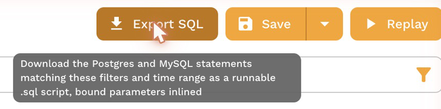
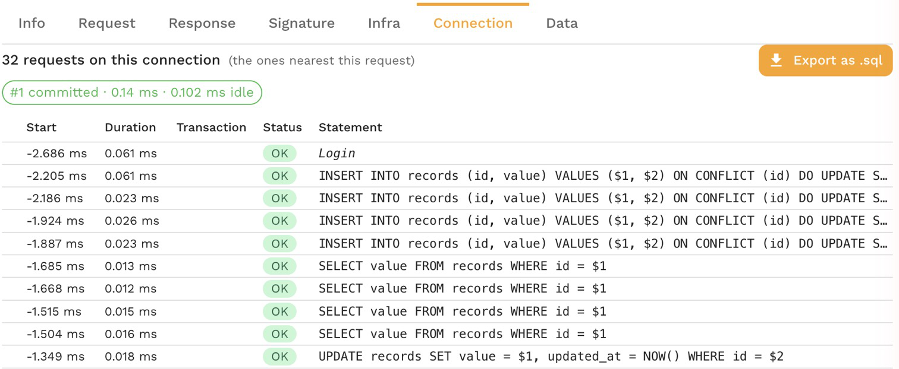

# Export a SQL script

The Traffic page can download the statements your services ran as a plain `.sql` file: every executed statement in the order it ran, with the values of prepared statements filled in as literals. Run it with `psql` or `mysql` to reproduce a production bug on a scratch database, hand it to a DBA, attach it to a ticket, or diff two of them.

It is the database counterpart of exporting a trace as a script in SQL Server Profiler, and it reads the recorded traffic, so you need no access to the production database.

## From the Traffic page

Filter the grid to the statements you want, then choose **Export SQL** next to **Save** and **Replay**. The script holds the Postgres and MySQL statements that match the current filters and time range, so filter first to narrow it to a service, a table, a session or an incident's few minutes. [Watch live SQL](./watch-live-sql.md) and [Find statements with filters](./find-statements.md) show how.

## From one connection

Open a Postgres or MySQL call and go to its **Connection** tab, then choose **Export as .sql**. The script holds that connection's statements in order, which is the easiest way to replay what one session did, transactions included. The button is hidden when the recording cannot tell that connection apart from others.

## What the script holds

- One statement per execution, with its bound parameters filled in as literals, quoted and typed for the database.
- A comment before each statement with its time, duration and outcome: the rows it returned or changed, or the error.
- Logins, logouts and changes of connection as comments, so a script that covers several connections says which one ran what.
- A statement whose values were not captured, or whose SQL was prepared before recording started, written commented out with the reason, never with unbound placeholders.

After the download, a message says how many statements were exported and how many are commented out. A filtered export holds at most the first 500 matching database requests and about 3 MB of SQL; when it stops short, the message says so, and a narrower filter or time range gets the rest.

[Export a SQL script in proxymock](../../proxymock/databases/export-sql-script.md#what-the-script-holds) shows an example script.

Replaying writes changes data, so run a script against a database you can throw away.

## Related

- [Inspect a statement](./inspect-a-statement.md)
- [Load and Regression Test a Database](../../proxymock/databases/load-and-regression-testing.md), to replay the statements with many sessions instead of once
