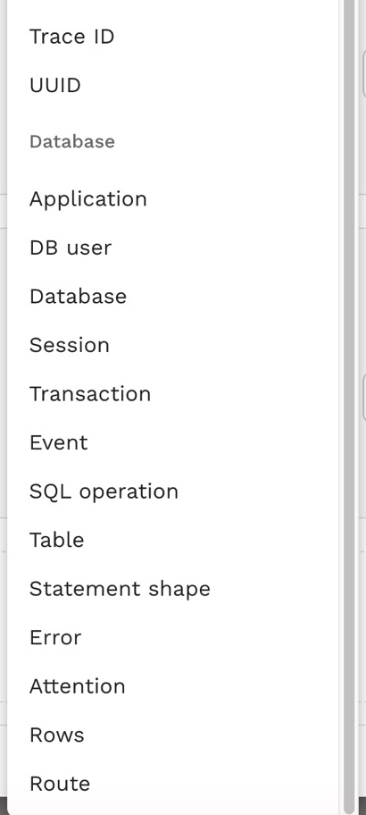

# Find statements with filters

A busy service runs millions of database calls a day. The **Database** filters on the **Traffic** page narrow them to the ones you care about in one step: the statements that failed with a given error, the calls that deadlocked, everything one service account ran, every statement that touched a table, or the queries that returned too many rows. Because the filters compare the facts Speedscale recorded for each call, they need no access to the database.

When a filter targets database traffic, the grid switches to the [Database columns](./index.md#watch-database-traffic), so the matches read like a database profiler trace.

## The Database filters

Open **Filters**, add a filter and pick a field from the **Database** group at the end of the list:

| Filter | What it matches | Example |
|---|---|---|
| Application | The client's application name | Every call from one service's connection pool |
| DB user | The database user that logged in | Everything a service account or a person ran |
| Database | The database it connected to | One schema in a shared server |
| Session | The server's id for the connection: the Postgres backend pid or the MySQL connection id | Everything one connection did |
| Transaction | `idle`, `active` or `failed` when the statement started | Statements that ran inside a transaction that had already failed |
| Event | `login`, `logout` or `statement` | Every login, to see who connects and how often |
| SQL operation | The leading command, such as `SELECT` or `DELETE` | Every `DELETE` |
| Table | A table the statement names | Every call that touches `orders` |
| Statement shape | The statement with its values masked | Every execution of one query |
| Error | The SQLSTATE for Postgres or the error number for MySQL | Every `23505` unique violation or `40P01` deadlock |
| Attention | `cancelled`, `timeout`, `deadlock`, `lock_timeout`, `terminated`, `cancel_request` or `aborted` | Every call that timed out |
| Rows | Rows returned or changed, compared with is, greater than or less than | Queries that returned more than 1,000 rows |
| Route | The route the app wrote into the statement's SQL comment | Every statement `orders#show` ran |

Text fields compare with **is**, **contains** or **regex**, and each can be negated. The value pickers offer the values in the traffic you are looking at, and errors show with their names, such as `23505 · unique_violation`.

## Filter by trace id

The **Trace ID** filter matches one request's trace across protocols: HTTP and gRPC calls by their `traceparent` or B3 headers, and database calls by the trace id the app wrote into their SQL comment. A filter on a header would drop the database calls, so use **Trace ID** to see a request together with the queries it ran. You can paste a whole `traceparent`; the filter keeps only the trace id. See [Link queries to the request that ran them](../../proxymock/databases/link-queries-to-requests.md) for how apps tag their SQL.

## Filter from a call

In the request drawer, every database fact of a call carries a filter and an exclude button. Open a failed call, select the filter next to its error code, and the grid shows every call that failed the same way; select the one next to its session to follow that connection. See [Inspect a statement](./inspect-a-statement.md).

## Recipes

| To find | Filter on |
|---|---|
| Deadlocks and lock timeouts | Attention is `deadlock`, or Attention is `lock_timeout` |
| Duplicate-key failures | Error is `23505` (Postgres) or `1062` (MySQL) |
| Slow writes | SQL operation is `UPDATE` and Duration greater than 100 ms |
| Unbounded queries | Rows greater than 1000 |
| Work done inside failed transactions | Transaction is `failed` |
| One connection's story | Session is the session id, then open any call's Connection tab |
| Who touches a sensitive table | Table is the table, then read the User and Application columns |

## Limits

- The connection facts (user, database, application, session) need a capture from Speedscale 2.5.1103 or later, and the route and trace id need 2.5.1153 or later. Traffic indexed before an upgrade keeps the facts it was indexed with, so filter on a recent time range.
- Database filters match PostgreSQL and MySQL calls. Other databases are found with the usual filters, such as Host or L7 Protocol.

## Related

- [Inspect a statement](./inspect-a-statement.md)
- [Database traffic](../../concepts/database-traffic.md)
- [Filters and Subsets](../../concepts/filter.md)
