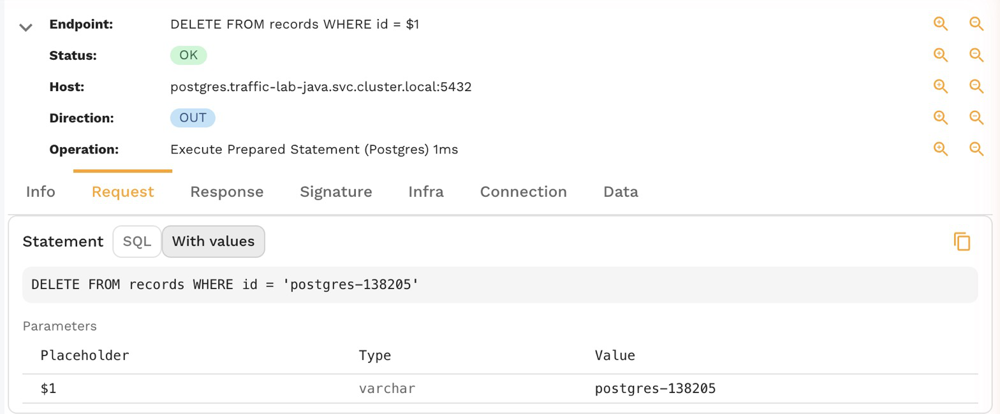
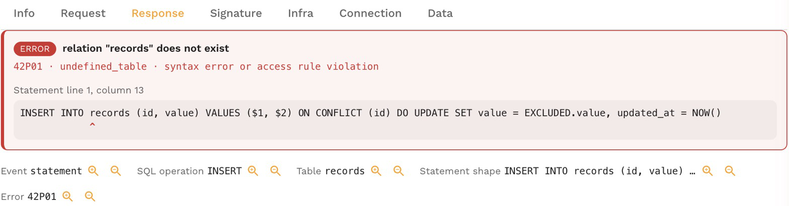
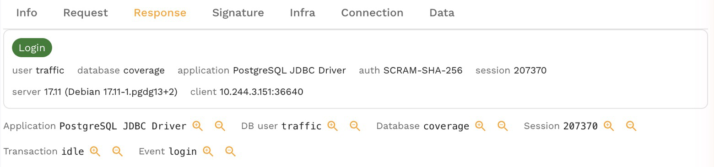
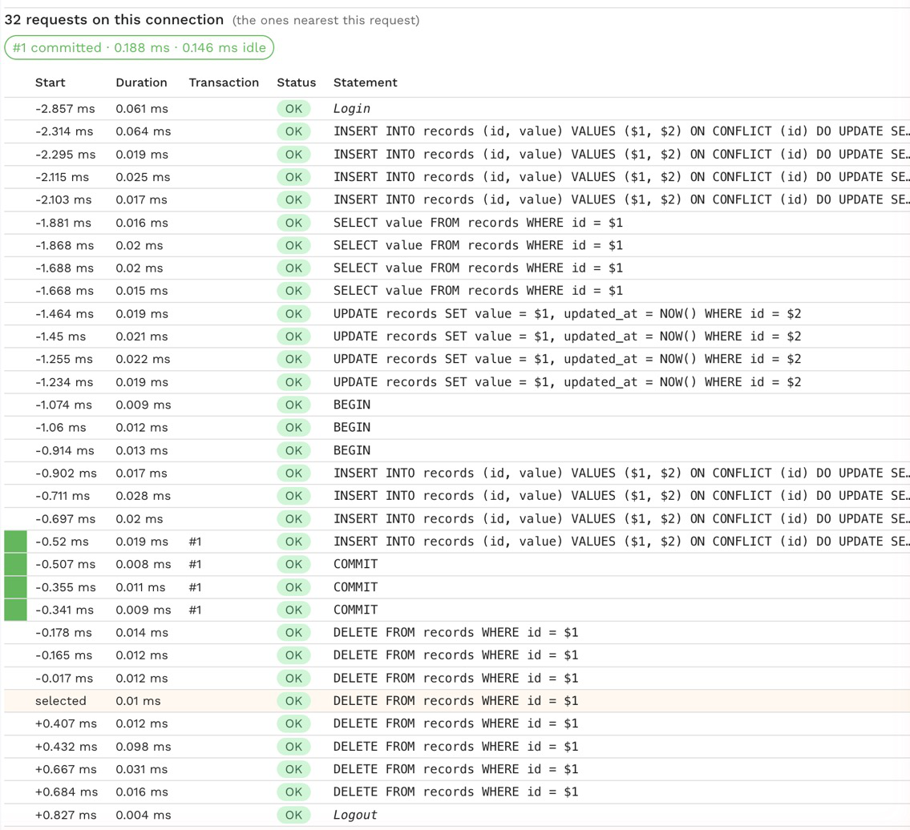

# Inspect a statement

Open any Postgres or MySQL call on the **Traffic** page to see what you would otherwise have to reconstruct from logs and code: the exact SQL with its values, how it ended, who ran it, and what else that connection was doing. Everything comes from the recorded traffic, so you can inspect a production call without access to the production database.

## The SQL with its values

The **Request** tab shows the statement. A prepared statement arrives with placeholders and its values separately, so the panel shows both:

- **SQL** is the statement as the app sent it, with `$1` or `?` placeholders.
- **With values** fills the bound values in as literals, so you can copy the statement and run it.
- **Parameters** lists each placeholder with its type and value.

## How it ended

The top of the **Response** tab says how the call ended:

- A successful call shows what it did: the command tag, such as `UPDATE 1`, and the rows it returned. Writes return no rows, so this is where an `UPDATE` or `DELETE` says how many rows it changed.
- A failed call shows an error card with the message, the SQLSTATE or MySQL error number and its name, and the line of SQL the server pointed at with a caret under the position.
- A call that was cancelled, timed out, deadlocked, waited too long for a lock or was terminated shows why. For a deadlock, a lock timeout, a timeout or a cancel, the card also lists the statements that were running at the same time on other connections, which is usually where the cause is.
- A chip says when the statement ran inside a transaction, or inside one that had already failed.

Below the card, each database fact of the call (event, operation, table, statement shape, error, user, session and so on) has a filter and an exclude button that add it to the Traffic filters. See [Find statements with filters](./find-statements.md).

## Who connected

A login call shows a login card: the user, the database, the client application, the authentication method, the session id, the server version and the client address. A refused login shows why it was refused.

## Everything that connection did

The **Connection** tab lists the calls on the same database connection around the selected one, in order, from the login to the logout when they are in range. Calls inside a transaction are marked with a colored bar and a number, and a chip above the list says how each transaction ended (committed, rolled back, failed, ended or still open), how long it took and how long the client held it open without running anything.

Use it to see what led up to a failed or slow statement, whether a transaction held its locks while the app did something else, and in what order a request's statements really ran. **Export as .sql** downloads the connection's statements as a runnable script; see [Export a SQL script](./export-sql-script.md).

## The request that ran it

When the app writes the request's trace id into its SQL comments, the drawer of a database call names the inbound request that ran it, marked **linked by trace ID**, and otherwise the request that was running when it ran, marked **by timing**. See [Link queries to the request that ran them](./link-queries-to-requests.md).

## Related

- [Find statements with filters](./find-statements.md)
- [Database traffic](../../concepts/database-traffic.md)
- [Inspect a statement in proxymock](../../proxymock/databases/inspect-a-statement.md)
