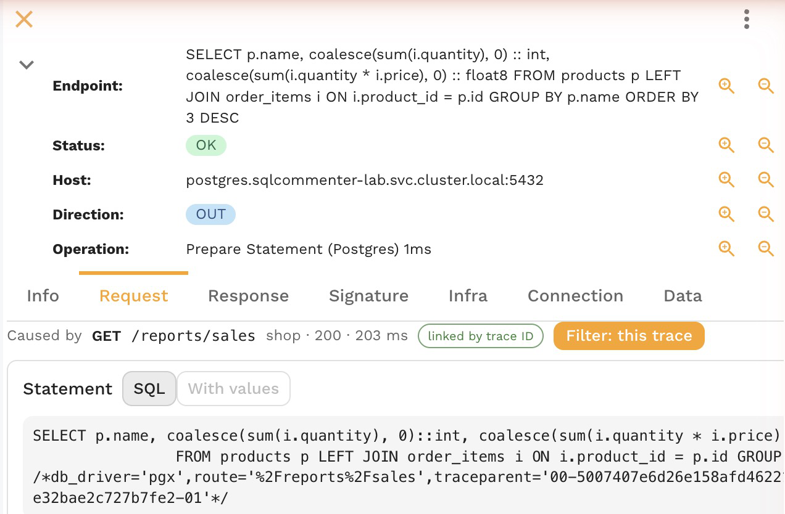

# Link queries to the request that ran them

A slow page, an N+1 loop or a failing write starts with an inbound request and ends in the database. The Traffic page links the two in both directions: from a statement to the request that ran it, and from a request to every statement it ran. You need no APM agent for this, since Speedscale links them from the recorded traffic.

## How statements are linked

- **By trace ID**: when your app writes the request's W3C trace context into a comment on each SQL statement, as sqlcommenter, Rails query log tags, marginalia and Datadog Database Monitoring do, the statement links to the inbound request that carries the same trace id. The link is exact even when requests overlap.
- **By timing**: a statement without that comment links to the latest request in the same service that was running when the statement ran. That is exact when requests arrive one at a time and a best guess when they overlap.

Untagged traffic still links, by timing, so the views below work for every service. Tagging makes the links exact; [Link queries to the request that ran them](../../proxymock/databases/link-queries-to-requests.md#turn-on-sql-comments-in-your-framework) shows the setting for Rails, Django, Flask, Spring Boot, Node.js, Go and Datadog.

## From a statement to its request

Open a Postgres or MySQL call on the **Traffic** page. Its **Request** tab shows **Caused by**: the inbound request's method and path, its service, status and duration, marked **linked by trace ID** or **by timing**.

When the call carries a trace id, **Filter: this trace** adds the **Trace ID** filter for it, so the grid shows the whole request: the inbound call, the HTTP and gRPC calls it made and its database calls. A filter on the `traceparent` header would drop the database calls, which carry the trace in their SQL comment instead.

An HTTP or gRPC call with a trace id shows the trace id and the same **Filter: this trace** button on its **Request** tab.

## From a request to its statements

Open an inbound request of a service that talks to a database. Its **Request** tab counts the statements it ran, such as **12 queries in this request (12 linked by trace ID)**, and **Show these queries** filters the grid to them:

- When every query carried the request's trace id, the filter is that trace id.
- Otherwise it is the service and the request's own time window, so untagged statements are included. With overlapping requests, some of them may belong to another request.

A count far above what the endpoint should need is the usual sign of an N+1 loop. The snapshot drawer shows the same count and **Caused by** for the requests in a snapshot.

## See one request as a waterfall

With a **Trace ID** filter on, the trace icon in the Traffic toolbar shows the filtered requests as a waterfall, with each statement nested under the request that ran it. The header counts how many queries were **linked by trace ID** and how many spans were **nested by timing**, and each exactly linked statement has a link icon.

## Filter by route

When the comment also names the route, such as `route='/orders/:id'` or a Rails controller and action, the **Route** filter in the Database group matches every statement one endpoint ran, and the database grid shows the route next to the statement.

## Limits

- Links need traffic indexed by Speedscale 2.5.1153 or later. Older traffic shows no trace id or route.
- The link needs the inbound request in the same service. A service that only connects to a database, such as a batch job with no inbound requests, has nothing to link to.
- The trace id in a prepared statement's comment is the one it was prepared with. See [Prepared statements](../../proxymock/databases/link-queries-to-requests.md#prepared-statements).

## Related

- [Find statements with filters](./find-statements.md)
- [Inspect a statement](./inspect-a-statement.md)
- [Trace a request without traces](../../proxymock/guides/trace-without-traces.md)
