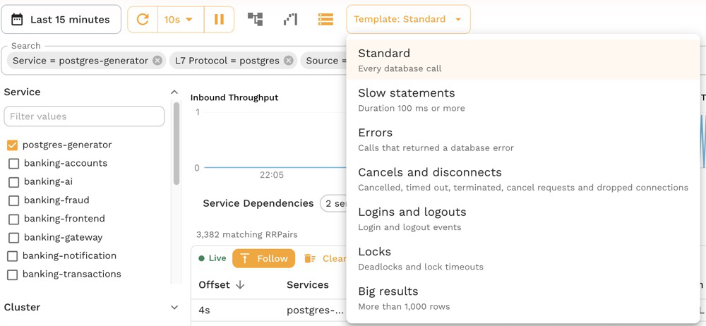
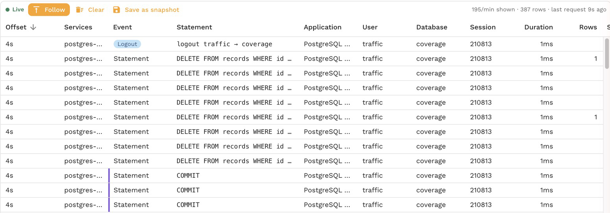

# Watch live SQL

The **Traffic** page can follow a service's database calls as they happen, one row per statement, login or logout, with who ran it, how long it took and how it ended. It works like a SQL Server Profiler trace, but it reads the traffic your services already send, so it needs no access to the database, no extended events session and no slow query log.

Use it to watch what a deploy does to the database, to catch the errors, lock waits or slow statements of an incident while it happens, or to see what a feature actually asks of the database while you click through it.

## Open it

1. On the **Traffic** page, keep a relative time range such as **Last 15 minutes** and auto refresh on.
2. Filter to the service, and to a database with **L7 Protocol** is `postgres` or `mysql`, or with any **Database** filter.

The grid switches to the database columns: Event, Statement, Application, User, Database, Session, Duration, Rows and Status. The database icon in the toolbar switches between these and the default columns. See [Find statements with filters](./find-statements.md) for every Database filter.

- **Event** says what the row is: a statement, an error, a login, a logout, or why the call needs attention, such as a timeout or a deadlock.
- **Statement** is the statement with its values masked, so repeats of one statement line up. A login or logout reads as the user and database, such as `login traffic → coverage`. When the app writes a route into its SQL comment, the route shows here too.
- A purple bar on the left marks a statement that ran inside a transaction, and a red one a statement inside a transaction that had already failed.
- **Duration** turns amber at 50 ms and red at 500 ms, and **Rows** turns amber above 1,000.

## Templates

With the database columns on, the **Template** menu starts from a common question instead of an empty filter:

| Template | Shows |
|---|---|
| Standard | Every database call |
| Slow statements | Duration 100 ms or more |
| Errors | Calls that returned a database error |
| Cancels and disconnects | Cancelled, timed out and terminated calls, cancel requests and dropped connections |
| Logins and logouts | Login and logout events |
| Locks | Deadlocks and lock timeouts |
| Big results | More than 1,000 rows |

Picking a template replaces the Database and Duration filters and keeps the rest, such as the service, so you can switch between questions about the same service. Change any filter afterwards and the menu reads **Custom**.

## Follow, Clear and Save as snapshot

While the grid is live, a bar above it says whether it is **Live**, **Paused** or **Not following**:

- **Follow**: new rows appear at the top as they arrive. Turn it off, or scroll away from the top, and new rows are held with a count of how many are waiting; turn it back on to jump to the newest. Opening a row pauses the grid until you close it.
- **Clear**: hides the rows shown so far and keeps watching, so the grid shows only what happens next, such as the statements of one click in your app. **Show cleared** brings them back.
- **Save as snapshot**: saves the requests in the grid's window, or the ones since Clear, with the current filters, as a [snapshot](../creating-a-snapshot.md) you can replay, mock or share.

The right side of the bar shows the rate over the last minute, the row count and how long ago the newest request arrived. When filters narrow what you see, the rate shows both the requests that pass every filter (**shown**) and everything in the selected services and protocols (**seen**), so a quiet stream reads differently from a filtered one.

Requests reach the grid about 10 seconds after they happen, the time it takes to capture and index them.

## Look at one call

Select a row to open it: the statement with its values, how it ended, the login that opened the connection and every other call on that connection. See [Inspect a statement](./inspect-a-statement.md).

## Related

- [Find statements with filters](./find-statements.md)
- [Export a SQL script](./export-sql-script.md)
- [Watch live SQL in proxymock](../../proxymock/databases/watch-live-sql.md)
